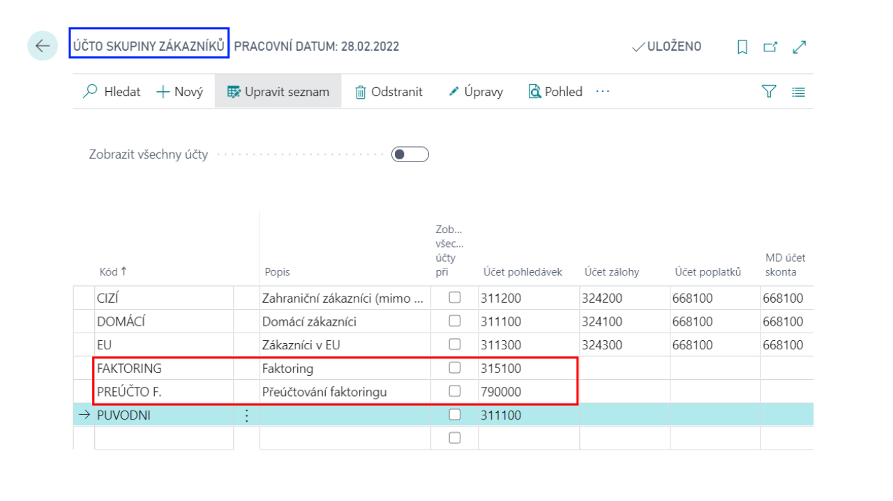
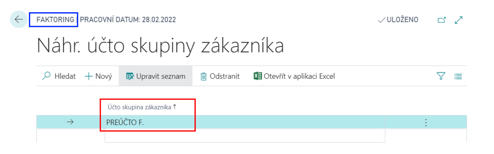
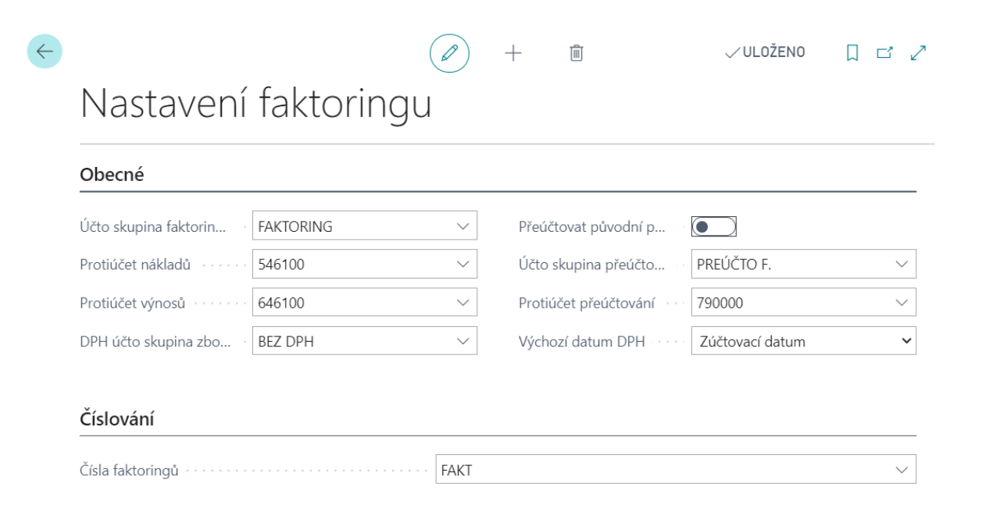

# Factoring - Nastavení

Základní nastavení add-onu fakoringu.
## Nastavení add-onu Faktoring
### Potřebné nastavní Business Central

Pro správnou funkci add-onu je potřeba nastavit a založit i jiné nastavení v Business Central.

|Nastavení|Popis|
|-|-|
|**Účty v účtové osnově**|V účtové osnově je nutné založit finanční účty pro sledování podstoupených pohledávek, nákladové a výnosové účty pro přeúčtování faktoringu; pokud již neexistují.|
|**Účto skupiny pro faktoring**|Přes Účto skupiny zákazníků je nutné založit nové účto skupiny pro faktoring, které se budou používat pro účtování faktoringu. |
|**Náhradní účto skupiny zákazníka**|Je nutné založit nové kombinace náhrad účto skupin zákazníka (dostupné ze stránky Náhr. Účto skupiny zákazníka).|

### Nastavení faktoringu

Na stránce Nastavení faktoringu je třeba provést základní nastavení pro modul faktoring: 
1. Vyberte ikonu , zadejte **Nastavení faktoringu** a poté vyberte související odkaz.
2. Na kartě faktoringu vyplňte následující pole:
    - **Účto skupina faktoringu** – účto skupina, která je použita pro účtování faktoringové pohledávky 
    - **Protiúčet nákladů** – účet, na který se zaúčtuje pohledávka za zákazníkem 
    - **Protiúčet výnosů** – účet, na který se zaúčtuje výnos z faktoringu 
    - **DPH účto skupina zboží** – zde je třeba nastavit DPH účto skupinu zboží, která v kombinaci s DPH obchodní účto skupinou ze zákazníka-faktora reprezentuje účtování bez DPH 
    - **Přeúčtovat původní položku** – volba ANO umožňuje dále sledovat pohledávku za původním zákazníkem na podrozvahových účtech 
    - **Účto skupina přeúčtování** a **Protiúčet přeúčtování** – podrozvahové účty, na kterých se bude dále sledovat pohledávka k původnímu zákazníkovi 
    - **Čísla faktoringů** – číselná řada, kterou budou faktoringy číslovány   

3. Po vyplnění polí můžete kartu zavřít.

### Šablony faktoringu 
Je možné definovat šablony pro převod faktoringových smluv do dokumentů Microsoft Word. Dokument je možné vytvořit na kartě faktoringu pomocí funkce **Vytvořit dokument faktoringu**.

**Viz také**

[Faktoring](ac-factoring.md)  
[Financial Pack](ac-finance-pack.md)  
