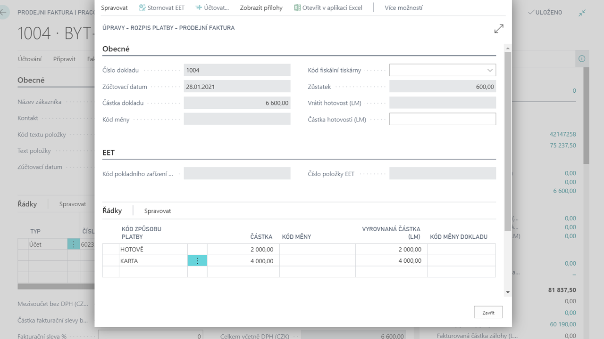

# Více úhrad
Add-on modul Více úhrad rozšiřuje standard prodejních dokladů, kdy namísto jednoho způsobu platby je možné definovat více způsobů např. část prodejního dokladu uhradit platební kartou a část hotově.

Na primárních dokladech (faktura, objednávka, dobropis) je v rozpisu platby možné definovat jeden či více typů úhrad (kódů způsobu platby) a tyto následně zaúčtovat (tzn. zaplatit doklad). Obdobně lze provést zaúčtování rozpisu platby na vytvořeném resp. zaúčtovaném dokladu (faktura, dobropis, záloha). Modul tvoří základ pro podporu maloobchodního prodeje a lze jej využívat spolu s modulem Fiskální tiskárny.

**Viz také**

[Nastavení - Více úhad](ac-multiple-payments-setup.md)  
[Financial Pack](ac-finance-pack.md)  
