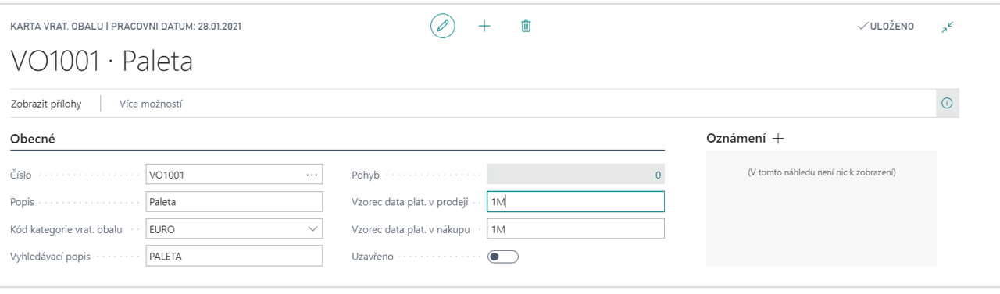

# Evidence vratných obalů (Vratné obaly)

Add-on modul **Evidence vratných obalů** je rozšířením modulu Zásoby systému Dynamics 365 Business Central. Umožňuje sledování oběhu vratných obalů a paletového hospodářství. Lze pomocí něj sledovat obalová salda obchodních partnerů s vazbou na příslušné obchodní transakce (Nákup, Prodej, Příjem, Výdej, Transfer, Spotřeba a Výroba) a dále pak sledovat aktuální cenu obalů.

##Viz také

[Nastavení - Evidence vratných obalů (Vratné obaly)](ac-pack-tracking-return-packing-setup.md)  
[Financial Pack](ac-finance-pack.md)  
