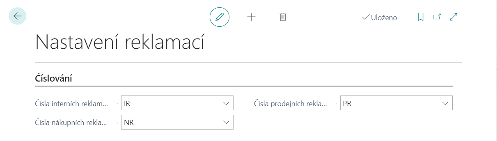
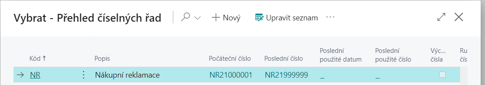
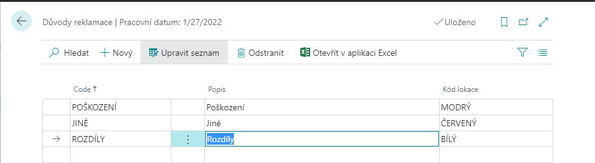
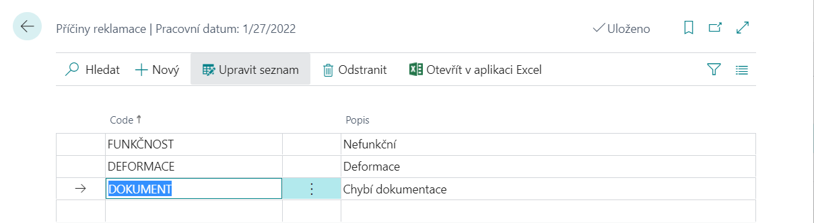
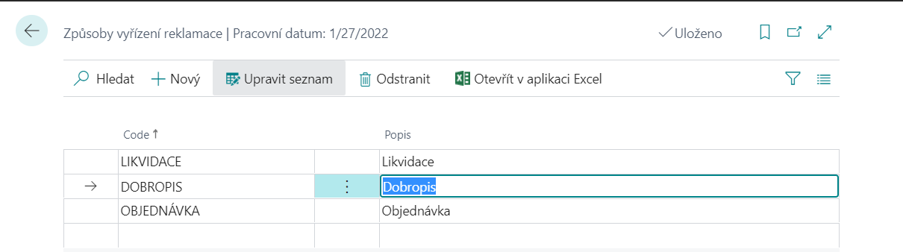
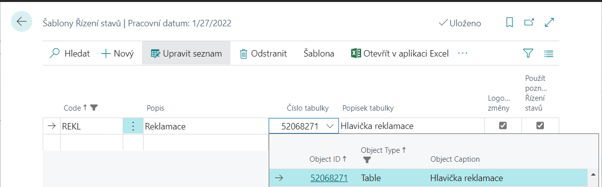
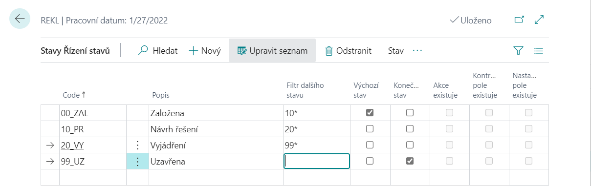
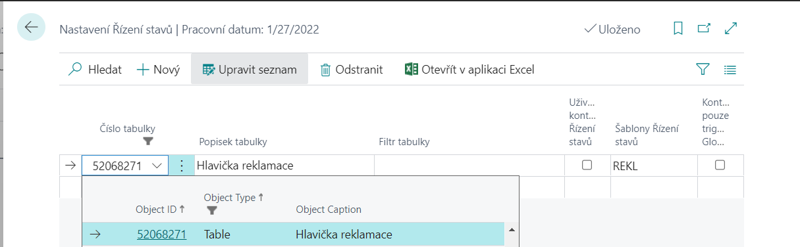

# Nastavení reklamací

Po importu modulu je třeba provést Nastavení reklamací na stránce – **Nastavení reklamací**.

- Vyberte ikonu ,zadejte **Nastavení reklamací** a poté vyberte související odkaz.

Na stránce **Nastavení reklamací** je třeba v záložce **Číslování** vybrat číselnou řadu pro nově vytvářené doklady - **Čísla interních reklamací**, **Čísla prodejních reklamací**, **Čísla nákupních reklamací**.

Číselnou řadu si musíme připravit, pokud jsme tak ještě neudělali. Číselná řada se tvoří stejným způsobem jako pro jiné agendy:

1. Vyberte ikonu , zadejte **Číselná řada** a poté vyberte související odkaz. 
2. Na stránce **Číselná řada** klikněte na funkci **Nový** a vytvořte novou číselnou řadu.
3. Zadejte **Kód**, **Popis** a **Počáteční číslo** číselné řady.
4. Zaškrtněte políčko **Výchozí čísla** pro automatické vyplňovaní čísel při zadávaní nových požadavků.

Příklad vytvořené číselné řady **(detailněji viz. modul - Číselné řady)**.

### Důvody reklamace

Číselník **Důvodů reklamace** obsahuje pole **Kód**, **Popis** a **Kód lokace**. K nastavení důvodů reklamace uživatelů se dostanete následovně:

1. Vyberte ikonu , zadejte **Důvody reklamace** a poté vyberte související odkaz. 
2. Na stránce **Důvody reklamace** vyberte akci Nový a poté zadejte **Kód**, **Popis** a **Kód lokace**.

### Příčiny reklamace

Číselník **Příčiny reklamace** obsahuje pole **Kód**, **Popis**. K nastavení příčin reklamace se dostanete následovně:

1. Vyberte ikonu , zadejte **Příčiny reklamace** a poté vyberte související odkaz. 
2. Na stránce **Příčiny reklamace** vyberte akci Nový a poté zadejte **Kód** a **Popis**.

### Způsoby vyřízení reklamace

Číselník **Způsoby vyřízení reklamace** obsahuje pole **Kód** a **Popis**. K nastavení Způsobů vyřízení reklamace se dostanete následovně:

1. Vyberte ikonu , zadejte  **Způsoby vyřízení reklamace** a poté vyberte související odkaz.
2. Na stránce **Způsoby vyřízení reklamace** vyberte akci Nový a poté zadejte **Kód** a **Popis**.

## Nastavení řízení stavů

Pokud chcete používat modul **Reklamace** je potřebné správně nastavit i modul **Workflow (Řízení stavů)**.

### Nastavení šablony řízení stavů

Nejprve je třeba nastavit šablonu řízení stavů *(detailněji viz. modul - Workflow)*.

1. Vyberte ikonu , zadejte **Šablony řízení stavů** a poté vyberte související odkaz.
2. Na stránce **Šablony řízení stavů** zvolte funkci **Nový**.
3. Vyplňte pole **Code** a **Popis**.
4. Do pole **Číslo tabulky** zadejte číslo **52068271** (číslo tabulky Hlavička reklamace).
5. Pokud chcete, aby se automaticky logovaly změny, zaškrtněte políčko **Logovat změny**.

6. Pokud chcete zadat jednotlivé stavy nově vytvořeného řízení stavů, kliknete na funkci **Šablona** →**Stavy Řízení stavů**.

Pro každý stav řízení stavů je třeba nadefinovat **Code**, **Popis** a **Filtr dalšího stavu**, který určuje, do jakých dalších stavů je možné z daného stavu přejít. Právě jeden ze stavů musí být označen jako **Výchozí stav** (zaškrtnutím pole **Výchozí stav**). Takto označený stav se vyplní při založení nového dokumentu Reklamace.
Některé stavy mohou být označeny jako **Konečný stav**, z něhož se už nepokračuje do žádného dalšího stavu.
 Pro aktivní řádek lze specifikovat **Akce Řízení stavů**, **Kontrolovaná pole** a **Nastavovaná pole**.

### Nastavení řízení stavů pro Reklamace

1. Vyberte ikonu , zadejte **Nastavení řízení stavů** a poté vyberte související odkaz.
2. Na stránce **Nastavení řízení stavů** zadejte do pole **Číslo tabulky** číslo 52068271, které označuje tabulku Hlavička reklamace.
3. V poli **Šablony Řízení stavů** vyberte příslušnou šablonu pro řízení stavů pro Reklamace.

**Viz také**

[Reklamace](ac-complaints-management.md)  
[Productivity Pack](ac-productivity-pack.md)

