# Reklamace
Modul **Reklamace** slouží k evidenci reklamací zboží prodaného i nakoupeného. Umožňuje však také evidovat i reklamace interní. Lze sledovat proces reklamace od založení reklamace, evidenci jednotlivých stavů reklamace, vytváření řádků vyřízení a poskytuje také základní tisky k reklamaci a vyřízení reklamace. Modul je provázán na více úrovních se sledováním pomocí modulu Řízení stavů (workflow).

## Vytvoření nové Reklamace
Po provedení potřebných nastavení lze vytvářet doklady **Reklamace**. Dokumenty lze vytvářet ručně a to, tak že:

1. Vyberte ikonu , zadejte **Přehled reklamací** a poté vyberte související odkaz. 
2. Na stránce **Přehled reklamací** vyberte ikonu **Nový**.
3. Vytvořte nový doklad Reklamace.

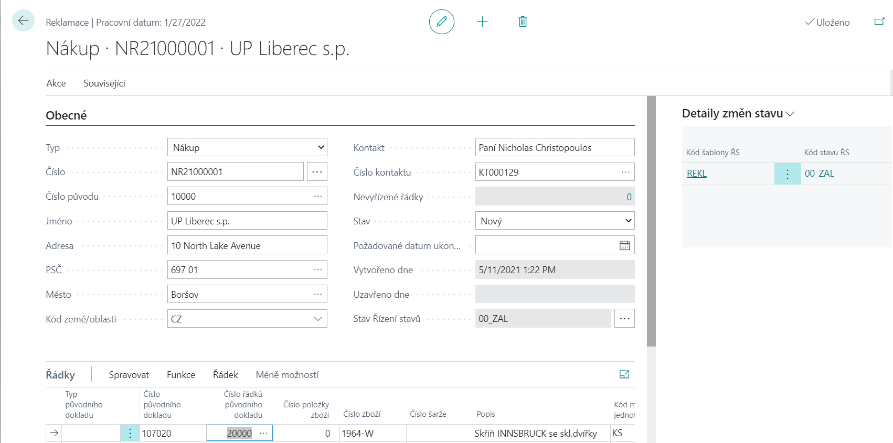

**Reklamace** zobrazuje relevantní informace vztahující se k danému dokladu. Je třeba zvolit o jaký **Typ** reklamace se jedná – Nákup, Prodej, Interní. Pole **Číslo** se vyplní automaticky dalším číslem z číselné řady. **Číslo původu** (číslo dodavatele, zákazníka, zaměstnance) je specifikováno dle vybraného Typy dokladu.
Všechny údaje v bílých polích lze editovat (je tedy možné vyplnit či změnit pole **Číslo kontaktu**, **Kontakt, Požadované datum ukončení, Telefon, E-mail,…** 
V záložce **Detail změny stavu** se po založení objeví nový záznam s výchozím stavem podle definice v šabloně řízení stavů. 
### Řádky reklamace

Přes řádky reklamace uživatel propojuje doklad reklamace s původními doklady. Nejprve je třeba do řádku zadat **Kód důvodu reklamace**, který specifikuje důvod reklamace pro daný řádek.
Pole **Číslo původního dokladu** (Účtované řádky nákupní příjemky, Řádky účtované příjemky vratky) lze propojit pro jednotlivý **Typ** = Nákup, Prodej. V případě, že se jedná o **Typ** = Interní, pak je třeba vybrat **Číslo položky zboží**, ke které se reklamace vztahuje. V případě, že pole **Typ původního dokladu** = Transfer lze původní doklad propojit přes pole Číslo původního dokladu (Řádky účtované dodávky transferu).
Z propojeného původního dokladu se předvyplní základní data – **Číslo zboží, Popis, Kód měrné jednotky, Reklamované množství, Číslo šarže,…**, které uživatel může změnit či upravit.

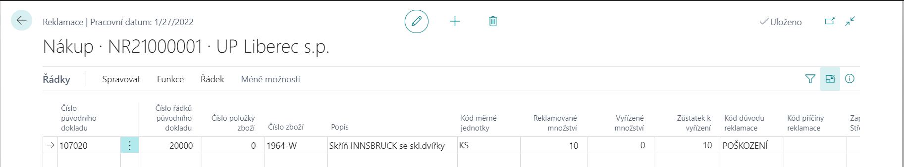
### Poznámky k reklamaci

Uživatelé mohou zadat řádkové poznámky dostupné jako funkce **Související/Reklamace/Poznámky**. Jedná se o Řádky poznámek na kartě požadavku – tyto strukturované poznámky obsahují pole Datum, Poznámka (100 znaků) a Kód.

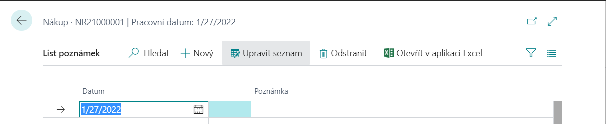
### Dokumenty

Pokud je instalován modul **Publikování SharePoint**, pak je možné u každé **Reklamace** pomocí funkce **Související/Dokumenty/Publikovat** publikovat dokument a pomocí funkce **Zobrazit** zobrazit publikovaný dokument *(detailněji viz. modul – SharePoint)*.

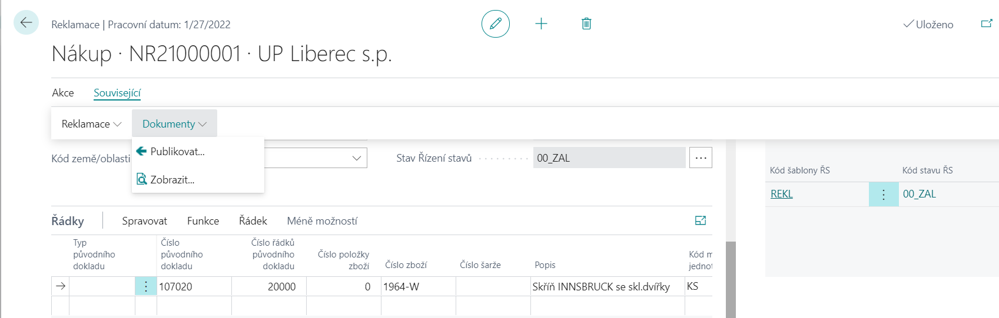
### Tisk

Pomocí funkce **Akce/Tisk/Reklamace** a **Akce/Tisk/Vyřízení reklamace** se spustí dvě základní sestavy pro zpracování reklamace a vyřízení reklamace (do vstupního filtru se nabídne číslo aktuálně zobrazeného požadavku, rozsah tisku lze pak blíže specifikovat prostřednictvím filtrů a parametrů.

## Zpracování reklamace

Po vytvoření Reklamace je možno ji dále zpracovávat a procesovat a následně ji pak přepnout např. do nového **Stavu** = V řešení.

Na řádku reklamace lze vyplnit pole **Kód příčiny reklamace** (výběr z číselníku **Příčiny reklamace**), **Zapříčinil – Středisko** (výběr z číselníku **Hodnot dimenzí – STŘEDISKO**), **Zapříčinil – Zaměstnanec** (výběr z číselníku **Zaměstnanci**). Přes akci **Řádek/Změna stavu** lze jednotlivý řádek reklamace procesně přesunout do dalšího definovaného stavu workflow a přes akci **Akce/Funkce/Změna stavu** změnit stav celého dokladu reklamace.

Sledování a řízení postupu reklamace tedy může být podpořeno přepínáním stavů workflow se všemi jeho možnostmi, jako např. informování uživatelů mailem, automatické nastavování polí či řízení přístupu vybraným uživatelům k jednotlivým stavům workflow (*detailněji viz. Řízení stavů*).

### Vytvořit řádek vyřízení

Lze využít funkce **Vytvořit řádek vyřízení**. Uživateli se zobrazí dotaz na **Množství k vyřízení a kód způsobu vyřízení**.

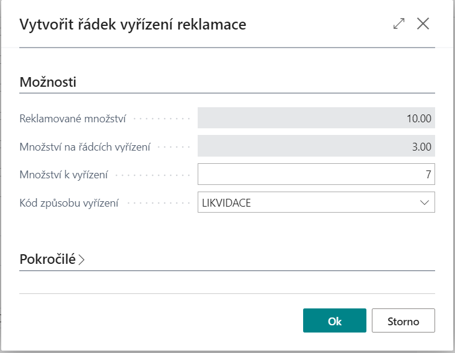

Lze tedy k jednomu řádku reklamace vytvořit více řádků vyřízení, a to vždy se specifickým kódem vyřízení. Vytvořené řádky vyřízení se z reklamace otevřou přes akci **Řádek/Řádky vyřízení reklamace**.

Dále je možno **Řádek vyřízení reklamace** procesovat a měnit jeho stav přes akci – **Akce/Funkce/Změna stavu**, případně změnit **Kód způsobu vyřízení**.

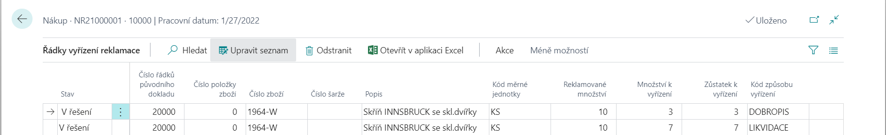

### Prodejní položky zboží

Pomocí funkce **Řádek/Prodejní položky zboží** se zobrazí zafiltrovaný přehled položek zboží **Typu** = Prodej za daného **Zákazníka, Číslo šarže, Číslo zboží, Kód varianty**.

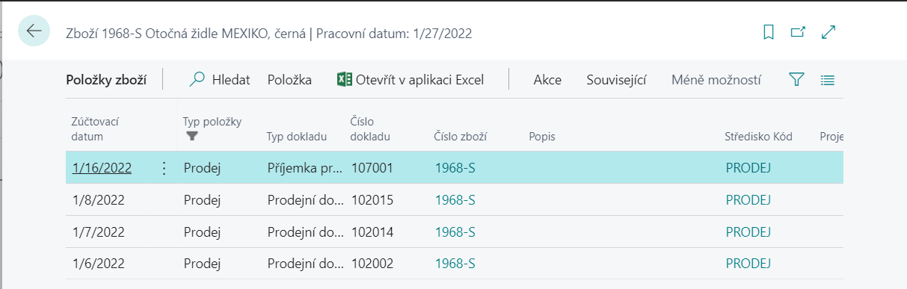

### Vytvořit nákupní reklamaci

Pomocí funkce **Vytvořit nákupní reklamaci** lze z Prodejní reklamace vytvořit reklamaci Nákupní. Funkce vytvoří novou Reklamaci k zadanému číslu dodavatele a překopíruje také řádek se všemi vyplněnými údaji.

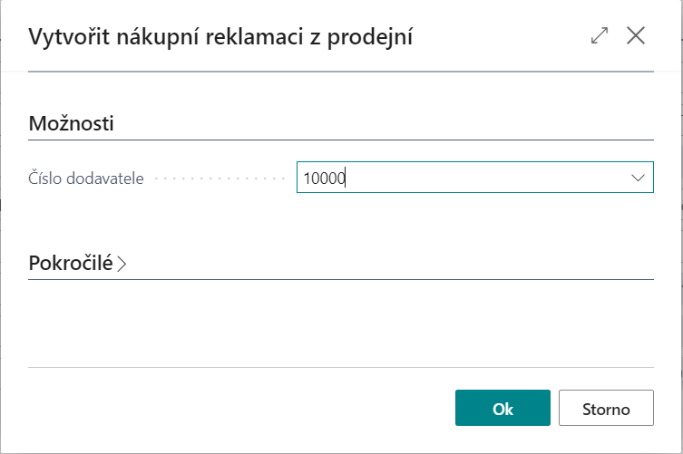

### Historie původního dokladu

Pomocí funkce **Řádek/Historie původního dokladu** se zobrazí přehled všech změn k vybranému řádku reklamace. Jedná se o změny propojení řádku reklamace na původní doklad včetně informací o datu a času změny záznamu a uživateli, který změnu provedl.

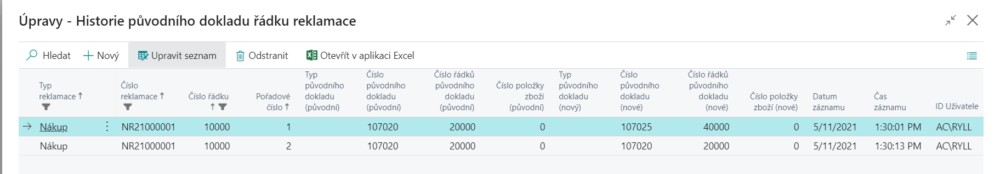

## Dispečer řádků reklamace

Dispečer řádků reklamace je dostupný:

- Vyberte ikonu , zadejte **Dispečer řádků reklamace** a poté vyberte související odkaz.

Tato stránka umožňuje souhrnný pohled na všechny reklamace. Nabízí přehledové zobrazení reklamací s přednastavenými volitelnými filtry v záhlaví pro snadnější vyhledávání a orientaci. Reklamace lze filtrovat např. podle **Lokace hlavičky**, **Příčiny reklamace**, **Datumu vytvoření**, podle **Uživatele, který reklamaci Vytvořil** či podle **stavu Řízení stavů**. Zobrazený přehled požadavků je možno navíc seřadit podle různých klíčů, zvl. podle Čísla reklamace, Čísla zboží, Popisu, Kódu příčiny reklamace a Zapříčinili – Středisko nebo Zaměstnanec.

Na řádku reklamace lze vyplnit pole **Kód příčiny reklamace** (výběr z číselníku **Příčiny reklamace**), **Zapříčinil – Středisko** (výběr z číselníku **Hodnot dimenzí – STŘEDISKO**), **Zapříčinil – Zaměstnanec** (výběr z číselníku **Zaměstnanci**).

Vybraný řádek reklamace lze pak zobrazit akcí **Souvisejíci/Řádek/Doklad**. Dále je zde funkce **Akce/Funkce/Změna stavu** pro změnu stavu workflow daného řádku reklamace.

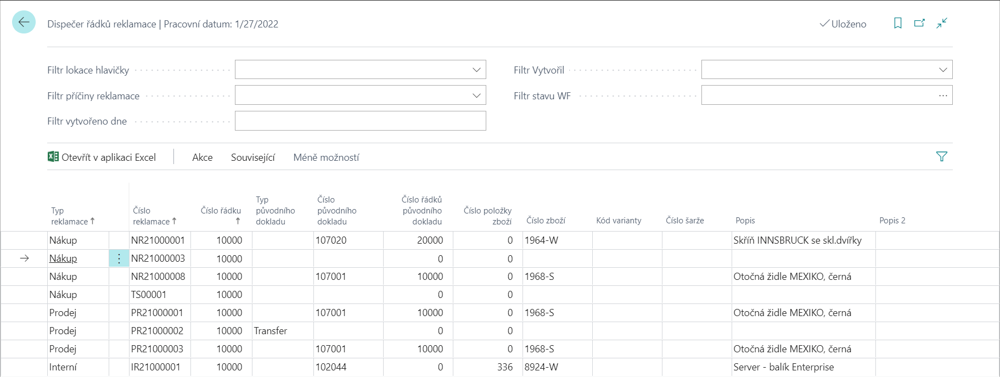

## Uzavření reklamace

Pomocí akce **Akce/Funkce/Uzavřít reklamaci** se celá Reklamace přepne do **Stav** = Uzavřeno a automaticky se vyplní pole **Uzavřeno dne a Uzavřel**.

Jedná se o stav, ve kterém jsou již všechny pole a akce nepřístupné tzn. nelze na Reklamaci již nic změnit či upravit.

[!NOTE]
Z tohoto stavu se již nelze vrátit do předchozího **Stavu** – V řešení nebo Nový.

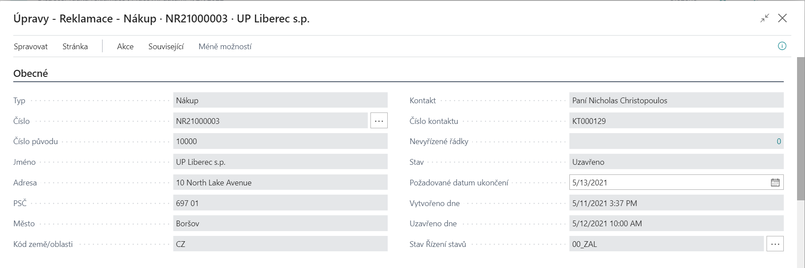

**Viz také**

[Reklamace - nastavení](ac-complaints-management-setup.md)  
[Productivity Pack](ac-productivity-pack.md)

