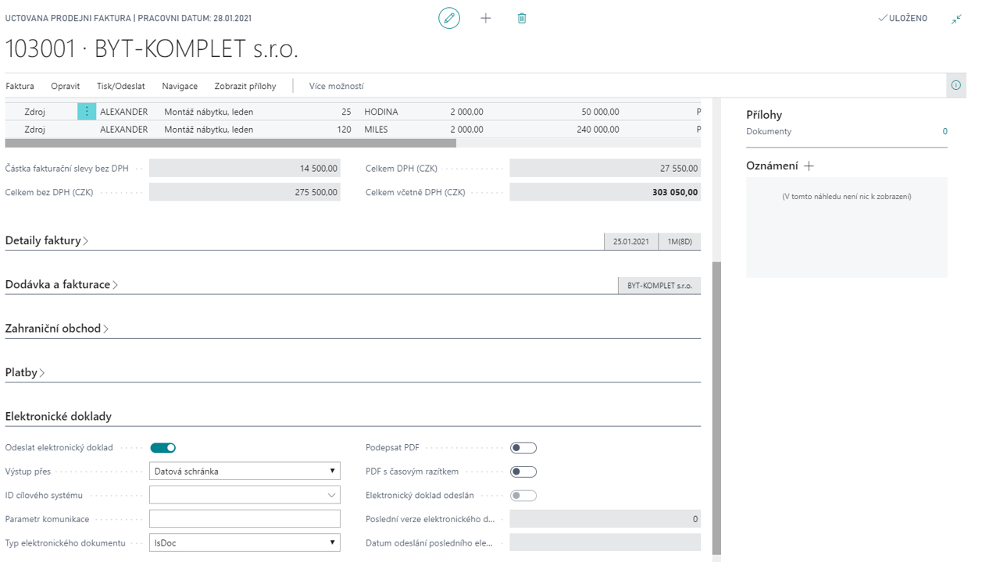

# Elektronická fakturace

Modul **Elektronická fakturace** slouží k moderní bezpapírové výměně daňových dokladů se zákazníkem. 

Modul umožňuje automaticky generovat jak strukturované dokumenty ve formátu XML, tak případně tvořit elektronické dokumenty pro vytištění v jiných formátech (PDF - moduly „Elektronická fakturace – pdf náhled“ a „Elektronická fakturace – PDFXChange“, DOC – modul „Elektronická fakturace – ISDOC“). 

Pro naplnění legislativních požadavků je XML soubor elektronicky podepsán a jednoznačně identifikován. Elektronický podpis je nastavitelný v systému. Součástí add-on modulu je i aplikace dodávaná zákazníkům pro volné šíření, která umožňuje adresátům XML dokumentu zkontrolovat elektronický podpis včetně platnosti a neporušenosti dokumentu. Pro uživatelské zobrazení XML dokumentu (strukturovaná data využitelná pro automatické exporty do informačních systémů) lze definovat tzv. XSD šablony, které transformují data z XML do vizuální podoby HTML dokumentu. Výsledné dokumenty lze automaticky šířit pomocí add-on modulu Spooler pomocí e-mailu nebo dalších komunikačních kanálů (TCP, named pipe, uložení na disk). 
K šířené elektronické fakturaci lze připojit libovolné elektronické přílohy (dodací listy, certifikáty atd.) bez omezení typu souboru. 

## Elektronická fakturace ISDOC

Viz. popis Elektronická fakturace – rozdíl pouze v tom, jak se faktura odešle.

## Elektronická fakturace -  PDFXChange

Viz. popis Elektronická fakturace – rozdíl pouze v tom, jak se faktura odešle. Tento modul poskytuje nástroje pro elektronické podepsání dokladu, případně možnost doplnění časového razítka.

**Viz také**

[Elektronická fakturace - Nastavení](ac-elektronic-dokuments-setup.md)  
[Productivity Pack](ac-productivity-pack.md)
