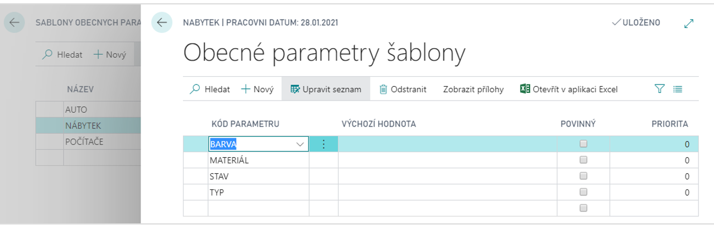

# Obecné parametry

Add-on modul Obecné parametry umožňuje přidat ke kartám v systému Dynamics 365 Business Central neomezené množství nových parametrů pro účely podrobného třídění a filtrování. Parametry lze dle účelu seskupovat do šablon. Modul obsahuje průvodce pro snadné zadávání hodnot parametrů ručním zadáním nebo výběrem z připravených číselníků.

**Viz také**

[Obecné parametry - nastavení](ac-general-parameters-setup.md)  
[Productivity Pack](ac-productivity-pack.md)