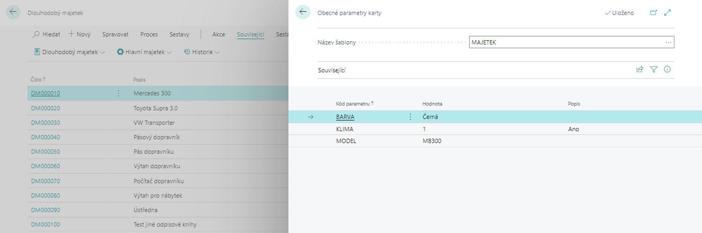

# Obecné parametry
> Aktualizace 17.03.2022

Add-on modul **Obecné parametry** umožňuje přidat ke kartám **zboží** nebo **dlouhodobého majetku** v systému Dynamics 365 Business Central neomezené množství nových parametrů pro účely podrobného třídění a filtrování. Parametry lze dle účelu seskupovat do šablon. Modul obsahuje průvodce pro snadné zadávání hodnot parametrů ručním zadáním nebo výběrem z připravených číselníků.

## Náhled obecných parametrů záznamu

Pro zobrazení seznamu uložených obecných parametrů k danému záznamu (v tomto případě k dlouhodobému majetku) s filtrem na danou entitu postupujte tímto způsobem:

1. Vyberte ikonu , zadejte **Dlouhodobý majetek** a poté vyberte související odkaz.
2. Na přehledu vyberte určitý dlouhodobý majetek, u kterého chcete zobrazit parametry.
3. Vyberte v sekci Související, ve skupině **Dlouhodobý majetek** funkci **Obecné parametry**.
4. Otevře se Vám okno, kde v horní části můžete vidět název šablony.
5. Ve spodní části uvidíte seznam paramtrů a jejich hodnoty.

6. Pokud má karta nastaveno více šablony parametrů, můžete mezi nimi přepínat, nebo zobrazit všechny hodnoty pomocí smazání filtru na přehledu.

## Vložení a změna obecných parametrů

Pro vložení obecných parametrů ke zboží nebo dlouhodobého majetku se používá akce **Vložení obecných parametrů**. Objeví se **průvodce**, pomocí kterého se ke konkrétní kartě vybere šablona (pokud jich je pro danou entitu definováno více než jedna), povinné a nepovinné parametry a nastaví se hodnoty těchto parametrů.

Pro vložení nebo úpravu obecných parametrů postupjte následujícím způsobem:

1. Vyberte ikonu , zadejte **Dlouhodobý majetek** a poté vyberte související odkaz.
2. Na přehledu v sekci Akce, použijte funkci **Vložení obecných parametrů**.
3. Spustí se průvodce pro vkládání.

### Průvodce vložení obecných parametrů

1. V prvním kroku průvodce budete vyzvání k vybrání **Šablony**. Následně k vyplnění řádků, tedy k zadání **Povinných obecných parametrů**.
2. Hodnoty vyplníte do polí řádku průvodce. Jako první vyplníte **Šablonu obecných parametrů**, poté **Hodnotu** a nakonec **Popis**.
3. V dalším kroku klikněte na **Další**.
4. Nyní v dalším okně můžete vyplnit **Nepovinné obecné parametry** obdobným způsobem jako u povinných.
5. Po zadání parametrů klikněte na tlačítko **Dokončit**, tím se nastavování uloží.

> [!NOTE]
> Stejný postup je použit jak pro vložení, tak i pro změnu parametrů nebo hodnot obecných parametrů daného záznamu.

## Vyhledávání záznamů dle obecných parametrů

Funkcionalitu obecných parametrů lze využít k vyhledání „podobných“ záznamů. Jinými slovy vyhledání těch záznamů dané entity, které mají například přiřazeny stejné parametry nebo mají stejné hodnoty některých parametrů.

Pro vyhledání dle parametrů u dlouhodobého majetku pokračujte následujícím způsobem:

1. Vyberte ikonu , zadejte **Dlouhodobý majetek** a poté vyberte související odkaz.
2. Na přehledu v sekci Akce vyberte funkci **Filtrovat dle Obecných parametrů**.
3. Otevře se Vám okno kde v prvním kroku vybere **Šablonu parametrů**.
4. Dalším krokem je vybrání podle kterých parametrů bude systém filtrovat. Provedete to tak, že kliknete na **tři tečky** v řádku u Filtru obecných parametrů.
5. V dalším dialogovém okně vyberete parametry, podle kterých chcete filtrovat.
6. Pomocí **OK** spustíte filtrování.

Pro **zrušení filtru** vyhledávání klikněte v přehledu v sekci Akce na funkci **Vymazat filtry Obecných parametrů**.

## Viz také

[Obecné parametry - nastavení](ac-general-parameters-setup.md)  
[Productivity Pack](ac-productivity-pack.md)