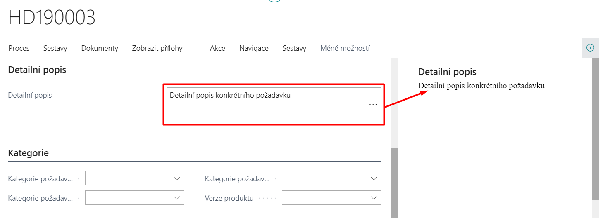
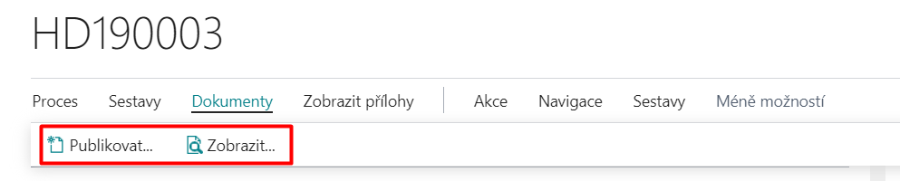
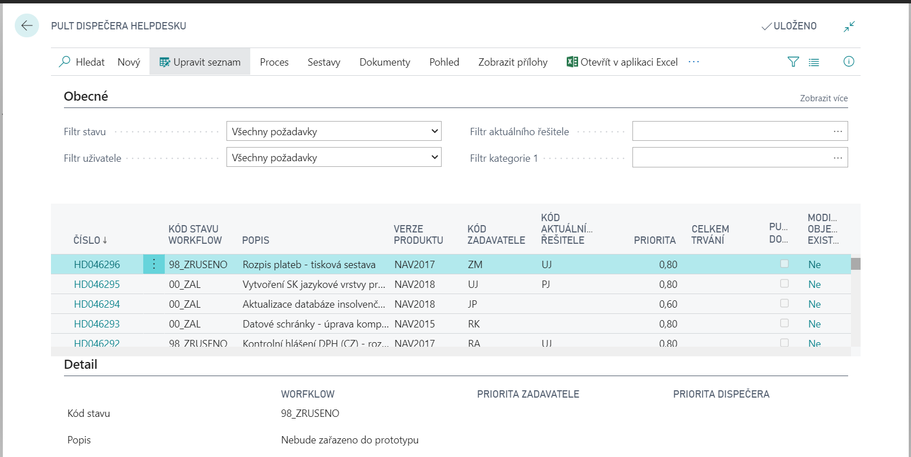

# HelpDesk

Modul Helpdesk slouží k centralizovanému zadávání, evidenci, zpracování a vyhodnocování různých požadavků uživatelů v systému Microsoft Dynamics 365 Business Central. Uživatelé zde mohou zadávat požadavky na servisní úkony, na poskytnutí podpory, úpravu nebo doplnění funkcionality, evidovat reklamace a podobně. Umožňuje také kategorizaci požadavků, nastavení priorit a řízené zpracování přiřazenými řešiteli. K dispozici je i historie uzavřených požadavků HelpDesku.

## Založení požadavku

Po provedení potřebných nastavení lze zadávat požadavky HelpDesku. Požadavky lze zadávat ručně nebo prostřednictvím Průvodce vytvořením požadavku. Povinnost použití průvodce lze definovat v **Nastavení helpdesku** zaškrtnutím políčka **Nový helpdesk pomocí průvodce**. Pro více informací o nastavení HelpDesku navštivte [HelpDesk - Nastavení](ac-helpdesk-setup.md).

### Založení požadavku pomocí Průvodce vytvořením požadavku
1. Vyberte ikonu , zadejte **Nový požadavek** a poté vyberte související odkaz.
2. Prvním krokem v průvodci je určení **Kódu zadavatele** a **Priority požadavku**. (Obě pole jsou povinná - nelze pokračovat bez vyplnění obou hodnot.)
3. Dalším krokem je zadání **stručného popisu požadavku** (nadpis) a **popisu požadavku**.
4. Pak je možné zvolit nastavení do předem definovaných kategorií (1-3). Po vhodném výběru klikněte na možnost **Dalsí**.
5. V dalším kroku průvodce se nachází volba **Publikovat dokumenty**. Po výběre této možnosti se automaticky spustí průvodce publikováním. Publikování dokumentu vyžaduje modul **Publikování SharePoint**.
6. Posledím krokem je tlačítko **Dokončit**, pomocí kterého vytvoříte zadaný požadavek.

## Požadavky Helpdesku
Přehled helpdesk požadavků lze zobrazit následovně:

1. Vyberte ikonu , zadejte **Seznam helpdesk požadavků** a poté vyberte související odkaz.
2. Pokud klikněte na **Číslo požadavku** v seznamu požadavků, zobrazí se příslušná karta požadavku.

Karta helpdesk požadavku zobrazuje relevantní informace vztahující se ke zvolenému požadavku. Údaje v bílých polích lze editovat (např. je možné doplnit prioritu dispečera, upravit data odezvy či řešení, event. změnit zařazení do kategorií na záložce Kategorie).

Požadavek lze také přidělit k určitému projektu. Pokud příslušný projekt ještě neexistuje je možné jej vytvořit přímo z karty požadavku na záložce **Akce** pomocí tlačítka **Vytvoř projekt**. Touto operací je založen nový projekt se stejným kódem jako je číslo požadavku (i se stejným popisem) a tento kód se automaticky doplní do pole **Číslo projektu**.

Na záložce **Řádky** se po založení požadavku objeví nový záznam s výchozím stavem podle definice v šabloně Řízení stavů pro helpdesk. Při každé další změně stavu požadavku se, v případě že máte pro tento stav nastavenu **Akci Řízení stavů logování** (52068291 WriteStatusChangeHlpDesk), vygeneruje další řádek s odpovídajícími hodnotami (viz podrobnější popis níže u zpracování požadavku).

### Poznámky k požadavku

Ke každému vytvořenému požadavku je možné doplnit poznámky. První vstup do poznámek je možný už při vytváření požadavku v Průvodci, jak bylo popsáno výše.

Uživatelé mohou využívat 2 formy poznámek:
- **Řádkové poznámky** - dostupné na záložce Řádky poznámek – tyto strukturované poznámky obsahují pole Datum, Poznámka (100 znaků) a Kód. 
- **Volné poznámky** - dostupné na záložce Detailní popis – tyto poznámky umožňují zadávat libovolný text, který může být navíc zobrazen v informačním okně v záložce Detaily.

Je na rozhodnutí správce, která forma poznámek bude v rámci celé firmy využívána.

### Dokumenty

Pokud je instalován modul **Publikování SharePoint**, pak je možné u každého požadavku v Přehledu HelpDesk požadavků na záložce **Akce** pomocí tlačítka **Publikovat** publikovat dokument a pomocí tlačítka **Zobrazit** zobrazit publikovaný dokument. 

Pro více informací o publikování dokumentů navštivte [Publikování SharePoint](ac-sharepoint-publisher.md)

### Tisk

Po kliknutí na akci **Reporty** a pak **Tisk** v Přehledu HelpDesk požadavků se spustí sestava Helpdesk požadavky (do vstupního filtru se nabídne číslo aktuálně zobrazeného požadavku). Rozsah tisku lze pak blíže specifikovat prostřednictvím filtrů a parametrů.

## Zpracování požadavku

Po vytvoření požadavku je možné jej dále zpracovávat. K tomu se na Kartě helpdesk požadavku využívá především záložka **Řešení požadavku** nebo funkce **Změna stavu** požadavku.

### Řešení

Při zpracování HelpDesk požadavku se na kartě požadavku na záložce Zpracování vyplní příslušné údaje, především **Kód řešení**, **Trvání**, **Popis zpracování** (max. 250 znaků) a **Kód další zodpovědné osoby**. Kód řešení se vybírá z předdefinované tabulky možných způsobů řešení ze stránky **Řešení**.

Délka **Trvání** se zadává ve dnech, hodinách, minutách, sekundách, příp. milisekundách, a to buď přímo vypsáním čísla a jednotky (lze použít zkratku počátku slova – např. d=den, m=minuta, mil=milisekunda apod.) nebo zadáním pouze čísla, které je interpretováno jako údaj v hodinách. Např. údaj 28,35 je převeden na 1 den 4 hodiny 21 minuty.

### Změna stavu

Pokud máte správně zadané informace na záložce Řešení múžete pro přechod do další fáze řešení požadavku stisknout funkci **Proces → Změna stavu**.

Zobrazí se dialogové okno s dalšími stavy řízení stavů, které podle definice filtru dalšího stavu připadají v úvahu.

Po dokončení operace je aktualizován **Kód stavu Řízení stavů** na záložce Obecné na kartě požadavku. Pokud je ve zvoleném stavu řízení stavů nastavena akce řízení stavů s přiřazenou codeunitou 52068291 – WriteStatusChangeHlpDesk, přičte se hodnota trvání do celkové doby trvání na záložce Obecné a vygeneruje se další řádek do položek helpdesk požadavku, který zobrazuje historii průběhu řešení - datum, řešitel, kód řešení, popis, trvání.

## Pult dispečera

1. Vyberte ikonu , zadejte **Pult dispečera helpdesku** a poté vyberte související odkaz.

- Pult dispečera umožňuje souhrnný pohled na zadané požadavky. Tato volba HelpDesku nabízí přehledové zobrazení požadavků s přednastavenými volitelnými filtry v záhlaví pro snadnější vyhledávání. Požadavky lze filtrovat např. podle stavu, podle uživatele, zadavatele, řešitele či podle kategorií. Zobrazený přehled požadavků je možno navíc seřadit podle různých klíčů, zvl. podle čísla, priority, stavu workflow nebo kategorií.

2. V řádcích vyberte konkrétní požadavek.
3. Klikněte na funkci **Proces** a pak **Karta** aby jste zobrazili kartu daného požadavku.

## Priorita požadavku

Jedním z nejdůležitějších kritérií pro rozhodování o plánování a koordinaci kapacit na řešení požadavků je stupeň naléhavosti, s jakou je nutno se tím kterým požadavkem zabývat. Významnou pomůckou dispečera v tomto procesu může být ukazatel celkové priority požadavku, jak byl vypočítán programem na základě vstupních parametrů:

- Váha oprávněné osoby, tj. zadavatele požadavku
- Priorita požadavku stanovená zadavatelem při vytváření
- Priorita požadavku stanovená dispečerem helpdesku při event. následném přehodnocení důležitosti požadavku.
  
### Celková priorita je vypočtena jako:
- součin hodnot **Váha zadavatele** (hodnota na kartě příslušné oprávněné osoby) a **Priorita požadavku** stanovené zadavatelem pokud dispečer nestanoví jinou prioritu (tj. priorita dispečera je nevyplněna).
- součin hodnot **Váha** zadavatele a **Priorita** požadavku stanovené dispečerem (tj. priorita dispečera je vyplněna).

## Sestavy

Nabídka tiskových sestav přiřazených modulu HelpDesk:
1. Vyberte ikonu , zadejte **Helpdesk požadavky (sestavy a analyzy)** a poté vyberte související odkaz.
2. Podle zadaných filtrů se vytisknou jednotlivé karty požadavků, zpožděné požadavky a seznam helpdesk požadavků.

## Zobrazení uzavřetých požadavků

1. Vyberte ikonu , zadejte **Přehled uzavřených helpdesk požadavků** a poté vyberte související odkaz.
2. Zobrazí se stránka, která obsahuje seznam už vyřízených helpdesk požadavků.

- Požadavky jsou uzavírány automaticky prostřednictvím nastavovaných stavů Řízení stavů po přechodu do jednoho z konečných stavů.

## Export HelpDesk požadavků

1. Vyberte ikonu , zadejte **Export helpdesk požadavků** a poté vyberte související odkaz.
2. Vyplnit vstupní filtry reportu.
    - Číslo, Nový požadavek, Uzavřený požadavek
3. Export požadavku potvrďte pomocí tlačítka **OK**.

## Viz také
[HelpDesk - nastavení](ac-helpdesk-setup.md)  
[AC Productivity Pack](ac-productivity-pack.md)
