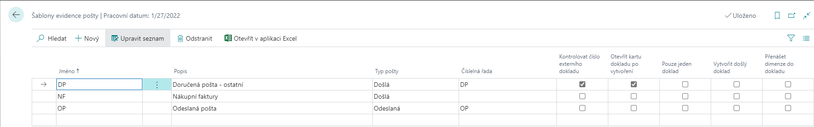
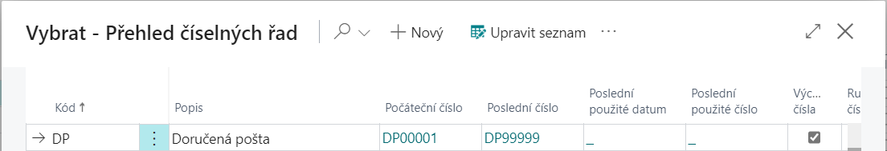
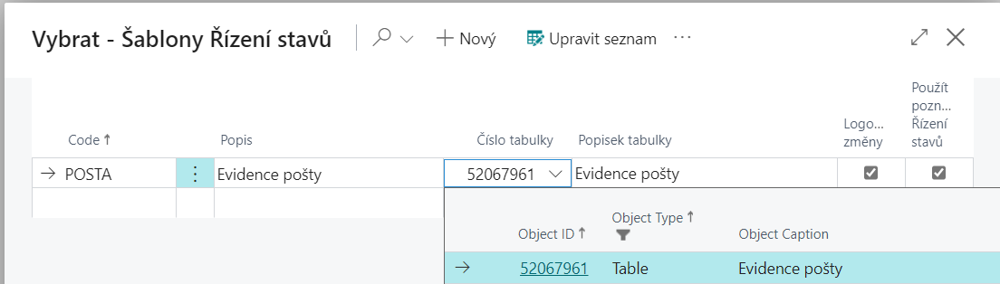
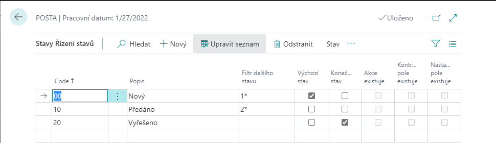
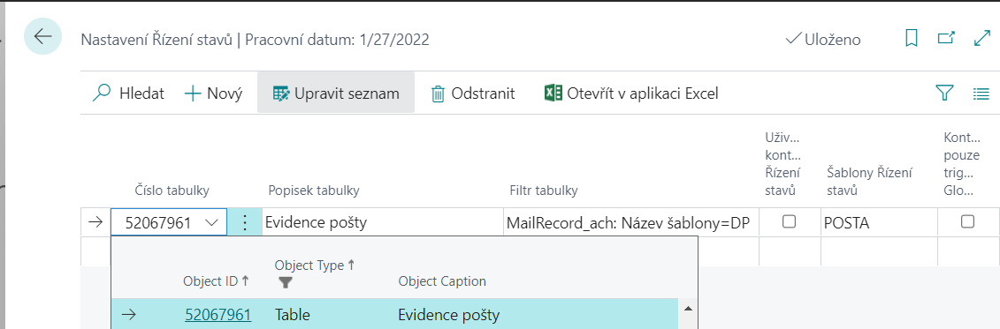
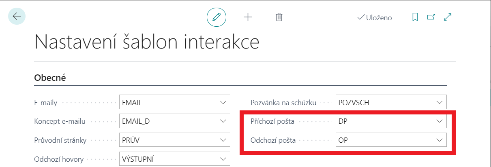
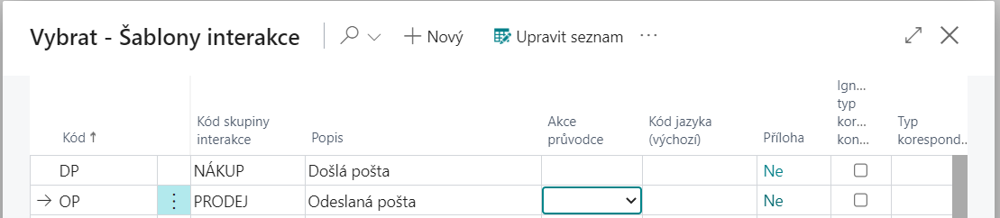

# Evidence pošty - Nastavení
## Šablony evidence pošty
Po importu modulu je třeba provést vytvoření Šablony evidence pošty na stránce – **Šablony evidence pošty**.

 - Vyberte ikonu , zadejte **Šablony evidence pošty** a poté vyberte související odkaz.

Na stránce **Šablony evidence pošty** je třeba vytvořit šablony pro **Typy pošty** - Odeslaná a Došlá pošta. Dále je možno zaškrtnout, jestli se má **Kontrolovat číslo externího dokladu**, **Otevřít kartu dokladu po vytvoření**, **Pouze jeden doklad**, **Vytvořit došlý doklad** nebo **Přenášet dimenze do dokladu**.

V poli **Číselná řada** se vybere číselná řada pro nově vytvářené doklady, kterou si dopředu musíme připravit, pokud jsme tak ještě neudělali. Číselná řada se tvoří stejným způsobem jako pro jiné agendy:

1. Vyberte ikonu , zadejte **Číselná řada** a poté vyberte související odkaz.
2. Na stránce **Číselná řada** klikněte na funkci **Nový** a vytvořte novou číselnou řadu.
3. Zadejte **Kód**, **Popis** a **Počáteční číslo** číselné řady.
4. Zaškrtněte políčko **Výchozí čísla** pro automatické vyplňovaní čísel při zadávaní nových požadavků.

Příklad vytvořené číselné řady (*detailněji viz. modul - Číselné řady*):

## Nastavení řízení stavů

Pokud chcete používat modul **Evidence pošty**, je potřebné správně nastavit i modul **Workflow (řízení stavů)**.

### Nastavení šablony řízení stavů

Nejprve je třeba nastavit šablonu řízení stavů *(detailněji viz. modul - Workflow)*.

1. Vyberte ikonu , zadejte **Šablony řízení stavů** a poté vyberte související odkaz.
2. Na stránce **Šablony řízení stavů** zvolte funkci **Nový**.
3. Vyplňte pole **Code** a **Popis**.
4. Do pole **Číslo tabulky** zadejte číslo **52067961** (číslo tabulky Evidence pošty).
5. Pokud chcete, aby se automaticky logovaly změny, zaškrtněte políčko **Logovat změny**.
6. Pokud chcete zadat jednotlivé stavy nově vytvořeného řízení stavů, kliknete na funkci **Šablona →Stavy Řízení stavů**.

Pro každý stav řízení stavů je třeba nadefinovat **Code**, **Popis** a **Filtr dalšího stavu**, který určuje, do jakých dalších stavů je možné z daného stavu přejít. Právě jeden ze stavů musí být označen jako **Výchozí stav** (zaškrtnutím pole **Výchozí stav**). Takto označený stav se vyplní při založení nového dokumentu Evidence pošty.

Některé stavy mohou být označeny jako **Konečný stav**, z něhož se už nepokračuje do žádného dalšího stavu.

Pro aktivní řádek lze specifikovat **Akce Řízení stavů**, **Kontrolovaná pole** a **Nastavovaná pole**.

### Nastavení řízení stavů pro Evidenci pošty

1. Vyberte ikonu , zadejte **Nastavení řízení stavů** a poté vyberte související odkaz.
2. Na stránce **Nastavení řízení stavů** zadejte do pole **Číslo tabulky** číslo 52067961, které označuje tabulku Evidence pošty.
3. V poli **Šablony Řízení stavů** vyberte příslušnou šablonu pro řízení stavů pro Evidenci pošty.

## Nastavení šablon interakce

Pokud chcete používat modul **Evidence pošty** i v modulu **Marketing** je potřebné správně nastavit i šablony interakce. Nastavení je pak využito při spuštění funkce **Vytvoř interakci** na Kartě evidence pošty, kdy ke Kartě kontaktu vznikne odpovídající Položka protokolu interakce *(detailněji viz. modul - Marketing)*.

### Nastavení šablon interakce

1. Vyberte ikonu , zadejte **Nastavení šablony interakce** a poté vyberte související odkaz.
2. Na stránce **Nastavení šablony interakce** vyberte do pole **Příchozí pošta** a **Odchozí pošta** správné šablony interakce.

### Šablony interakce

1. Vyberte ikonu , zadejte **Šablony interakce** a poté vyberte související odkaz.
2. Na stránce **Šablony interakce** zadejte kód pro správnou skupinu interakce.

## Viz také

[Evidence pošty](ac-incoming-mail.md)  
[Productivity Pack](ac-productivity-pack.md)
