# Evidence pošty

Add-on modul **Evidence pošty** rozšiřuje moduly **Nákupu** a **Prodeje** systému Microsoft Dynamics 365 Business Central o podporu evidence doručené a odeslané pošty. Evidovanou poštu je možné řízeně zpracovávat pomocí modulu **Workflow (Řízení stavů)**, provázat s nákupními či prodejními doklady a prostřednictvím modulu **Publikování SharePoint** a nebo modulu **Došlé doklady** připojit ke kartě evidované pošty naskenovaný či elektronicky přijatý dokument. Další možností je propojení karty evidence pošty se záznamem v modulu **Datové schránky**.

## Vytvoření nové Karty evidence pošty
Po provedení potřebných nastavení lze vytvářet dokumenty Evidence pošty. Dokumenty lze vytvářet ručně a to, tak že:
1. Vyberte ikonu , zadejte **Evidence pošty** a poté vyberte související odkaz. 
2. Na stránce **Šablony evidence pošty** vyberte kód pro správnou Šablonu evidence pošty.
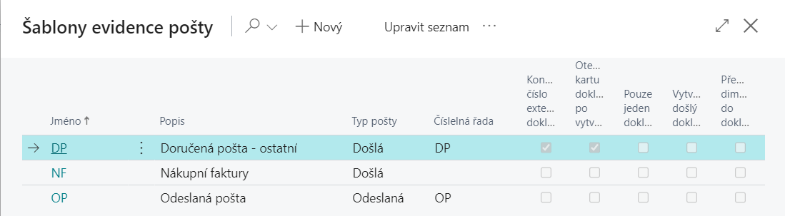
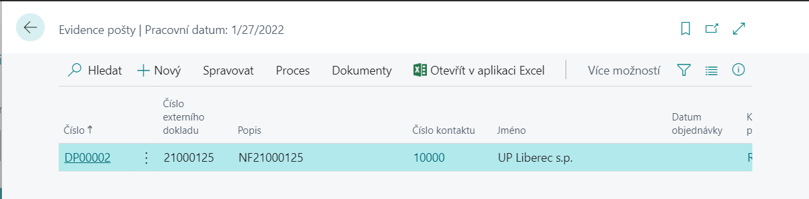
3. V přehledu **Evidence pošty** vyberte funkci **Nový**.
4. Vytvořte nový doklad Evidence pošty.
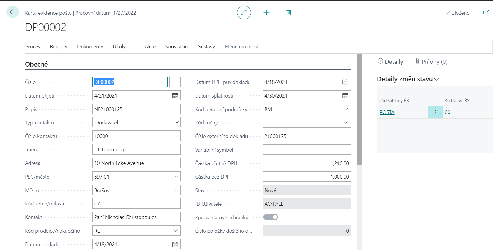

**Karta evidence pošty** zobrazuje relevantní informace vztahující se k danému dokladu. Pole **Číslo** se vyplní automaticky dalším číslem z číselné řady. **Typ kontaktu** a **Číslo kontaktu** specifikuje o jaký doklad se jedná – Dodavatel, Zákazník, Kontakt (vyplňuje se pokud zatím neexistuje Dodavatel a nebo Zákazník).

Všechny údaje v bílých polích lze editovat (je tedy možné vyplnit pole **Popis**, všechny datumové pole, **Kód platební podmínky**, **Kód prodejce/nákupčího, Kód měny, Číslo externího dokladu** atd., které se následně převezmou do vytvořeného dokladu. Dále lze zadat evidenční pole **Částka včetně DPH** a **Částka bez DPH**.
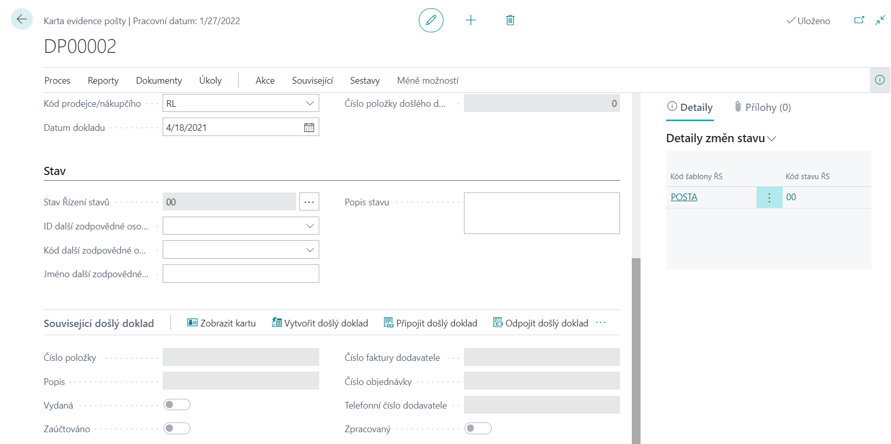
V záložce **Stav** se po založení objeví nový záznam s výchozím stavem podle definice v šabloně řízení stavů. Dále lze vyplnit – **Další zodpovědnou osobu** (buď z Uživatelů a nebo z modulu Zaměstnanci) a textové pole **Popis stavu**.

V záložce **Související došlý doklad** lze vytvořit anebo připojit či odpojit Došlý doklad. Jedná se o vazbu na modul **Došlá pošta (detailněji viz modul – Došlá pošta)**.

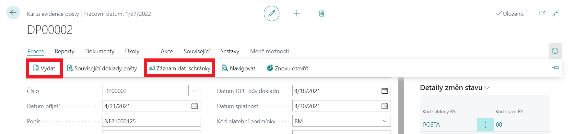
Jestliže se jedná o doklad vytvořený z Datové schránky je možno si nechat zobrazit původní doklad přes funkci – **Proces/Záznam dat. schránky (detailněji viz  modul – Datové schránky)**.

**Dimenze** jsou automaticky naplněny při vyplňování jednotlivých polí na kartě evidence pošty tzn. na základě vyplnění **Čísla kontaktu**, **Kódu prodejce/nákupčího**. V případě, že uživatel chce tyto dimenze upravit či změnit je zde funkce **Pošta/Dimenze**.

Po vyplnění všech potřebných dat je vhodné doklad odsouhlasit a zamezit jeho změnám. Jedná se o funkci – **Proces/Vydat**.

### Poznámky k požadavku
Uživatelé mohou zadat řádkové poznámky dostupné jako funkce **Související/Pošta/Poznámky**. Jedná se o Řádky poznámek na kartě požadavku – tyto strukturované poznámky obsahují pole Datum, Poznámka (100 znaků) a Kód.
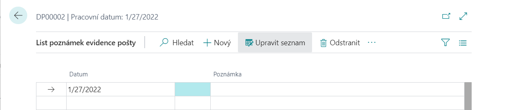
### Dokumenty
Pokud je instalován modul **Publikování SharePoint**, pak je možné u každé Karty evidence pošty pomocí funkce **Dokumenty/Publikovat** publikovat dokument a pomocí funkce **Zobrazit** zobrazit publikovaný dokument **(detailněji viz modul - SharePoint)**.
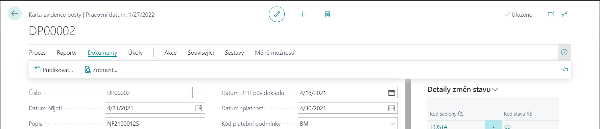
### Připojené dokumenty
Pomocí funkce **Související/Pošta/Přílohy** lze ke kartě připojit jakýkoliv doklad, který je následně uložen do tabulky systému Microsoft Dynamics 365 Business Central.
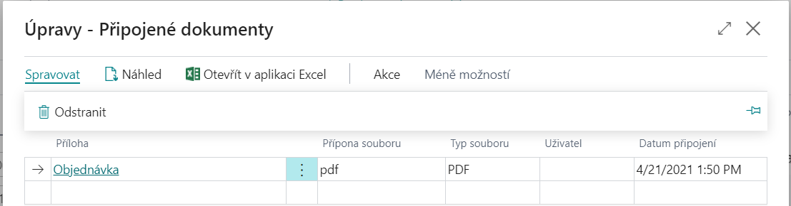
### Tisk
Pomocí funkce **Reporty/Tisk** na stránce **Karta evidence pošty** se spustí sestava **Evidence pošty** (do vstupního filtru se nabídne číslo aktuálně zobrazeného požadavku, rozsah tisku lze pak blíže specifikovat prostřednictvím filtrů a parametrů.

## Zpracování požadavku
Po vytvoření Karty evidence pošty je dokument možno dále zpracovávat.
### Schvalování požadavku
Pokud je vytvořeno a povoleno workflow Výměny došlých dokladů a vytvořeno Nastavení uživatelů schvalování lze Odeslat požadavek ke schvalování – funkce **Akce/Odeslat požadavek ke schválení (detailněji viz modul – Schvalování)**. Pokud karta pošty nebyla schválena nelze Vytvořit doklad.
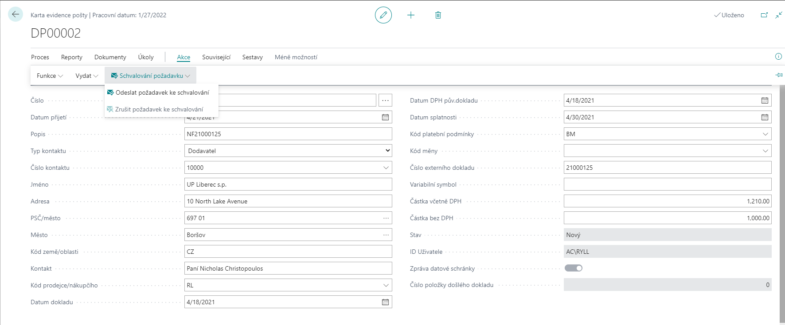
Požadavek na schválení lze schválit pomocí funkce – **Související/Pošta/Schvalování** a nebo jej zrušit pomocí funkce – **Akce/Zrušit požadavek na schválení**.

### Vytvoření interakce
Po spuštění funkce **Vytvoř interakci** vznikne ke Kartě kontaktu odpovídající Položka protokolu interakce dle **Nastavení šablon interakce** pro **Příchozí** a **Odchozí poštu (detailněji viz modul - Marketing)**.
### Vytvoření dokladu
Lze využít funkce **Vytvořit doklad**. Uživateli se zobrazí dotaz, jaký doklad se má vytvořit a po vytvoření se automaticky zobrazí karta nového dokladu.

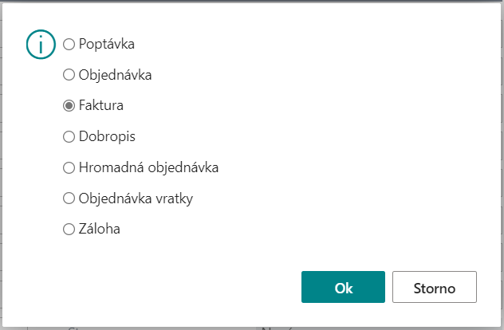

Do hlavičky vytvořeného dokladu se přenesou všechny údaje z Karty evidence pošty. Pokud jsou na kartě evidence pošty vyplněny dimenze a v Šabloně evidence pošty je zaškrtnuto pole Přenášet dimenze do dokladu, tak budou přeneseny také dimenze do vytvořeného dokladu. Tento doklad lze otevřít standardní funkcionalitou Navigace, přes funkce – Navigace a nebo Související doklady pošty.
### Objednávky kontaktu
Pomocí funkce **Objednávky kontaktu** si lze nechat zobrazit přehled Nákupních nebo Prodejních řádků a to podle typu Kontaktu. Řádky jsou zafiltrované:
- řádky **Nákupní objednávky** nebo **Nákupní objednávky vratky** a to k zadanému číslu Dodavatele.
- řádky **Prodejní objednávky** nebo **Prodejní objednávky vratky** a to k zadanému číslu Zákazníka.
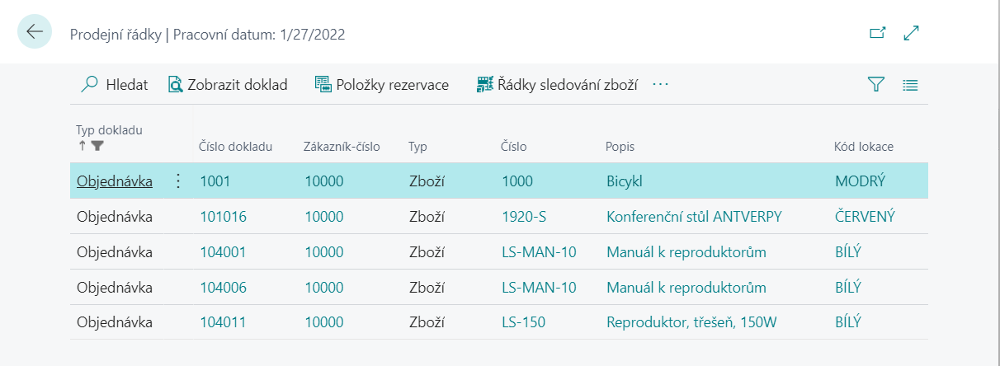
### Navigovat (Související doklady pošty)
Standardní funkce **Navigovat** zobrazí kartu evidence pošty a **Související doklady pošty**.
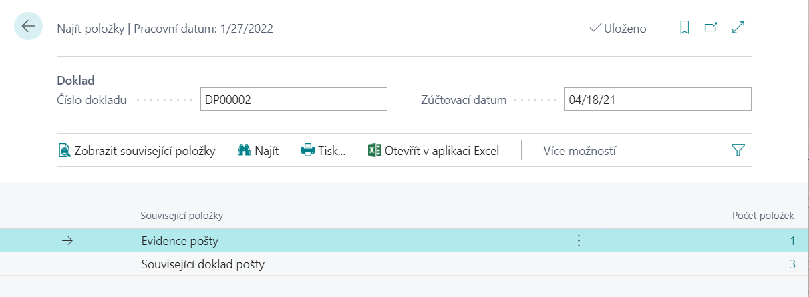
Pomocí funkce **Související doklady pošty** nebo funkce **Zobrazit Související položky** v rámci Navigace se zobrazí detailní přehled všech souvisejících dokladů k vybrané kartě evidence pošty.
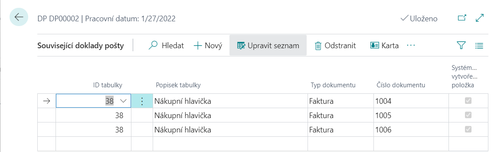
## Pult evidence pošty
Pult evidence pošty je dostupný následujícím způsobem.
- Vyberte ikonu , zadejte **Pult evidence pošty** a poté vyberte související odkaz.

Tato stránka umožňuje souhrnný pohled na neuzavřené karty evidence pošty. Nabízí přehledové zobrazení požadavků s přednastavenými volitelnými filtry v záhlaví pro snadnější vyhledávání a orientaci. Nejprve je třeba zvolit, o jaké karty evidence pošty se jedná, tzn. šablonu evidence pošty. Dále pak lze požadavky filtrovat např. podle **Zákazníka** či **Dodavatele**, **Stavu**, podle **Zodpovědné osoby** či podle **Typu pošty**. Zobrazený přehled požadavků je možno navíc seřadit podle různých klíčů, zvl. podle čísla, zákazníka nebo dodavatele, datumu či zodpovědné osoby. Dole pod přehledem karet jsou pak doplňující informace o **Stavu požadavku**, **Částce dokladu**, **Částce ke schválení** a **Schválené částce**.

Vybraný požadavek lze pak zobrazit volbou **Karta**. Dále jsou zde funkce pro **Vytvořit interakci**, **Stáhnout zprávy z datové schránky**, **Navigovat** případně přidat **Poznámky**, nebo zobrazit připojené **Dokumenty**.
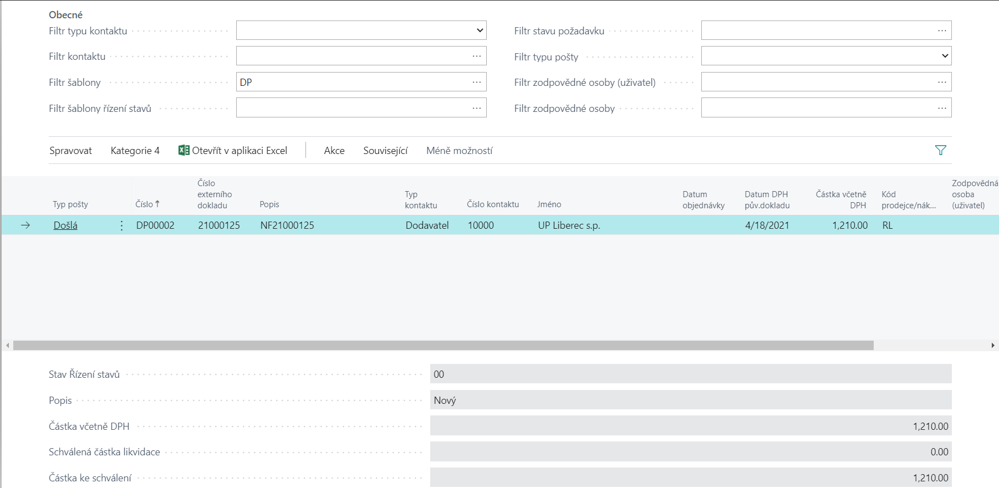
## Uzavřená evidence pošty
Uzavřená evidence pošty je dostupná:
- Vyberte ikonu , zadejte **Uzavřená evidence pošty** a poté vyberte související odkaz.
Zobrazením stránky **Uzavřená evidence pošty** se zobrazí uzavřené požadavky, tj. požadavky, které už byly vyřízeny. Požadavky jsou uzavírány ručně prostřednictvím funkce Uzavřít evidenci pošty.
Vybraný požadavek lze pak zobrazit volbou **Zobrazit**. Dále jsou zde funkce pro zobrazení **Související doklady pošty** a **Záznam datové schránky**.
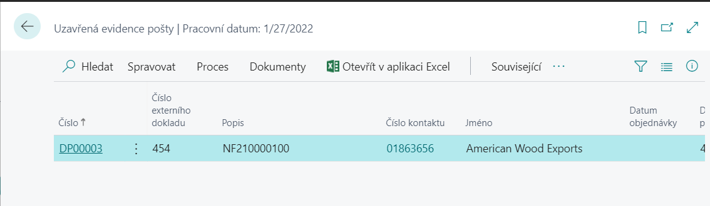

## Viz také
[Evidence pošty - nastavení](ac-incoming-mail-setup.md)  
[Productivity Pack](ac-productivity-pack.md)
