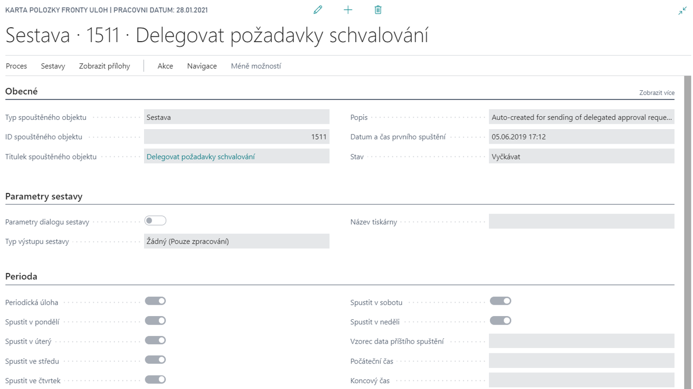

# Rozšíření fronty úloh (Job Queue)

Modul **Fronta úloh** umožňuje automatizované spouštění sestav či procedur v systému Dynamics 365 Business Central v plánovaných intervalech. Je využíván především pro automatické periodické generování sestav, přičemž umožňuje odesílat výsledné sestavy jako přílohu e-mailu ve formátu HTML, ukládat je, nebo publikovat na SharePoint. Zejména vedoucí pracovníci tak mají k dispozici aktuální výsledky či přehledy na určeném místě, aniž by museli sestavu pokaždé ručně generovat. Dalším možným využitím je pravidelné bezobslužné spouštění dávkových úloh, jako například adjustace nebo účtování nákladů na zboží.

Rozšíření fronty úloh je doplňující modul umožňující definovat parametry spouštění úlohy a akce vykonávané při startu, úspěšném nebo neúspěšném dokončení úlohy jako je například zaslání notifikačního emailu.

##Viz také

[Rozšíření fronty  úloh (Job Queue) - nastavení](ac-job-queue-extension-setup.md)  
[Productivity Pack](ac-productivity-pack.md)
