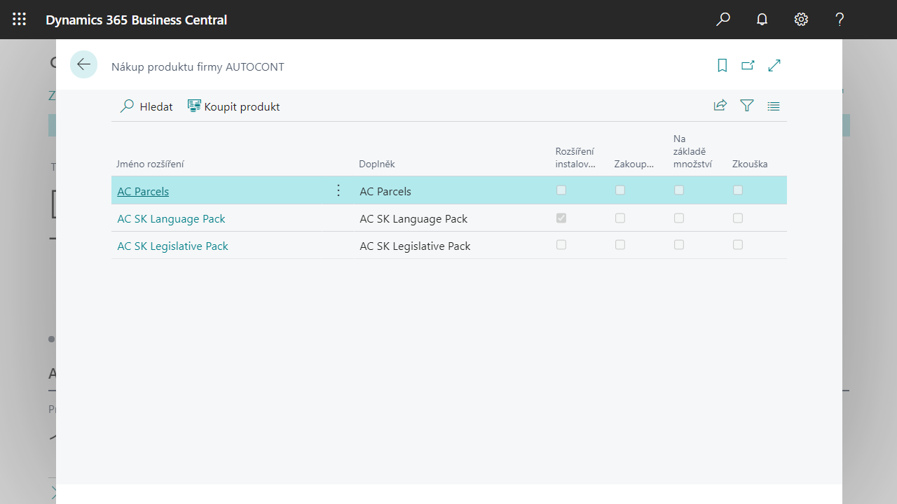

# AC Monetizace 
> Aktualizace 03.02.2022

Jedná se o funkcionalitu umožňující uživateli správu předplatného produktů firmy AUTOCONT v prostředí Business Central. 

## Aktivace Zkušebního období 

Každý produkt má 30-ti denní zkušební období pro ověření, zda funkcionalita zákazníkovi vyhovuje. Aktivaci lze provést buď: 

   - **Automaticky** při spuštění Asistovaného nastavení příslušného produktu (Instalace & Rozšíření -> Asistovaná nastavení, část Nastavit rozšíření AUTOCONT).
   - Otevřením stránky **Nákup produktu firmy AUTOCONT** a spuštěním akce **Koupit produkt** (pozn. seznam obsahuje všechna komerčně dostupná rozšíření; před aktivací je nutná instalace rozšíření).

V obou případech se spustí krátký průvodce aktivací, v jehož průběhu je třeba povinně zadat: 

- E-mail – tento bude využit pro komunikaci ohledně předplatného, např. pro zasílání upozorňování na blížící se termín konce předplatného, apod. 

- Souhlas s [Obchodními podmínkami](https://www.autocont.cz/podnikove-aplikace/PAS-predplatne-podminky).

Poznámka: Pokud se neobjeví požadavek na potvrzení, že uživatel opravdu chce vytvořit zkušební předplatné (a otevře se rovnou okno pro výběr plánu předplatného), pak v tomto tenantu již bylo zkušební období někdy dříve aktivováno. 

## Zakoupení produktu 

Kdykoliv v průběhu zkušebního období je možné zakoupit produkt s tím, že zákazník nepřijde o zbývající část zkušebního období. 

O blížícím se konci zkušebního období informuje uživatele oznámení na Domovské stránce s odkazem na stránku **Nákup produktu firmy AUTOCONT**. 

Funkce **Koupit** produkt na stránce **Nákup produktu firmy AUTOCONT** uživatele postupně provede jednotlivými kroky: 

- **Výběr plánu** – nejprve je třeba zvolit, zda-li chce zákazník obnovovat předplatné každý měsíc nebo jednou ročně.
- **Detaily zákazníka** – Doplnění chybějících údajů o firmě potřebných pro objednávku a fakturaci.
- **Detaily platební karty** – Zadání detailů o platební kartě, které budou uloženy ve službě STRIPE.

## Správa předplatného 

Pro správu předplatného slouží stránka **Seznam předplatných AUTOCONT**, kde uživatel: 

- Získá přehled o předplacených produktech od firmy AUTOCONT,
- má možnost ukončit předplatné vybraného produktu, 
- má možnost zrušit předplatné,
- má možnost aktualizovat informace o zákazníkovi (akce Aktualizujte informace o zákazníkovi),
- má možnost změnit platební kartu – při aktualizaci údajů (viz předchozí) lze zvolit Aktualizovat platební kartu, následně se zobrazí dialog Stripe.

 ## Viz také

 [Productivity Pack](ac-productivity-pack.md)