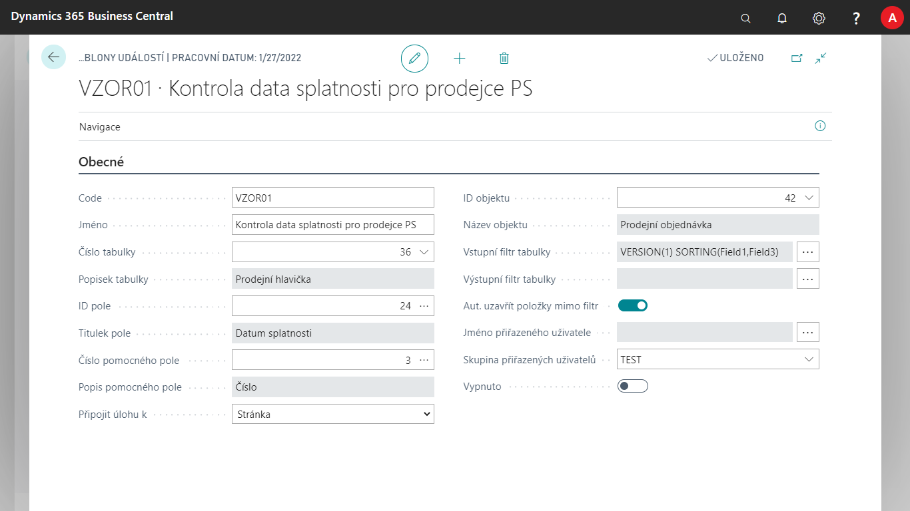
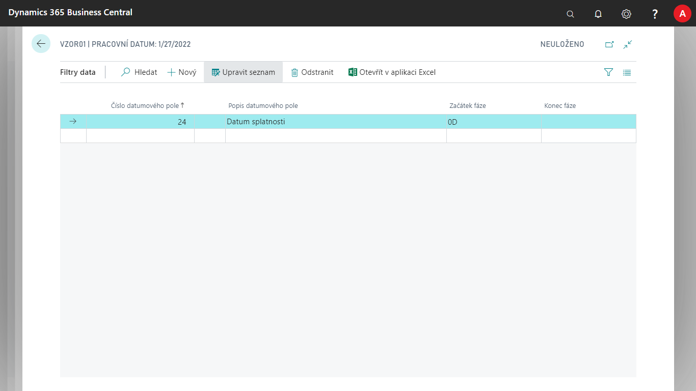
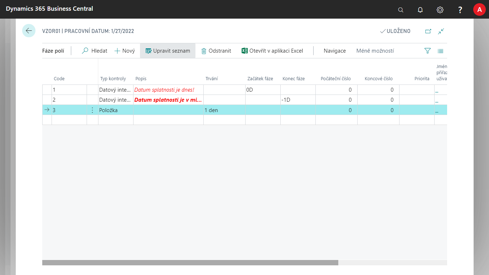
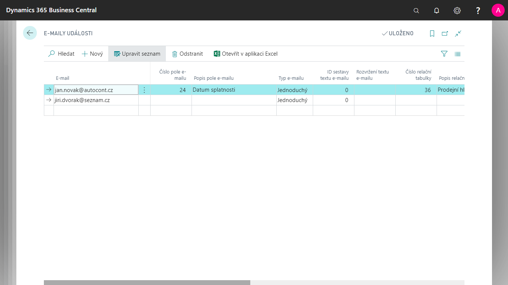

# Nastavení modulu Správa upozornění

Modul **Správa upozornění** umožňuje **systémové upozorňování** na stavy dat a procesů evidovaných v systému Microsoft Dynamics 365 Business Central. Upozorňování pracuje jak interně v prostředí systému, tak i externě formou e-mailu. Modul dokáže pracovat off-line, jelikož nereaguje na okamžitou změnu v datech, ale **zasílá informace v naplánovaných intervalech**. Kromě sledování aktuální události lze sledovat i vývoj události v čase.

## Vytvoření a upravení karty šablony události

Pro vytvoření nové sledované události, je potřeba ji založit a definovat na stránce **Přehled šablon událostí**.

1. Vyberte ikonu , zadejte **Přehled šablon událostí** a poté vyberte související odkaz.  
2. Na stránce **Přehled šablon událostí** vytvořte novou události zvolením tlačítka **Nový**
3. Otevře se nová karta události s některými genericky předvyplněnými poli.
4. Na poli **Číslo tabulky** vybereme tabulku, nad kterou chceme provádět sledování a dále zvolíme **ID pole** z dané tabulky – dle tohoto pole se vyhodnocuje daná fáze. **Číslo pomocného pole** slouží pouze pro bližší rozlišení události.
5. V poli **Připojit úlohu k**, zvolte, jestli chceme po zobrazení události v Položkách upozornění otevřít stránku nebo sestavu. Pole ID objektu, pak blíže specifikuje jakou.
6. Na poli Vstupní filtr tabulky, zvolte, které položky z tabulky mají vstoupit, nebo nevstoupit pro jejich následné další pracování.
7. Na poli Výstupní filtr tabulky, zvolte další upřesnění filtru.
8. Pokud chcete položky, které projdou mimo filtr, uzavírat automaticky zvolte zaškrtávací políčko **Aut. uzavřít položky mimo filtr**.
9. Pomocí polí **Jméno přiřazeného uživatele**, nebo **Skupina přiřazených uživatelů** nastavte, komu bude následná vytvořená úloha přiřazena.
10. Událost začněte sledovat odškrtnutím pole **Vypnuto**. To určuje, zda se pole sleduje či nikoliv.

>[!NOTE]
>Funkcionalita **ID pole** pracuje i s kalkulovanými poli a jedná se o nepovinné pole.

## Nastavení filtrů dat

Kromě nastavení filtrů na stránce Šablony události v polích **Výstupní a Vstupní filtr polí**, můžeme nastavit také filtry polí pomocí volby **Filtry data**. Ten nastavíme následujícím způsobem.

1. Na stránce Šablona událostí vyberte akci **Filtry data**
2. Nastavte **Číslo datumového pole**, na které se bude filtr vztahovat.
3. Zde, v polích **Začátek fáze** a **Konec fáze** zadejte vzorec data vztažený k systémovému datu (TODAY).

## Nastavení fází událostí

Pro každou **Kartu šablony události** je potřeba nastavit fáze, do kterých se daná událost může dostat při splnění podmínek.

1. Na stránce **Karty šablony události** vyberte akci **Fáze**.
2. Vytvořte nový řádek pomocí tlačítka **Nový**.
3. U každého řádku zadejte **Code**, který slouží k rozlišení jednotlivých fází sledování.
4. Navolte **Typ kontroly**.
Ten nabývá hodnot **Položka**, **Datový interval** nebo **Číselný interval**. Při výběru fází má nejvyšší prioritu výběru Položka, pak Datový interval a nakonec Číselný interval. Toto pole se vztahuje k poli Číslo pole z Karty šablony události.

> [!NOTE]
> Při výběru typu kontroly **Položka** se bere do úvahy pole **Trvání**. Určuje, jak dlouho bude fáze trvat od doby vzniku položky upozornění. Při výběru **Datový interval** se pracuje s poli **Začátek fáze** a **Konec fáze**. Zadává se tedy vzorec data vztažený k systémovému datu (TODAY). Hodnota Číselný interval zase pracuje s poli **Počáteční číslo** a **Koncové číslo**.

## Zadání adresáta E-mailů

Ke každé fázi událostí lze také přiřadit e-mailovou adresu určující, komu se daná událost odešle. Existují tři různé způsoby, jak zadat adresáta e-mailu, které jdou mezi sebou kombinovat. Email tak může odejít na všechny tři definice pro jednu položku.

| **Typ definice**                            | **Popis** |
|---------------------------------------------|-----------|
| **Ručně definovaný e-mail**                 |  Tuto možnost použijte v případě, kdy chcete poslat upozornění vždy na tento definovaný e-mail.          |
| **Dynamický e-mail z pole v záznamu**       |   Tuto možnost použijte, pokud chcete poslat upozornění na e-maily, které jsou přímo uloženy v záznamu ve zdrojové tabulce šablony upozornění, který je také zdrojem upozornění. (např. upozornění nad kartou zaměstnance, která obsahuje i jeho e-mail).        |
| **Dynamický e-mail z pole relační tabulky** |  Používá se v případech, kdy chceme poslat upozornění na e-mail, který je uložen v relační tabulce ke zdrojové tabulce šablony upozornění s vazbou přes jedno pole, které nastavíme. Například při upozornění nad prodejním dokladem, kdy chceme e-mail poslat na prodejce dokladu. E-mail je pak uložen v poli E-mail v tabulce Prodejce/nákupčí, která má z prodejní hlavičky vazbu přes jedno pole **Kód prodejce** – Kód.         |

## Nastavení Ručně definovaného emailu

1. Vyberte ikonu , zadejte **Šablona událostí**, a poté vyberte související odkaz.
2. Na stránce **Karty šablony události** vyberte akci **Fáze**.
3. Zde vyberte **Fáze polí** akci **Emaily**
4. Na stránce **E-maily událostí** vyberte akci **Nový** a vyplníte pole **E-mail** podle potřeby.

## Nastavení Dynamického emailu z pole v záznamu

1. Vyberte ikonu , zadejte **Šablona událostí**, a poté vyberte související odkaz.
2. Na stránce **Karty šablony události** vyberte akci **Fáze**.
3. Zde vyberte **Fáze polí** akci **Emaily**
4. Na stránce **E-maily událostí** vyberte akci **Nový** a vyplňte pole **Číslo pole e-mailu**. Jde o textové pole z tabulky definované šablonou události.

## Nastavení dynamického emailu z pole relační tabulky

1. Vyberte ikonu , zadejte **Šablona událostí**, a poté vyberte související odkaz.
2. Na stránce **Karty šablony události** vyberte akci **Fáze**.
3. Zde vyberte **Fáze polí** akci **Emaily**
4. Vyplňte pole **Číslo relační tabulky** tabulkou, kde se nachází pole s e-mailem.
5. Do pole **Číslo relačního pole e-mailu** zadejte pole s e-mailem v relační tabulce.
6. Do pole **Číslo pole relace z** zadejte pole z **Tabulky šablony události**, které definuje vazbu do relační tabulky.
7. Do pole **Číslo pole relace do** zadejte pole z relační tabulky, na kterém je definována vazba.

## Obsah E-mailů

Existují dva způsoby, jak definovat obsah e-mailu (předmět a tělo). S **pevně definovanou naprogramovanou strukturou**, kterou si sami navolíme a bude při každém spuštění použita, nebo pomocí **dynamického obsahu**, kde je obsah definovaný pomocí polí a textů e-mailu.

## Nastavení emailu s pevně definovanou strukturou

Předmětem tohoto druhu emailu je **kód šablony události** a **popis fáze**. Tělem e-mailu je zase obsah z pole **primární klíč** z položky události.

1. Vyberte ikonu , zadejte **Šablona událostí**, a poté vyberte související odkaz.
2. Na stránce **Karty šablony události** vyberte akci **Fáze**.
3. Zde vyberte **Fáze polí** akci **Emaily**.
4. Vyplňte pole **Typ e-mailu** jako **Jednoduchý**.

## Nastavení emailu s dynamickým obsahem

Předmět i tělo tohoto druhu emailu se definuje v textech mailu s využitím polí e-mailu. Samotné pole je možné definovat z následujících tabulek: zdrojová tabulka šablony upozornění, Šablona událostí, Fáze pole.

1. Vyberte ikonu , zadejte **Šablona událostí**, a poté vyberte související odkaz.
2. Na stránce **Karty šablony události** vyberte akci **Fáze**.
3. Zde vyberte **Fáze polí** akci **Emaily**.
4. Vyplňte pole **Typ e-mailu** jako **Strukturovaný**.

**Viz také**

[Správa upozornění](ac-notifications.md)  
[Productivity Pack](ac-productivity-pack.md)
