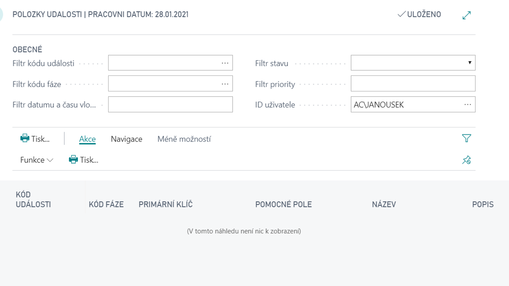

# Správa upozornění

Add-on modul Správa upozornění umožňuje systémové upozorňování na stavy dat a procesů evidovaných v systému Dynamics 365 Business Central. Upozorňování pracuje jak interně v prostředí systému, tak i externě formou e-mailu.

Základem použití modulu je definování sledovaných stavů a událostí v systému, na které je třeba upozornit uživatele nebo na ně určitým způsobem reagovat. Kromě sledování aktuální události lze sledovat i vývoj události v čase.

**Viz také**

[Správa upozornění - nastavení](ac-notifications-setup.md)  
[Productivity Pack](ac-productivity-pack.md)
