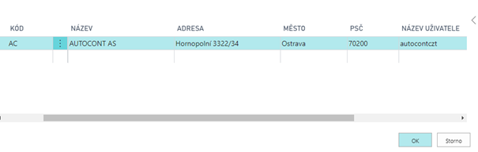

# Nastavení - AC Parcels - Integrace Balíkobot
> Aktualizace: 08.03.2022

Pro správné fungování addonu Zásilek je zapotřebí nastavit několik oblastí. Addon se prvotně nastavuje pomocí průvodce a poté je možné nastavení měnit ručně.

## Oblasti nastavení addonu:
- Číslenou řada
- Expediční místa
- Nastavení Zásilek
- Přepravce
- Nastavení lokací
- Parametry zásilky
- Nastavení tisku
- Nastavení způsobu platby (dobírka)
- Automatické aktualizace
- Nastavení v Sandboxovém prostředí

Ostatní číselníky (Služby přepravce, Manipulační jednotky a Pobočky přepravce) si addon stahuje z API Balíkobotu.
## Nastavení AC Parcels pomocí průvodce

1. Vyberte ikonu , zadejte **Asistovaná nastavení** a poté vyberte související odkaz.
2. Vyberte Nastavení zásilek.
3. Po přečtení instrukcí klikněte na tlačítko **Další**.
4. Pokud chcete můžete importovat RapidStart balíček ručně, nebo můžete kliknout na **Další a balíček se stáhne a importuje sám**.
5. V dalším kroku vytvořte nové expediční místo pomocí tlačítka **Nový** a vyplňte pole:
    - Kód
    - Uživatelské jméno
    - Heslo
6. Můžete také vyplnit dodatečné informace:
    - Popis
    - Jméno
    - Adresa
    - Město
    - PSČ
7. V poli **Expediční místo** vyberte nově vytvořený záznam.
8. V dalším kroku vyberte lokaci vytvořené expediční místo a klikněte na další.
9. Vytvořte nového přepravce pomocí polí:
    -  Kód
    - Jméno
    - Integrační služby: Balíkobot.cz
    - Kód balíkobot
    - Povolit více balíků - ANO
    - Synchronizace master dat - ANO
10. Vyberte funci **Synchronizovat master data**.
11. Do pole Číslená řada vyberte patřičnou číselnou řadu pro zásilky.
12. Jakmile vše vyplníte a kliknete na **Dokončit**, asistovaný průvoce se zavře a začnou se synchronizovat master data.

## Ruční úprava nastavení
### Expediční místa

Expediční místo je místo Vašeho skladu odkud jsou expedovány zásilky. Uživatel může mít několik expedičních míst. Pro každé expediční místo je nutné jiné API, dále je expediční místo spojeno s jednou lokací Vaší společnosti. 

1. Vyberte ikonu , zadejte **Expediční místa** a poté vyberte související odkaz. 
2. Na přehledu vybrat funkci **Nový**
3. Zadat **Kód** pro expediční místo, popis, adresu a **Název uživatele a heslo** k Vašemu API.
4. Zavřít přehled expedičních míst pomocí OK

### Nastavení lokací
Na kartě dané lokace je potřeba vybrat expediční místo, které je spjaté s daným API. Pokud bude více lokací, je nutné na každé nastavit příslušné expediční místo. Toto slouží k omezení chybovosti uživatelů, aby nemohli spojit do zásilky doklady s různými expedičními místy.

Pro přiřazení expedičního místa lokaci je zapotřebí nastavit **Kód Expedičního místa**. 

1. Vyberte ikonu , zadejte **Lokace** a poté vyberte související odkaz.
2. Otevřít kartu požadované lokace
3. Vyplnit pole **Kód expedičního místa** v záložce Obecné

### Nastavení Zásilek

Základní nastavení Balíkobotu je nutné provést na stránce **Nastavení Zásilek**.

Okno nastavení Zásilek obsahuje:
 - **Čísla zásilek** - Číselná řada pro zásilky.
 - **Kód výchozího expedičního místa** - Výchozí expediční místo, odkud budou odváženy zásilky (viz další kapitola)
 - **Tisk předávací protokolů svozu** – Automatický tisk předávacích protokolu po objednání svozu
 - **Výchozí název tiskárny** – Určuje tiskárnu štítků
 - **Mezdí doba odezvy** – Určuje dobu timeoutu komunikace v jednotlivé zprávě
 - **Povolen protokol aktivity** - Spuštění sledování logu aktivity
 - **Režim ladění** – Umožňuje odchytávání zpráv v komunikaci s danou službou
 - **Automatická synchronizace master dat** - Spustí na frontě úloh proceduru, která v určité časové periodě aktualizuje všechna data ze strany Balíkobotu.
 - **Automatická aktualizace stavu přepravy** - Spustí na frontě úloh proceduru, která v určité časové periodě aktualizuje stav přepřavy zásilek za poslední měsíc.

Základní nastavení se provede pomocí průvodce nastavení aplikace.
Ostatní tabulky se stahují a plní po zapnutí synchronizace master dat.
Aktualizace těchto dat probíhá ručně pomocí funkce „Resynchronizace master dat“.
#### Základní nastavení AC Parcels - Integrace Balíkobot
Pro spuštění funkcí Balíkobotu je potřeba provést nastavení:

1. Vyberte ikonu , zadejte **Nastavení Zásilek** a poté vyberte související odkaz.
2. Vybrat číselnou řadu pro zásilky
4. Vybrat kód výchozího expedičního místa
5. Povolit nebo zakázat automatický tisk protokolů svozu
6. Povolit nebo zakázat Protokol aktivity

### Nastavení přepravců
Základní číselník se nahrává pomocí RapidStart balíčku pro Business Central. Tento balíček obsahuje data, která se nestahují z API Balíkobotu:
#### Tabulka přepravců

Ostatní tabulky se stahují a plní po synchronizaci master dat a v tabulce přepravců.
Aktualizace těchto dat probíhá ručně pomocí funkce „Resynchronizace master dat“.

 
Přehled obsahuje i dopravce, které nemáte u Balíkobotu nakonfigurované. Pro takové se neprovádí import dalších dat (viz dále).
### Na přehledu přepravců je několik polí k nastavení:
 - **Integrační služba** – Určuje přes jakou integrační službu se přepravce používá (v tomto případě Balikobot.cz)
 - **Povolení synchronizace master dat** – Po zapnutí se mohou stánout master data
 - **Poslední synchronizace master dat** – Datum poslední synchronizace master dat
 - **Povoleno pro Balíkobot** - Přepravce je povolen a je možné ho používat
 - **Povolit více balíků** - Při vytváření zásilky umožní funkce vytvořit více balíků v rámci jedné zásilky
 - **Paletová přeprava**
 - **Počet manipulačních jednotek** - U paletové přepravy je možnost nastavit více manipulačních jednotek
 - **Pouze pobočky** – Určuje, že přepravce slouží pouze jako výdejní místo
 - **Maximální délka adresy** – Nastavuje délku adresy u vybraného přepravce
 ### Funkce nad přepravci
 - **Test spojení** – Test komunikace mezi integrační službou a Business Central
 - **Synchronizace master dat** – Spustí synchronizaci master dat
 - **Služby přepravců** - Tabulka služeb jednotlivých přepravců
 - **Pobočky přepravců** - Tabulka lokalit, kde si mohou zákazníci zboží od přepravce převzít 
 - **Manipulační jednotky** - Tabulka manipulačních jednotek paletové přepravy
 - **ADR jednotky přepravce** – Tabulka ADR jednotek přepravce

Pokud přidáte přepravce až poté, co byla provedeno prvnotní nastavení pomocí asistovaného nastavení, je nutné správně vyplnit pole:
- Kód
- Adresa URL sledování balíku
- Integrační služba
- Kód Balíkobot

Poté je nutné použít funkci **Synronizace master dat**!
### Nastavení služeb přepravců

Služby přepravců se stahují automaticky pomocí API Balíkobotu. Je možné vynutit určité nastavení pro jednotlivé služby přepravce. Pro nastavení musíte:
1. Vyberte ikonu , zadejte **Přepravci** a poté vyberte související odkaz.
2. V seznamu vyberte požadovaného přepravce a zvolte funkci **Služby přepravce**
3. Na následující stránce vyplňte pole dle pořeby:
    - **Povoleno pro Balíkobot** - Službu je možné používat (ve výchozím stavu povoleno)
    - **Vynutit hmotnost zásilky**
    - **Vynutit objem zásilky**
    - **Vynutit cenu zásilky**
    - **Vynutit dobírku zásilky**
    - **Vynutit variabilní symbol zásilky**
    - **Hmotnost na řádku** - Hmotnost musí být vyplěna v řádku zásilky 
    - **Služby ČP** – Pouze pro Českou poštu - dlouhý textový řetězec služeb pošty nad danou zásilkou
o	https://www.balikobot.cz/dokumentace/cp_ciselnik_sluzeb.pdf

      

## Parametry zásilek

Parametry pro jednotlivé přepravce jsou stahovány z API balíkobotu.

### Nastavení způsobu platby - Dobírka

Pro nastavení a používání funkce zásilka na dobírku je zapotřebí nastavit na způsobu platby booeal **Dobírka**.

1.  Vyberte ikonu , zadejte **Způsob platby** a poté vyberte související odkaz.  
2. V přehledu zašktněte možnost **Dobírka**.
3. Zavřete přehled způsobu platby.
 ## Nastavení tisku
### PDF reader
Pro tisk štítků je zapotřebí mít nainstalovaný PDF reader. Pro práci se štítky doporučujeme Foxit pdf a také ho mít nastavený jako výchozí program pro PDF soubory.
### Výběr formátu tisku – klientská zóna
Základním krokem nastavení tisku štítků je definice jakým způsobem se budou generovat PDF se štítky ze strany Balíkobotu. V klientské zóně (https://client.balikobot.cz/) uživatel musí nastavit, zda se bude tisknout ve formátu na celou stránku nebo dle pozic na papíru velikosti A4. Vše záleží na tom, na jaké tiskárně se bude tisknout. Pro tisk na tiskárně pro štítky se nemusí vybírat pozice tisku štítku.

### Výběr tiskárny
 Pro nastavení tisku štítku je potřeba nastavit ID sestavy a přidělit uživateli tiskárnu. Funkce tisk štítků je nastavená, aby tiskla na definové tiskárně.

Pro definice tiskárny je nutné:
1. Vyberte ikonu , zadejte **Výběry tiskáren** a poté vyberte související odkaz. 
2. Zvolit **Nový**.
3. Vybrat ID uživatele, ID sestavy 52068430 a Název tiskárny

Tisk předávacího protokolu se tiskne automaticky po objednání svozu. Pokud uživatel nechce automatický tisk, stačí v Nastavení Balíkobotu vypnout Boolean - Tisk předávacích protokolů svozu. Tisk se provádí z Výchozí tiskárny dle Vašeho zařízení. Případně pokud máte nastavenou výchozí tiskárnu ve **Výběry tiskáren** jako zbytek Vašich tiskových sestav.

## Automatické aktualizace

### Automatická aktualizace master dat
Automatikcká aktualizace master dat spustí na frontě úloh proceduru, která v určité časové periodě aktualizuje všechna data ze strany Balíkobotu (Ve výchozím stavu v neděli ve 14:00).

Pro zapnutí této funkce postupujte následujícím způsobem:
1. Vyberte ikonu , zadejte **Nastavení Zásilek** a poté vyberte související odkaz.
2. V Nastavení zásilek zapněte "Automatická aktualizace master dat".
3. Uživatel bude vyzván k založení a otevření nové položky fronty úloh, která bude ve stavu "Vyčkávat".
4. Poté je možné nastavení zavřít.

### Automatická aktualizace stavu přepravy
Automatická aktualizace stavu přepravy spustí na frontě úloh proceduru, která v určité časové periodě aktualizuje stav přepřavy zásilek za poslední měsíc.

Pro zapnutí této funkce postupujte následujícím způsobem:
1. Vyberte ikonu , zadejte **Nastavení Zásilek** a poté vyberte související odkaz.
2. V Nastavení zásilek zapněte "Automatická aktualizace stavu přepravy".
3. Uživatel bude vyzván k založení a otevření nové položky fronty úloh, která bude ve stavu "Vyčkávat".
4. Poté je možné nastavení zavřít.

## Nastavení v Sandboxovém prostředí
### Zablokování modulem runtime

Při asistovaném nastavení add-onu se může zobrazit hláška "*Požadavek byl zablokován modulem runtime*". 

Pro vyřešení tohoto problému postupujte následujícím způsobem:
1. Vyberte ikonu , zadejte **Správa rozšíření** a poté vyberte související odkaz.
2. Otevře se stránka **Nainstalovaná rozšíření**. 
3. Zvolte řádek rozšíření **AC Parcels** a poté použijte akci **Konfigurace**.
4. Na stránce **Konfigurace rozšíření** aktivujte přepínač **Povolit požadavky HttpClient**.
5. Poté stránku můžete zavřít a spustit znovu Asistovaného průvodce.

## Nastavení PaperLess Trade

### Zapnutí Paperless Trade u přepravce

Paperless Trade slouží k odeslání elektronické faktury (případě pro-forma Faktury) pro celní řízení.

Pro správné nastavení postupujte tímto způsobem:

1. Vyberte ikonu , zadejte **Přepravci** a poté vyberte související odkaz.
2. Na přehledu přepravců vyberte přepravce, u kterého chcete službu zapnout.
3. Službu zapnete vybráním pole **Paperless Trade**.
4. Po nastavení můžete přehled zavřít

### Automatické připojení faktury k zásilce

Pro správné fungování Paperless Trade musíte k zásilce připojit PDF soubor faktury (pro-forma faktury). 

V případě vytváření zásilky z účtované prodejní faktury je možné vygenerovat doklad a připojit ho automaticky při vytváření zásilky. Pro správné nastavení pokračujte títmo způsobem:

1. Vyberte ikonu , zadejte **Přepravci** a poté vyberte související odkaz.
2. Na přehledu přepravců vyberte přepravce, u kterého chcete zapnout automatické vytváření dokladu.
3. Automatické vytváření PLT dokladů zapnete vybárním pole **Vytvořit PLT dokument**.
4. Po nastavení můžete přehled zavřít.

## Viz také
[Zásilky](ac-parcels.md)  
[AC Productivity Pack](ac-productivity-pack.md)  
[AUTOCONT řešení](../index.md)
