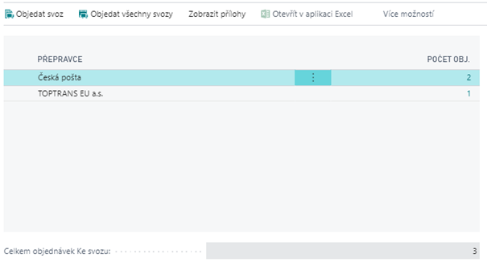

# AC Parcels - Integrace Balíkobot
> Aktualizace: 08.03.2022

Addon zásilek slouží k vytvoření zásilek a přímému tisku štítků vybraných dopravců, odesílání dat o zásilkách přepravci a objednání samotného svozu balíků. Pomocí totoho rozšíření je zrychlen proces zpracování a vytváření zásilek posílaných zákazníkům. Tento Addon využívá API služby Balíkobot.

Tento addon je stavěn na základě načítání čárového kódu (čísel) účtovaných dokladů. Zásilky je možno vytvářet z účtovaných prodejních dodávek a faktur. Pokud uživatel vytvoří zásilku z účt. prodejní dodávky, zásilka se vytvoří bez dobírky, naopak pokud ji vytvoří z faktury, tak se zásilka vytvoří s dobírkou.

Seznam přepravců:
 - Airway
 - Česká pošta
 - Dachser
 - DB Schenker
 - DHL
 - DHL DE
 - DHL Freight
 - DHL Freight Euroconnect
 - DHL Parcel Europe
 - DPD
 - DSV
 - Fedex
 - Fofr
 - Gebrüder Weiss CZ
 - Gebrüder Weiss SK
 - Geis
 - GLS
 - JAPO Transport
 - Liftago
 - Lockers.ai
 - Magyar Posta
 - Messenger
 - Pošta Bez Hranic
 - PPL
 - Raben
 - SK Parcel Service
 - Slovenská pošta
 - Spring
 - TNT
 - Top Trans
 - UPS
 - We Do
 - We Do Uloženka
 - Zásilkovna

## Vytvoření prodejní objednávky
Základním krokem procesu vytváření zásilek je prodejní objednávka. Data z prodejní objednávky se přenášejí do dalších dokladů, z kterých se vytváří zásilky, proto je nezbytné zadat bezchybně data již na počátku procesu. (Stejně tak se zásilky dají vytvářet z prodejních faktur.)

### Nutná pole k zadání před vydáním dokladu
- Adresa zákazníka
- Kód přepravce, kód služby přepravce případně kód pobočky přepravce
- Zákazníkovo telefonní číslo, e-mail nebo jeden z těchto údajů
- Kód způsobu platby (pokud se jedná o dobírku), variabilní symbol
- Vaše reference (v případě, že Váš zákazník vyžaduje na štítek např.: své číslo objednávky)

Systém nevydá doklad pokud není vyplněno telefonní číslo a/nebo e-mail! (viz. nastavení kontroly).
Pokud na objednávce není vybrán žádný přepravce, kontrola je na vydání dokladu (telefonní číslo a e-mail) vypnutá.
### Volitelná pole k zadání před vydáním dokladu
Uživatel již v prodejní objednávce může zadat volitelné parametry zásilky. K zadání slouží infomrační panel **Parametry zásilky** na kartě prodejní objednávky. Pomocí tlačítka Vložit se otevře okno s parametry z nastavení, které je možno doplnit dle potřeby. Může se jednat například o:
- Kontrola věku adresáta
- Kontakt na řidiče
- Donáška do patra
- Dopolední doručení
- Kontrola věku adresáta.
- Kontakt na řidiče.
- Donáška do patra.
- Dopolední doručenní.
- A mnohé další.

## Karta zásilky
Karta zásilky se skládá celkem z pěti částí.

### Hlavička zásilky
V hlavičce dokladu jsou pouze povinné údaje potřebné k založení zásilky, pro zadání dalších údajů jako jsou rozměry nebo vzkaz řidiči je nutné využít podokno Parametry zásilky. Každý přepravce a služba přepravce má své specifické parametry, které v případně nevyplnění nahlásí zpráva, která informuje o tom, co za údaj není na zásilce vyplněn.
### Řádky zásilky
Pro definici počtu balíků v rámci jedné zásilky existuje pole „Počet balíků“. Pokud se bude jednat o balíkovou přepravu (NE PALETOVOU), po zadání počtu balíků se vytvoří řádky zásilky, ke kterým budou přiřazeny jednotlivé štítky od dopravce. V případě paletové přepravy bude toto pole určovat množství jedné manipulační jednotky (nevytvoří se několik řádků, ale vznikne jeden řádek a vyplní se množství; např.: 3 palety).
### Další části

|Část|Popis|
|-|-|
|**Parametry zásilky**|Volitelné parametry zásilky.|
|**Připojené doklady**|V podokně připojené doklady je možné vidět všechny dodací listy nebo faktury, které byly vloženy do jedné zásilky (funkční pouze, když se zásilka posílá na jednu adresu). |
|**Obsah zásilky**|Obsah zásilky je především pro odesílání mimo EU, kdy je nutné udávat informace o tom co je v zásilce.|
|**Přílohy zásilky**|Slouží k připojení pdf dokladů k zásilce.|

## Vytvoření nové zásilky z účtovaného dokladu

Po zaúčtování dodání nastává proces vytvoření zásilky pro zákazníka. Jedním ze způsobů je vytvoření zásilky s dodacího listu nebo účtované faktury. Pomocí načítání čísla dokladu se automaticky předvyplní formulář **Vytvořit zásilku**. Tímto krokem uživatel nemusí ručně vypisovat údaje o zásilce.

1. Vyberte ikonu , zadejte **Vytvořit zásilku** a poté vyberte související odkaz.
1. Vložte číslo účtovaného dokladu (účtovaná prodejní dodávka, účtovananá prodejní faktura) do pole **Číslo dokladu**. Nebo využijte funkci Skenovat kódy (v případě kdy máte čárový kód s číslem dokladu).
1. Uživatel má možnost zadat počet balíků v rámci jedné zásilky.
1. Vyberte funkci **Vytvořit zásilku a vytisknout štítek**.
1. Zásilka je nyní vytvořena a zároveň je ve stavu **Ke svozu**, tzn. má již od dopravce přidělené číslo, štítek a data jsou na straně Balíkobotu).

## Ruční vytvoření zásilky

Zásilky lze vytvářet i ručně bez účtovaných dokladů, např.: pro odeslání dopisů, nebo dodatečného balíčku. Na přehledu zásilek se nachází funkce „Nový“, která otevře prázdnou kartu zásilky. Karta Zásilky a karta Vytvořit zásilku jsou skoro stejné. Při ručním vytváření zásilky, se nedá skenovat číslo účtovaného dokladu a údaje se musí vyplnit ručně. Při tomto vytváření je nutné zadat Stav „Nová“ a přídat jeden řádek. Po nachystání dat pro zásilku funkce „Přidat ke svozu“ zaeviduje zásilku v systému Balíkobotu. Poté je nutné ručně štítek vytisknout.

Potřebné kroky pro ruční vytvoření zásilky:
1. Na přehledu zásilek zvolte funkci **Nový**.
2. Vyplěte potřebná pole pro daného přepavce a jeho službu.
3. Proveďte funkci **Přidat ke svozu** (zásilka je ve stavu **Ke svozu** a je možné tisknout štítek).
4. Proveďte funkci **Tisk štítku**.
5. Zásilka je připravena k objednání svozu.

## Úprava zásilky
Upravovat zásilky lze pouze pokud jsou ve stavu **Nová**. Pokud je zásilka ve stavu **Svozeno** nelze ji již editovat. Pro úpravu/smazání informací zásilky, musí být zásilka ve stavu **Ke svozu**. Pomocí funkce Odebrat ze svozu se změní stav z **Ke svozu** na **Nová**.

 Po tomto kroku je třeba informovat přepravce, že zásilku mažete nebo upravujete. V tento okamžik je zásilce odebráno číslo od přepravce a je smazán štítek. Po upravení dat uživatel použije funkci **Přidat ke svozu** a pro vytištění nového štítků použije funkci **Tisk štítků**.

1. Vyberte ikonu , zadejte **Zásilky** a poté vyberte související odkaz.
2. Klikněte na řádek ze zásilkou a použijte funkci **Odebrat ze svozu**.
3. Otevřete danou zásilku (nyní má stav **Nová**).
4. Doplňte údaje/hodnoty o zásilce (Změna přepravce, Počet balíků, Hmotnost, Rozměry...).
5. Použijte funkce **Přidat ke svozu** (zásilka je ve stavu **Ke svozu** a je možné tisknout štítek).
6. Dále je nutné použít funkci **Tisk štítku**.
7. Zásilka je připravena k **objednání svozu**.

## Objednání svozu
Objednání svozu slouží k předání informace o Vašich zásilkách dopravci. Samotný proces objednání svozu je jednoduchý, slouží k tomu funkce „Objednat svoz“ na přehledu zásilek. 

Funkce zobrazí seznam přepravců s počtem zásilek, které ještě nebyly objednány ke svozu. Uživatel může objednat svoz pouze pro vybraného přepravce nebo pro všechny najednou.

Pro objednání svozu je nutné udělat tyto kroky:
1. Na přehledu zásilek vybrat funkci **Objednat svoz**.
2. Na kartě Objednání svozu zvolte, zda se bude objednávat svoz jednoho přepravce (**Objenad svoz**) nebo všech (**Objednat všechny svozy**).
3.  Po spuštění funkce se vytiskne **Předávací protokol svozu**.

## Tisk předávacího protokolu svozu
Předávací protokol je generován ze strany přepravců.
Tato sestava se může nastavit, aby se tiskla automaticky po objednání svozu. Nastavení automatického tisku je v okně **Nastavení zásilek**. Pro dodatečný tisk předávacího protokolu vybraného přepravce slouží funkce se stejným názvem na přehledu zásilek, kdy stačí stát na jedné ze zásilek daného přepravce v daný den svozu. Poté se vytiskne soupiska všech zásilek od vybraného přepravce za určený den.

Pro dodatečný tisk předávacího protokolu svozu:
1. Vyberte zásilku z daného svozu a použijte funkci **Tisk předávacího protokolu svozu**.
2. Otevře se PDF soubor, který se následně vytiskne z okna prohlížeče.

## Sledování zásilek
Na přehledu zásilek lze na první pohled zahlédnout stav přepravy zásilky. Tento stav není strukturován a je pouze informativní bez detailu. Pro aktualizaci tohoto stavu na řádku zásilky slouží tlačítko **Aktualizovat stav přepravy**.

Pokud chcete zobrazit jednotlivé stavy od přepravce využijte funkci na přehledu zásilek **Sledování zásilky**, která otevře stránku s jednotlivými stavy přepravy.

## Kontroly a omezení

 - Pokud jsou na prodejní objednávce vyplněny pole Kód přepravce a Kód služby přepravce, je nutné zadat telefonní číslo a e-mail příjemce. Pokud pole nebudou vyplěny nelze doklad vydat.
 - Při zadávání dat na kartě zásilky (automaticky pomocí načtení kódů, nebo ručně) je na kartě zásilky funkce **Ověřit data zásilky**. Po spuštění dostanete informaci, zda jsou předávané informace v pořádku.
 - Jedno expediční místo může být přiřazeno jedné lokaci. Vzniká vazba 1:1.

 ## Infomace o účtu a kontrola platných přepravců
 Za účely kontroly Vašich předplacených přepravců jsme implementovali metodu WHOIAM, který vypisuje informace o Vašem API připojení a seznam aktivních přepravců.

 Pro ověření Vašeho účtu zda se jedná o testovací nebo produkční a výpis přepravců pokračujte následujícím způsobem:

1. Vyberte ikonu , zadejte **Přepravci** a poté vyberte související odkaz.
2. Vyberte jednoho z vašich přepravců a klikněte na funkci **Test spojení**.
3. Po ověření účtu vyskočí hláška *Připojení ke službě bylo úspěšné.* a zobrazí se Vám inforace o účtu a Aktivní dopravci.
4. Poté můžete okno zavřít.

## Paperless Trade

Paperless Trade slouží k odeslání elektronické faktury (případě pro-forma Faktury) pro celní řízení zakódované v PDF BASE64.

V addonu AC Parcels můžete využít funkce k automatického vytvoření a přiložení PDF faktury k zásilce za předpokladu vytváření zásilky z účtované prodejní faktury.
V případě vytváření zásilky z účtované prodejní dodávky musíte PDF vkládat ručně.

### Vytvoření zásilky z účtované projdení faktury

Předpokladem pro použití je správné nastavení Paperless trade.

1. Vyberte ikonu , zadejte **Zásilky** a poté vyberte související odkaz.
2. Na přehledu zásilek použijte funkci **Vytvořit zásilku**.
3. Vložte číslo účtované faktury.
4. Systém automaticky vygeneruje PDF faktury a připojí k zásilce.
5. Použijte funkci **Vytvořit zásilku** nebo **Vytvořit zásilku a tiskout štítek**
6. Pokračujte ve zpracování další zásilky nebo formulář zavřete.

### Vytvoření zásilky z účtované prodejní dodávky

1. Vyberte ikonu , zadejte **Zásilky** a poté vyberte související odkaz.
2. Na přehledu zásilek použijte funkci **Vytvořit zásilku**.
3. Vložte číslo účtované dodávky.
4. Systém automaticky doplní data pro zásilku.
6. V záložce **Přílohy Zásilky** klikněte do řádku a připojte již dříve ručně vygenerované PDF (pro-formu faktury).
5. Použijte funkci **Vytvořit zásilku** nebo **Vytvořit zásilku a tiskout štítek**
6. Pokračujte ve zpracování další zásilky nebo formulář zavřete.

## Viz také
[Nastavení - AC Parcels - Integrace Balíkobot](ac-parcels-setup.md)  
[AC Productivity Pack](ac-productivity-pack.md)  
[AUTOCONT řešení](../index.md)
