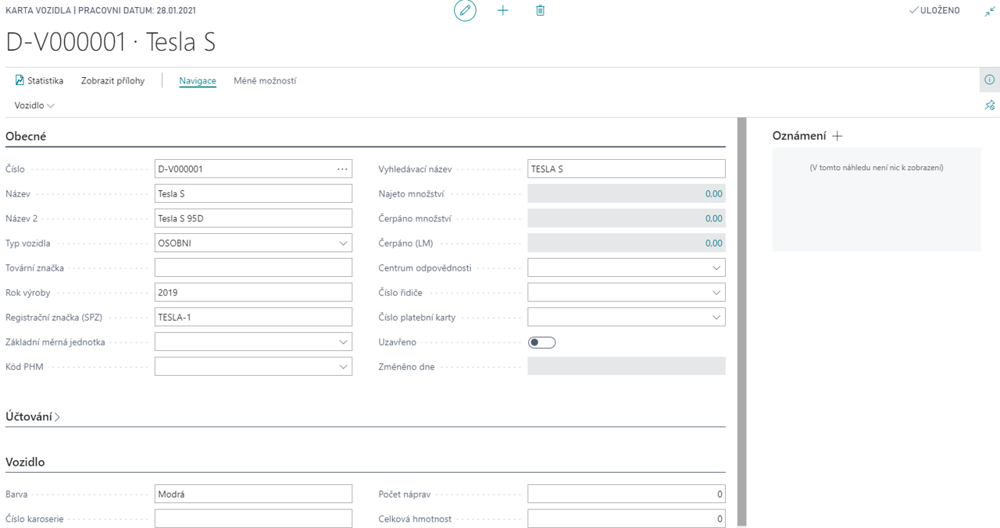

# Doprava - základ

Modul Doprava – základ řeší problematiku evidence vozidel, plánování údržby vozidel, evidence řidičů, evidence knih jízd a evidenci spotřeby pohonných hmot (včetně možnosti importu souborů o nákupech na palivové karty, např. CCS).

**Viz také**

[Doprava - základ - nastavení](ac-transport-basic-setup.md)  
[Productivity Pack](ac-productivity-pack.md)
