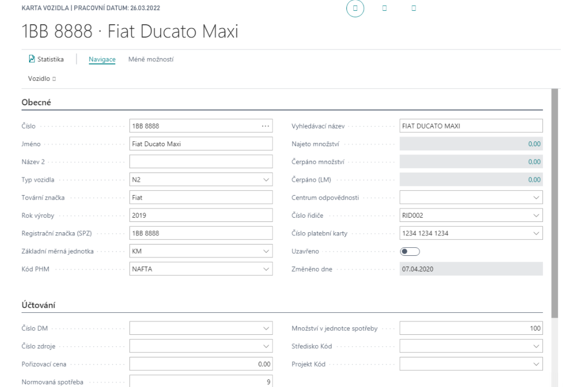

# Doprava

Add-on Doprava řeší problematiku evidence vozidel, plánování údržby vozidel, evidence řidičů, evidence knih jízd a evidenci spotřeby pohonných hmot (včetně možnosti importu souborů o nákupech na palivové karty, např. CCS).

## Definice řidičů
Karta řidiče definuje sledovanou osobu a k ní navázané informace.  

Pro založení nového řidiče postupujte následujícím způsobem:
1. Vyberte ikonu , zadejte **Přehled řidičů** a poté vyberte související odkaz.
2. Na přehledu vyberte funkci **Nový**.
3. Na kartě řidiče vyplňte potřebné informace.

K řidiči lze ukládat „**Odborné způsobilosti**“ – tj. věci související s osobou jako řidičem – řidičská oprávnění, speciální oprávnění a zároveň nastavovat platnosti těchto způsobilostí. Čísleník způsobilostí najdete v sekci navigace na stránce karty řidiče.

## Definice vozidel
Vozidla jsou definovány pro potřeby sledování spotřeby a údržby. K vozidlu lze evidovat informace o vozidlu jako vlastním, dále vazbu na přidělenou platební kartu (pro potřeby importu čerpání), přiděleného (výchozího řidiče) a vazby na další záznamy (Majetek, zdroj….) 

Pro vytvoření karty vozidla postupujte následujícím způsobem:
1. Vyberte ikonu , zadejte **Přehled vozidel** a poté vyberte související odkaz.
2. Na přehledu vyberte funkci **Nový**.
3. Na kartě vozidla vyplňte potřebné informace.

K vozidlu lze definovat další údaje: 
 - **Vybavení** – vybavení jímž je jednotlivé vozidlo vybaveno.
 - **Měrné jednotky** – používané s tímto vozidlem.
 - **Náklady** – standardní náklady/ceny pro jednotlivé typy provozu.
 - **Spotřeba** – standardní spotřeba vozidla pro jednotlivé typy provozu.
 - **Evidence údržby** – sledování údržby vozidla vč. termínů příští údržby.

## Výpis čerpání PHM 
Pro zadání čerpání k vozidlům slouží „Výpis čerpání PHM“. Tyto čerpání jsou připravena pro import ze souboru dodavatele, alternativně lze zadat ručně. 

Pro založení Výpisu čerpání postupujte následujícím způsobem:
1. Vyberte ikonu , zadejte **Výpis čerpání PHM** a poté vyberte související odkaz.
2. Na přehledu vyberte funkci **Nový**.
3. Na kartě vypňte potřebné informace.
4. Vyplňtě jednotlivé řádky a doklad vydejte.

5. Dalším krokem zpracování výpisu je jeho „Vydání“. Na vydaném výpisu je možné použít následující funkce: 
    
    - Vytvoření deníku PHM – pro zapsání položek čerpání k vozidlu 
    - Vytvoření nákupní faktury – pro vytvoření nákupní faktury na základě čerpání 

6. Posledním krokem je zaúčtování Deníku PHM: 
    

## Knihy jízd
Slouží k záznamům o provozu vozidla, zadává se prostřednictvím Kniha Jízd. 

Pro vyplnění knihy jízd pustupujte pomocí těchto kroků:
1. Vyberte ikonu , zadejte **Kniha jízd** a poté vyberte související odkaz.
2. Vyplňtě řádky dle potřeby.
    - Typ cesty, Číslo vozidla, Popis, Číslo řidiče, Typ provozu a další.
3. Zaúčtujte deník.

V případě, že je využívána rozšířená funkcionalita plánování dopravy, tak lze použít funkci pro předgenerování knihy jízd na základě vydaných příkazů k jízdě. 

## Plánování dopravy 

Tato část je součástí rozšířené verze **Doprava – plánování**. 

V rámci plánování se pracuje s tzv. **Požadavkem dopravy**, který je záznamem o předpokládané dopravě, tyto požadavky je možné vytvářet z dokladů **Prodejní objednávka**, **Nákupní objednávka**, **Objednávka transferu** pomocí funkce **Vytvořit požadavek na dopravu**. 

Pro vytvoření požadavku z nákupní objednávky postupujte následujícím způsobem:
1. Vyberte ikonu , zadejte **Nákupní objednávky** a poté vyberte související odkaz.
2. Otevřete existující objednávku nebo vytvořte novou.
3. Pro vytvoření požadavku na dopravu použijte funkci **Vytvořit požadavek na dopravu**.
4. Dokončete průvodce požadavku na dopravu.

Tato funkce je průvodcem, kdy předvyplní maximální množství údajů ze vstupního dokladu. Předpokladem je, že tyto požadavky vytváří běžní uživatelé zpracovávající doklady. 

Další fází je vlastní „**Plánování dopravy**“ pomocí stránky „Pult dispečera dopravy“ – kde odpovědný pracovník vidí jednotlivé požadavky a může je zpracovávat – plánovat data, přiřazovat vozidla/řidiče, kombinovat dle dostupných kapacit atd. 

V rámci plánování se řeší stavy požadavku: 
- Nový – pouze vytvořený 
- Zaplánováno – Je vytvořen příkaz k jízdě 
- Uzavřeno – Doprava byla dokončena 

**Viz také**

[Doprava - základ - nastavení](ac-transport-basic-setup.md)  
[Productivity Pack](ac-productivity-pack.md)
