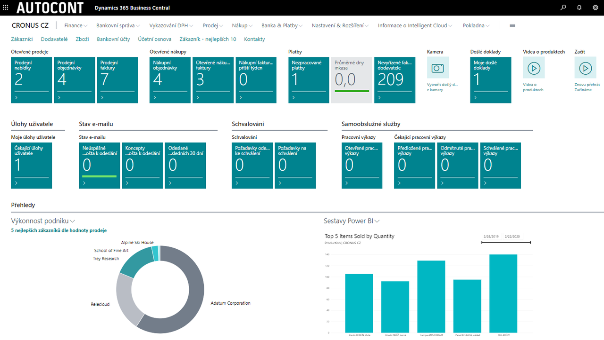

# Microsoft Dynamics 365 Business Central

Microsoft Dynamics 365 Business Central je moderní informační systém pro malé a středně velké společnosti, které hledají jednoduché a snadno přizpůsobitelné řešení s komplexním pokrytím jejich potřeb a s intuitivním uživatelským prostředím. Nabízí zvýšení produktivity a konkurenceschopnosti, šetří vstupní investice a snižuje starosti spojené s provozem a bezpečností.

Data jsou dostupná kdykoliv a odkudkoliv. Provoz informačního systému je možný v cloudu nebo ve vlastním prostředí. On-line provoz systému v cloudu má zásadní výhodu v nižších počátečních nákladech na implementaci, zajištěné bezpečnosti a snazších aktualizacích systému. Uživatelé se mohou připojit z počítače, chytrého telefonu nebo tabletu s Google Android nebo Apple iOS.

Více informací k Business Central naleznete na našich stránkách [ACDynamics365.cz](https://www.acdynamics365.cz/aplikace/provoz-mensi-firmy).

**Nasazení Microsoft Dynamics 365 Business Central od společnosti AUTOCONT je jednoduché a rychlé díky široké škále rozšiřujících modulů a oborových řešení.**

## AUTOCONT ROZŠIŘUJÍCÍ MODULY

Standardní systém Dynamics 365 Business Central rozšiřujeme o řadu funkcionalit doplňujících legislativní požadavky a osvědčené postupy.
Jednotlivé funcionality jsme seskupili do následujících balíčků.

### [AC Financial Pack](../AC-FinancialPack/ac-finance-pack.md) - rozšíření pro finance
  - Sada rozšíření aplikace
  - Insolvenční rejstřík
  - Faktoring
  - Více úhrad
  - Fiskální tiskárny
  - Evidence obalů základ (EKOKOM)
  - Evidence vratných obalů (Vratné obaly)

### [AC Productivity Pack](../AC-ProductivityPack/ac-productivity-pack.md) - rozšíření pro produktivitu
  - Elektronická fakturace
  - Datové schránky
  - Evidence pošty
  - Obecné parametry
  - Publikování SharePoint
  - Rozšíření fronty  úloh
  - Doprava - základ
  - Doprava - plánování
  - WorkFlow - řízení stavů
  - Správa upozornění
  - Reklamace
  - HelpDesk
  - Centrální číselníky
  - Spooler
  - Evidence nářadí a pomůcek
  - Zásilky
### [SK Legislative Pack](../AC-SK/ac-sk-legislative-pack.md) - rozšíření o Slovenskou legislativu a Slovenský jazyk

## AUTOCONT OBOROVÁ ŘEŠENÍ
Kromě rozšiřujících modulů jsou k dispozici níže uvedená specializovaná oborová řešení.

- Lázeňství, hotelnictví a wellness
- Doprava a logistika
- Řízení projektů a zakázek
- Montážní výroba
- Neziskové organizace
- Servisní firmy
- Holdingové společnosti
- Vydavatelství
- Farmaceutický a kosmetický průmysl
- Velkoobchod a maloobchod, distribuce
- a řada dalších

## Viz také
[AC Financial Pack](../AC-FinancialPack/ac-finance-pack.md)  
[AC Productivity Pack](../AC-ProductivityPack/ac-productivity-pack.md)  
[SK Legislative Pack](../AC-SK/ac-sk-legislative-pack.md)