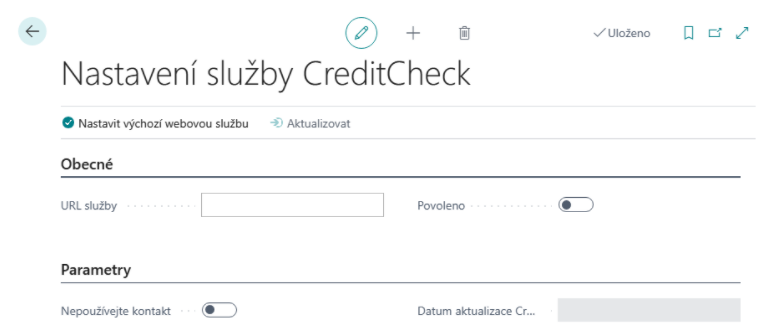
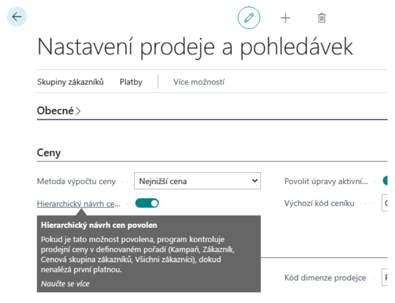
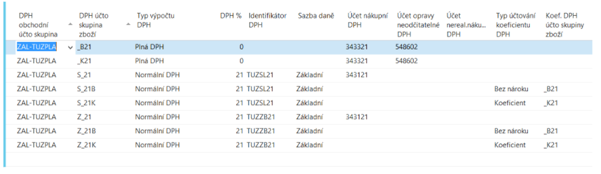

# Sada rozšíření pro Finance - Nastavení
> Aktualizace: 01.02.2022
## Nastavení kontroly CREDITCHECK
### Nastavení kontroly CreditCheck

1. Vyberte ikonu , zadejte **Nastavení služby CreditCheck** a poté vyberte související odkaz.
2. Spusťte funkci **Nastavit výchozí webovou službu**, která naplní URL služby.
3. Službu spustíte pomocí tlačítka **Povoleno**.

> [!NOTE]
> Pokud vaše firma nepoužívá Kontakty, je třeba zapnout **Nepoužívat kontakty pro CreditCheck**. Pak se při stažení dat z CrediChecku budou plnit přímo pole „**Stav CreditCheck**“ na kartě zákazníka, dodavatele.

### Aktualizace informací o bonitě

Aktualizaci je možné provádět manuálně dle potřeby nebo nechat systém provádět aktualizaci v pravidelných intervalech.

Pro automatické nastavení postupujte takto:
1. Vyberte ikonu , zadejte **Nastavení služby CreditCheck** a poté vyberte související odkaz.
2. Nastavte příznak **Automatická aktualizace**.

> [!NOTE]
> Vytvořená položka fronty úloh je ve výchozím stavu nastavena na spouštění v 6:00 v pracovní dny.

Manuální aktualizaci provedete pomocí funkce Aktualizace stavu CreditCheck takto:

1. Vyberte ikonu , zadejte **Aktualizace stavu CreditCheck** a poté vyberte související odkaz.
2. Službu spustíte pomocí tlačítka Ok.

### User setup

V nastavení uživatelů na záložce Obecné je nový boolean „**Povolit změnu stavu CreditCheck**“, který po-kud jej má uživatel zaškrtnut, pak mu umožní zrušit naimportovaný stav.

### Nastavení a aktualizace webových zdrojů

V nastavení kontroly CreditCheck je možné zapnout aktualizaci vytváření webových zdrojů pro všechny kontakty s vyplněným IČ.

1. Vyberte ikonu , zadejte **Nastavení služby CreditCheck** a poté vyberte související odkaz. **
2. Nastavte příznak **Aut. aktualizace webových zdrojů.

> [!NOTE]
> Vytváření webových zdrojů pro placený výpis je možné pomocí **Aut. aktualizace webových zdrojů - Plný**, ovšem pouze pokud je vyplněno pole **Přístupový kód**.

> [!NOTE]
> Vytvořená položka fronty úloh je ve výchozím stavu nastavena na spouštění v 6:00 v pracovní dny.

## Nastavení Hierarchického návrhu prodejních cen

### Nastavení prodeje a pohledávek
1. Vyberte ikonu , zadejte **Nastavení prodeje a pohledávek** a poté vyberte související odkaz.
> [!TIP]
> Nastavení závisí na používané verzi. Ve verzi BC17 pro zapnutí zvolte **Hierarchický návrh cen povolen**.

> [!TIP]
> Od verze BC18 doporučujeme používat zcela novou funkcionalitu pro cenotvorbu v BC.
> Vyberte ikonu Žárovky, která otevře funkci Řekněte mi , zadejte **Správa funkcí** a poté vyberte související odkaz. Ověřte, že máte funkci **Aktualizace funkcí: Nové zkušenosti s cenami prodeje** povolenu pro všechny uživatele.

## Nastavení kumulování plateb
### Nastavení dodavatele pro kumulaci plateb

1. Vyberte ikonu , zadejte **Dodavatelé** a poté vyberte související odkaz.
2. Otevřete kartu dodavatele pro kterého chcete povolit kumulaci plateb.
3. Na stránce Karta dodavatele v záložce Platby nastavte **Kumulovat platby**.

Nastavení parametrů kumulace na bankovním účtu

1. Vyberte ikonu , zadejte **Banky** a poté vyberte související odkaz.
2. Otevřete kartu bankovního účtu pro který chcete nastavit kumulaci plateb.
3. Na stránce Karta bankovního účtu v záložce Platební příkazy/Bankovní výpisy nastavte kumulaci plateb dle potřeby.

### Možnosti nastavení kumulace plateb
- Pole **Kumulovat platební příkazy** – zapíná/vypíná kumulaci
- Pole **Kumulovat export podle variabilního symbolu** – kumulace se za VS
- Pole **Kumulovat export podle konstantního symbolu** – kumuluje se za KS
- Pole **Kumulovat export podle specifického symbolu** – kumuluje se za SS
- Pole **Číselná řada variabilního symbolu** – pokud se nekumuluje dle VS, KS nebo SS, pak se do pole VS doplní číslo dle zde nastavené číselné řady (SS a KS se vezmou z prvního slučovaného řádku příkazu)
- Pole **Popis kumulovaného řádku plat. příkazu** – popis pro vytvořený kumulovaný řádek

## Nastavení kontroly registrace k DPH

### Registrace k DPH na dokladech

V Nastavení financí se zadává datumový vzorec, který systém použije (ve vztahu k pracovnímu datu) pro definici období, ve kterém upozorňuje uživatele na zastaralou informaci o registraci k DPH. Není-li pole Vzorec data kontroly DIČ na dokladech vyplněno, je upozorňování vypnuté.

1. Vyberte ikonu , zadejte **Nastavení financí** a poté vyberte související odkaz.
2. Na stránce Nastavení financí v záložce Ostatní nastavte pole **Vzorec data kontroly DIČ na dokladech**.

## Nastavení kontrol směnných kurzů
### Kontrola správnosti při zadávání směnného kursu

Na každé v systému definované cizí měně se dají nastavit horní a dolní limit hodnoty v lokální měně. Zvlášť výhodné je to u málo používaných měn, kdy je o to větší riziko chyby uživatele při zadávání kursu na dokladu, apod. Je-li pole s limitem na měně prázdný, kontrola se neprování.

1. Vyberte ikonu , zadejte **Měny** a poté vyberte související odkaz.
2. Spusťte akci **Upravit**.
3. Na stránce karta měny v záložce Obecné nastavte pole **Horní limit Částky vzt. sm.kurzu** a **Dolní limit Částky vzt. sm.kurzu**.

### Kontrola existence směnného kursu

V Nastavení financí se zadává datumový vzorec, který systém použije (ve vztahu k zúčtovacímu datu) pro definici období, ve kterém upozorňuje uživatele na neexistenci záznamu v tabulce směnných kurzů. Není-li pole Vzorec pro kontr.sm.kurzu na dokl. vyplněno, je upozorňování vypnuté.

1. Vyberte ikonu , zadejte **Nastavení financí** a poté vyberte související odkaz.
2. Spusťte akci **Upravit**.
3. Na stránce Nastavení financí v záložce Ostatní nastavte pole **Vzorec pro kontr.sm.kurzu na dokl**.

> [!NOTE]
> Obvykle se nastavuje „-1D“ pro denní směnné kursy.

## Nastavení vymáhání pohledávek
### Druhy vymáhání

Specifické typy vymáhání lze nastavit pomocí číselníku Druhy vymáhání:

1. Vyberte ikonu , zadejte **Druhy vymáhání** a poté vyberte související odkaz.
2. Na stránce Druhy vymáhání zadejte kód pro nový záznam (např. „FACTORING“ pro rozlišení důvodu vzniku pohledávky). Tento můžete doplnit i upřesňujícím popisem v poli Popis.

## Nastavení rozšíření číselné řady
### Nastavení masky číselné řady

Nové pole pro strukturu masky číselné řady bylo přidáno do tabulky číselné řady, kde uživatel definuje poziční strukturu čísla generovaného v této číselné řadě. Tato funkce umožňuje jednodušeji vytvářet nové číselné řady pro nový fiskální rok a snižuje množství chyb.

1. Vyberte ikonu , zadejte **Číselná řada** a poté vyberte související odkaz.
2. V poli **Maska** nastavte kombinaci pevných a zástupných znaků ve formátu „**XXrrcccc**“
   - XX – fixní část čísla; musí být velkými písmeny, délka není omezena (jen celková délka výsledného čísla)
   - rr (popř. rrrr) – označení roku, které doplní generátor ze zadaného počátečního datumu
   - cccc - variabilní část čísla; musí být malými písmeny, délka není omezena (jen celková délka výsledného čísla)

> [!TIP]
> Nastavíte-li masku „BVY1rrcccccc“, pak generátor spuštěný s počátečním datem 1.1.2021 vytvoří řádek číselné řady, kde Počáteční číslo bude „BVY121000001“ a Poslední číslo bude „BVY121999999“.

### Nastavení návazností číselných řad

Byla přidána nová tabulka Návaznost číselné řady.

1. Vyberte ikonu , zadejte **Číselná řada** a poté vyberte související odkaz.
2. Vyberte akci **Návaznosti**.
3. Dle určení číselné řady vyplňte některý ze sloupců:

   - **Návazná číselná řada** – jaká číselná řada má být použita v navázané aktivitě, když má zdrojový dokument zadanou číselnou řadu: objednávka vytvořená z poptávky, objednávka vytvořená z hromadné objednávky

   - **Číselná řada účtování** – jaká číselná řada má být použita pro zaúčtovaný doklad, když má zdrojový dokument zadanou číselnou řadu: zaúčtovaný prodejní/nákupní/servisní doklad (faktura, dobropis), vydaná upomínka, vydané penále, účtovaná dodávka/příjemka skladu, účtovaná montážní zakázka, účtovaný příjem/výdej zásob, účtovaná obj. fyz. inventury

   - **Číselná řada dodávky** – jaká číselná řada má být použita pro účtovanou dodávku, když má zdrojový dokument zadanou číselnou řadu: účtovaná prodejní dodávka z prodejní objednávky nebo faktury, dodávka transferu z objednávky transferu

   - **Číselná řada příjemky** – jaká číselná řada má být použita pro účtovanou příjemku, když má zdrojový dokument zadanou číselnou řadu: účtovaná nákupní příjemka z nákupní objednávky nebo faktury, příjemka transferu z objednávky transferu.

   - **Číselná řada dodávky skladu** - jaká číselná řada má být použita pro dodávku ze skladu, když má zdrojový dokument zadanou číselnou řadu: dodávka ze skladu z objednávky prodejní/nákupní/transferu.

   - **Číselná řada příjemky skladu** - jaká číselná řada má být použita pro příjemku na sklad, když má zdrojový dokument zadanou číselnou řadu: příjemka na sklad z objednávky prodejní/nákupní/transferu.

## Nastavení zaokrouhlení dle způsobu úhrady

Nastavení zaokrouhlení se provádí různě v závislosti na měně, jako je tomu u jiných podobných parametrů:

**Nastavení pro lokální měnu**

1. Vyberte ikonu , zadejte **Nastavení financí** a poté vyberte související odkaz.
2. Vyberte akci Nastavení zaokrouhlení faktur.
3. Na stránce Nastavení zaokrouhlení faktur definujte nastavení zaokrouhlení pro všechny způsoby plateb, u kterých má být jiné nastavení než to výchozí z Nastavení financí.

> [!NOTE]
> Pohled je filtrován na prázdný Kód měny.

**Nastavení pro cizí měny**

1. Vyberte ikonu , zadejte **Způsoby plateb** a poté vyberte související odkaz.
2. Vyberte akci Nastavení zaokrouhlení faktur.
3. Na stránce Nastavení zaokrouhlení faktur definujte nastavení zaokrouhlení pro cizí měny v kombinaci s vybraným způsobem platby, u kterých má být jiné nastavení než to výchozí z Karty měny.

## Nastavení krácení odpočtu DPH
### Nastavení účtování DPH

1. Vyberte ikonu , zadejte **Nastavení účtování DPH** a poté vyberte související odkaz.

Pro kombinace DPH účto skupin, kde se bude řešit krácení vstupní DPH koeficientem, musí být nastaveno (kromě jiného):
- Typ účtování koeficientu DPH
- Koef.DPH účto skupiny zboží

Dále musí být nastaveny nové kombinace stejné DPH obchodní účto skupiny a DPH účto skupiny zboží definované v poli „Koef.DPH účto skupiny zboží“ (viz výše) s Typem výpočtu DPH = Plná DPH

Pro tyto kombinace musí být nastaveno (kromě jiného):
- „Účet opravy neodčitatelné DPH“ – použije se jako protiúčet běžného nákupního účtu DPH při přeúčtování krácení odpočtu DPH koeficientem.

> [!NOTE]
> Nastavené kombinace DPH účto skupin s Typem výpočtu DPH = Plná DPH nevstupují do výkazu DPH.

### Nastavení zálohového koeficientu

1. Vyberte ikonu , zadejte **Nastavení financí** a poté vyberte související odkaz.
2. V poli Zálohový koeficient DPH" na záložce DPH nastavte hodnotu procenta platného pro aktuální účetní období.

## Nastavení registrace k DPH ve více zemích

### Více DIČ zákazníků

1. Choose the , icon, enter **Customers** and then choose the related link.
2. Vyberte akci  Země/oblasti registrace.
3. Zadejte kód země a DIČ pro vybraného zákazníka.
4. Dále doplňte DPH obch. účtoskupinu, která se má použít v případě prodeje zákazníkovi do této země.

### Více DIČ dodavatelů

1. Vyberte ikonu , zadejte **Dodavatelé** a poté vyberte související odkaz.
2. Vyberte akci Země/oblasti registrace (Související -> Dodavatel).
3. Zadejte kód země a DIČ pro vybraného dodavatele.
4. Dále doplňte DPH obch. účtoskupinu, která se má použít v případě nákupu z této země dodatatele.

### Více registrací k DPH

Základní nastavení spočívá v evidenci registrací k DPH v jednotlivých zemích a nastavení, jak má systém měnit DPH účtoskupiny v dokladech pro správné zpracování položek DPH při uzavírání DPH a pro správnou tvorbu podkladů (nejčastěji pro účetní kanceláře v daných zemích).

1. Vyberte ikonu , zadejte **Informace o společnosti** a poté vyberte související odkaz.
2. Vyberte akci Země/oblasti registrace.
3. Na stránce Země/oblasti registrace zadejte kód země a DIČ společnosti registrované v této zemi. Pro vytvořený záznam doplňte Kód měny (místní) určující měnu, ve které se podává přiznání k DPH ve vybrané zemi.
4. Zavřete stránce Země/oblasti registrace.
5. Vyberte akci Směry registrace Země/oblasti.
6. Na stránce Směry registrace Země/oblasti definujte, jak má systém nahrazovat DPH obch.účtoskupiny na dokladech.

V případě používání jiné měny než lokální v zemi registrace, je nutné udržovat kursy mezi měnou dokladu a lokální měnou země registrace.

1. Vyberte ikonu , zadejte **Měny** a poté vyberte související odkaz.
2. Vyberte akci Směnné kursy země/oblasti registrace.
3. Zadejte datum a směnný kurs.

> [!NOTE]
> Systém neobsahuje funkcionalitu pro import směnných kursů země/oblasti registrace.

### OSS – EU režim

1. Vyberte ikonu , zadejte **Nastavení financí** a poté vyberte související odkaz.
2. V poli Registrace OSS – EU na záložce DPH potvrďte, že je vaše firma registrována pro režim OSS.
3. V poli Kód měny pro OSS na záložce DPH vyberte kód měnu odpovídající měně Euro.
4. Vyberte akci Nastavení DPH pro OSS (Související -> DPH účtování).
5. Na stránce Nastavení DPH pro OSS zadejte DPH obch.účtoskupinu pro kombinaci zemí zahájení a ukončení přepravy.

> [!NOTE]
> Příznakem OSS se určuje, zda-li uvedená kombinace zemí je či není předmětem režimu OSS.

## Nastavení účtování přeplatků nákupních záloh

Popsaná automatizace při účtování finální faktury se zapíná v Nastavení účtování DPH pro vybrané kombinace účtoskupin. Pokud je toto chování vhodné pouze pro některé případy, je třeba pro ně míst vydefinované zvláštní DPH účtoskupiny (zboží).

1. Vyberte ikonu , zadejte **Nastavení účtování DPH** a poté vyberte související odkaz.

Na stránce Nastavení účtování DPH vyhledejte záznam pro který chcete zapnout a zvolte funkci Úpravy.

Nastavte příznak v poli Určeno pro vrácení zálohy na záložce Zálohy.

## See also

[Sada rozšíření pro Finance](ac-controling-basic.md)  
[Financial Pack](ac-finance-pack.md)
