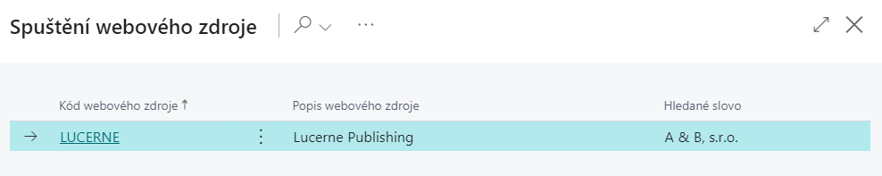
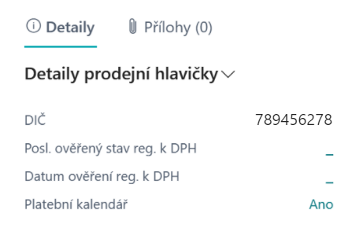
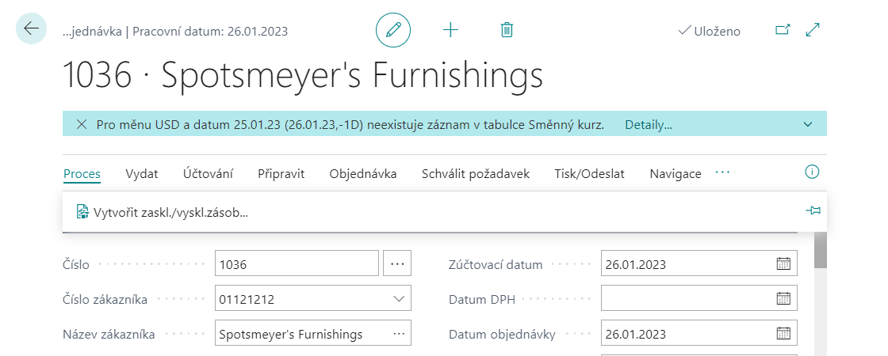

# Application extension set
> Update: 03.03.2022

Add-on module **Application extension set** contains common features to support the operation of the other add-on modules of the Finance Extension Pack. The list of functions can be found on the right side of the page.

The Controling Basic addon is required for other AC Financial Pack add-on modules.

## Credit Check

This is the integration of BC into the commercial CreditCheck service, which is used to check the creditworthiness of partners.

Therefore, in order to have as much information about the selected partner in the system as possible, the information is imported via the Creditcheck ERP web service, see. http://www.creditcheck.cz/ProductDetail.aspx?id=02.

CreditCheck declares that it performs 185 different types of checks in its database of Czech companies every day. The Creditcheck ERP service is free of charge, as is the creation of the CreditcheckList. It is therefore possible to check a partner in the Creditcheck database without logging in. In cases where an orange or red traffic light is found at the company, you need to log in to view the details. This is a paid service that the customer concludes with CreditCheck as needed.

### CreditCheck status

Downloaded information about the creditworthiness of the CreditCheck ERP customer (creditworthiness also includes information about an unreliable VAT payer) is displayed on the supplier's card in the Supplier Evaluation Information Window.

> [!NOTE]
> Use the customize function to display the information window.

### Launch web resources

Launching the contact's web resources is now also possible on the vendor / customer card and also on related documents (quotation, order, invoice, cash receipt, payment order). To start, click on the CreditCheck status icon (traffic light). This form will appear:

### Cancel CreditCheck status

If the user has the "*Allow change of CreditCheck status*“ boolean checked in the settings, then he can cancel the imported status on the contact card using the "Cancel CreditCheck status" function. The reason may be that the user has checked this partner and does not consider the issue for which this condition is listed to be important, so he will cancel it.

> [!WARNING]
> The stated change is irreversible and the change of the CreditCheck status (new designation) will be made only if a new problem has been detected with the specified partner. E.g. that he now also went into insolvency proceedings.

## Hierarchical proposal of prices

Standard sales pricing is based on the idea of finding the lowest possible price. This is not always satisfactory, then it is possible to choose the so-called hierarchical price proposal.

Note: The hierarchical design is only available for the selling price of the goods.

A hierarchical price proposal means that the price (as well as the line discount) is found in a fixed order (according to the hierarchy). If a definition is found at the taught level, it no longer looks.

The system searches for **sales prices** in the following order:
1. Campaign
2. Customer
3. Customer price group
4. All customers

The system searches for **sales line discounts** in the following order:
1. Campaign and Items
2. Campaign and Price group of goods
3. Customer and Items
4. Customer and Goods Price Group
5. All Customers and Goods
6. Customer and Price group of goods
7. Customer price group and Goods price group
8. All Customers and Price Group of Goods

## Payment calendars

The functionality of the Payment Calendars is available for sale and purchase, and its operation is similar in both areas.  The payment calendar can be defined on an unposted document, but also ad-ditionally on a posted document in the document currency.

**Posting a sales invoice with a payment calendar**

1. Choose the , icon, enter **Sales Invoices** and then choose the related link.
2. Create a new sales invoice according to your conventions. In the **Due date** field define the latest date for the payment schedule.
3. Start the **Payment Calendar** action.
4. Start the **Generate Payments** function.
5. Define the number of partial payments and the system will calculate the fields with the amounts of payments. The system will add the last payment to the total invoice amount.
6. Fill in the **Due date of the first payment** and the date formula in the Payment period field.
7. Click **OK** to start generating the payment calendar proposal.
8. You can still manually edit the created payment calendar.
9. Click **OK** to close the page.
10. Run the **Post** function on the sales invoice.

In addition, after posting a sales invoice (or order), customer items are created that balance the ba-lance of the original item and several new receivables (with the same document type, document nu-mber, etc.) are created with due dates and amounts according to the payment calendar.

> [!NOTE]
> On the sales document, the presence of the payment calendar is indicated by the Payment Calendar flag in the facts window with the Sales Header Details. Click Yes to open the relevant calendar.

**Create a payment calendar for a posted invoice**

1. Choose the , icon, enter **Posted Sales Invoices** and then choose the related link.
2. Start the **Payment Calendar** action.
3. Define your own installment schedule in the lines.
4. Settle the invoice balance and post the payment calendar with the **Post** function.

## Cumulation of payments on the payment order

The functionality allows you to merge payment order lines, which is useful if you need to pay for multiple purchase documents in a single amount. It is cumulated according to the Account Number, SWIFT, IBAN, Currency and optionally according to VS, KS and SS.

This functionality combines payment lines for vendors who are allowed to accumulate payments, according to the rules set in the bank account. For more information, see Payment cumulation settings.

**Creating a payment order with cumulation of payments**

1. Choose the , icon, enter **Payment Orders** and then choose the related link.
2. Select the number of the bank with the set payment accumulation for which you want to crea-te a payment order and confirm with the OK button **OK**.
3. Run the **Suggest Payments…** action (the alternative is to enter the order lines manually, or the Im-port function…)
4. Fill in the **Last due date** and the **Available amount**, or adjust other parameters.
5. Click **OK** to start generating the payment proposal.
6. You can still manually edit the created payment order (to verify the functionality of payment cumulation, check that you have more than one payment in the rows to the same vendor ac-count with payment cumulation enabled)
7. Run the **Issue** function on the payment order.
8. Click **OK** to confirm the Issue option.
9. Select **Yes** to confirm the opening of the issued payment order card.
10. Run the **Create Export Lines** function on the issued payment order.
11. Select **Export Lines** to open a list of export lines. Unmerged items are transferred to the export lines of the payment order in the same detail. If you want to change the result, change the settings and run the line creation function again.
12. Run the **Export payment order…** action (the alternative is to enter the order lines manually, or the Import… function)

> [!NOTE]
> If it is not cumulated according to symbols, then the merged lines are created with the variable symbol from the number series and SS and KS are taken from the first merged line of the command. The due date is taken to be the lowest of the merged rows.

**Cumulated payments on the bank statement**

From the user's point of view, the statement processing process is unchanged. The only difference is that when Issued, the system searches for matching records on the issued payment order in the export lines according to the movement identification data on the statement line. If it finds, the "cumulated payments" will be replaced by split lines in the background (the original cumulated line is also transferred, but with a zero amount).

## VAT registration check

To eliminate the risk of incorrect accounting and reporting of VAT, 2 new controls were added to the system.

The first serves to alert users to discrepancies with VAT registration when working with documents, the second is then used retrospectively when processing documents for the VAT statement. For more information, see Set up VAT registration control.

**Checking VAT registration on documents**

When you create sales, purchase, or service documents, you check for the existence of a valid verification of the VAT registration within the specified time interval. This check is carried out during the validation of the customer/payer (or supplier/creditor) on the document; for the period from the work date retrospectively, a record in the table **VAT ID verification** with verified registration is searched (status **Valid** = VAT ID is registered for VAT or **Invalid** = VAT ID is not registered for VAT).

The user is notified when the relevant VAT number has never been verified in the system before. Similarly, it is notified when the VAT NUMBER is verified older than according to the settings. Press Details… the user will display the **VAT Verification Protocol**.

Note: Not only information about verifying VAT registration is visible on purchase (but also sales or service) documents in the Purchase Header Details fact window. From this window it is possible to run an action to check the VAT number entered on the document.

**Check VAT registration by VAT entries**

Before submitting a VAT statement, it is a good idea to verify that all reported records will be correct from the point of view of VAT registration.

1. Choose the , icon, enter **VAT Statements** and then choose the related link.
2. Run the **Check VAT Reg. - VAT Entries** report.
3. Choose the OK button to run the report.

**Check VAT Reg. - VAT Entries**

This report reviews VAT entries, checks the status of VAT registration, or verifies the VAT ID online if necessary.

The output of the report is a list of VAT items according to the option **Show status**

- All
- **Unverified and Invalid** – Lists items that for some reason failed to verify the status (Unverified) and items with a VAT ID that is not currently registered for VAT.
- **Unverified and Valid** – used typically for checking items for non-VAT payers, where a valid registration is actually an error.

## Exchange rate controls

To eliminate the risk of incorrectly entering the exchange rate and thus posting a document with an incorrect exchange rate, 2 new checks were added to the system..

### Checking the accuracy of the entered exchange rate

The system checks the manually entered exchange rate against the set limits. The inspection is performed:

- when entering value into exchange rates,
- when entering a course on purchase, sales or service documents.

### Exchange rate import control

When browsing or creating sales, purchasing or service documents, the system checks for the existence of an exchange rate for a specific date. This date is calculated with respect to the Settlement Date and takes into account weekends and other non-working days (public holidays, Christmas, Easter, etc.).

If it does not find an entry in the Exchange Rates table for such a business day, it displays a notification. Click **Details…** to open the Currency exchange rates table for the document.

## Enforcement of receivables

The functionality serves as support for enforcement of receivables that have not yet been repaid. For such receivables, tis necessary to have up-to-date information on the status of the receivable, the course of recovery.

Note: If you need to attach electronic documents to the register, consider using the SharePoint Publishing addon from AUTOCONT, or another third party product.

The receivable collection status is displayed in the **Customer Ledger Entry FactBox**. As a result, the user has immediate access to this basic information, but also detailed information at the click of a button.

**Creating a new record for a receivable**

1. Choose the , icon, enter **Cust. Ledger Entry** and then choose the related link.
2. On the **Customer Ledger Entries** page, navigate to the selected record and run the **Receivable Information** function.
3. Confirm that you wish to create a accounts receivable information card.

**Receivable status recording**
The Receivables Status field, located on the Receivable Information Card page, is used to record the status of enforcement. This field takes the following values:

- < empty >
- Enforcement
- Court Proceedings
- Insured Accident
- Delegation
- Distraint
- Bankruptcy
- Settled up

It is also possible to record whether and to whom the receivables were transferred, the type of recovery and, last but not least, the date of conclusion of the recovery of the receivable.

**Archiving**

On the Receivable Information Card page, you can use the Create Archive function to create a copy of the current Receivables Information status at any time. To view archived records, run the Archived Records function on the Receivables Information page.

**Records of related receivables**

On the Receivable Information page, you can assign a receivable to another in the Parent Entry No. field if, for example, it is a common enforcement procedure.

To view related records, run the Related Entries function on the Receivable Information Card page.

## Extension of number series

The needs of companies in the field of working with number series tend to be more diverse than the system standard allows. Therefore, we have expanded its options with 2 additional tools:

- Number series masks – to facilitate the generation of ranges for the next (usually fiscal) period
- Continuity of number series – for the possibility of defining different series for billed documents

**Generating number series according to masks**

1. Choose the , icon, enter **No. Series Mask Generator** and then choose the related link.
2. On the **No. Series Mask Generator** page, on the Options tab page, enter:

   - **Starting date** – from which date the new number series should be active
   - **Increment-by No.** – determines the size of the interval between numbers in the number series
   - **Warning No.** – determines when you want to receive a warning about the approaching end of the series (optional)
3. If necessary, enter a filter for the No. Series Code for which the above is to be applied.
4. Select the **OK** button to run the report.

**Continuity of number series**

Links can be used in a variety of areas, typically on purchase, sales, service documents or links to them, transfer orders, etc.

For more information, visit Number Series Links Setup. [Settings - Application extension set](ac-controling-basic-setup.md).

## Rounding of the invoice according to the payment method

In practice, there is often a need to address the rounding of invoices differently according to the context of the method of payment, eg differently for cash transactions, differently for payments from an account or differently for documents with payment by advance invoice. Today, the company has such an option for rounding using advanced settings based on the Payment Method Code.

For more information, visit Number Series Links Setup. [Settings - Application extension set](ac-controling-basic-setup.md).

## Other functionalities

This chapter describes other minor modifications or enhancements broken down by area.

## General

**Data migration functionality extension**

The Set Processing Order feature has been added to the Configuration Workbook and Configuration Package Tab pages. This function suggests the order in which the individual packages should be processed, taking into account the interrelationships (the Field Order and Table Order fields in the Configuration Workbook).

1. Choose the , icon, enter **Configuration Worksheet** and then choose the related link.
2. On the **Configuration Worksheet** page, run the **Set Processing Order** function.
3. On the Get Config.Table Processing Order page, select **Package Code** for which the order is to be set.
4. Select the **OK** button to run the report.

**The Data Structure Definition report** can serve as documentation for migration tasks. The report can be found not only on the Configuration Worksheet page, but also completely separately:

1. Choose the , icon, enter **Config.Wksh. - Data Structures** and then choose the related link.
2. Select Package Code.
3. Choose the OK button to run the report.

### Finance

- **Reports in Item Registers**

   On the **Item Journals page** the following reports are added:

   - **Item Register - Value**

- **Banks**

   Added Account and Print functions on Reconciliation Log.

   NOTE: As of version BC19, it is recommended to use the newer Banking Documents functionality, which does not use the Reconciliation Log.

- **Cash Desks**

   The Correction field is added to the header of the cash document. If enabled by the user, the system will post to the same sides of the accounts, but with the opposite sign. As a result, the correction document does not increase turnover on the sides of the accounts.

### Sales

- **QR code for payment on the sales invoice**

   New CU 52057071 "QR Code_acb", where there is a function for the QR code for the sales invoice. The .NET component Microsoft.Dynamics.Nav.MX.dll, which is a standard AddIn from MS, is used. An example of use is in report 52057066 "Sales - Invoice QR_acb", only the printing of the QR code itself and an example of calling a function.

   NOTE: In BC online it is necessary to use different method – see [Barcode Fonts with Business Central Online - Business Central | Microsoft Docs](https://docs.microsoft.com/en-us/dynamics365/business-central/dev-itpro/developer/devenv-report-barcode-fonts#one-dimensional-barcode-fonts-with-business-central-online)

### Inventory

- **Quantity control**

   The error message about the unavailability of goods in stock was supplemented by the location code and a specific serial number or batch.

### CRM

- **Creating web contact resources**

   If you additionally add a new web resource, you can then generate bulk for all (or only selected) contacts:

   1. Choose the , icon, enter **Create Cont. Web Sources** and then choose the related link.
   2. In the options, select the **Web Source Code** you want to add to Contacts.
   3. In the options, select the contact field from which the variable value of the link URL is to be added.
   4. If necessary, specify a filter to limit the selection of contacts to which the above should be applied.
   5. Select the **OK** button to run the report.

## Reduciton of VAT deduct

The aim of the functionality is to additionally account for the reduction of VAT deduction from VAT accounts to defined financial accounts (usually cost accounts). According to the recorded estimate (advance coefficient), VAT deductions are charged during the accounting period. If necessary, after the end of the calendar year, it is possible to recalculate according to the actual proportion of the use of these taxable transactions for the purposes of the transactions carried out in that year.

With the correct settings, this functionality is suitable not only for Czech but also for Slovak companies.

> [!NOTE]
> It does not address the immediate charging of "non-deductible" VAT on primary documents (invoice, credit note, cash document, financial diary) or the routing of "non-deductible" VAT to the source of taxation (goods, fixed assets, services).

**Function Calculate and post VAT coefficient**

This function allows you to prepare a print report or even post the calculated VAT deductions. he function only works with VAT items containing combinations of account groups set up for VAT deductions - see Setting the VAT deduction reduction.

1. Choose the , icon, enter **Calc. and Post VAT Coefficient** and then choose the related link.
2. In Options, fill in:

   - Starting date
   - Ending date
   - Starting VAT date date
   - Ending VAT date
   - Use entry data – whether to take data from the entries.
   - Posting date (editable only if Use data from item = TRUE)
   - Document No. (editable only if Use data from item = TRUE)
   - Show VAT Entries
   - Post – if VAT entries are to be posted for VAT deduction.
   - Dim. values from coeff. cost acc.
3. On the VAT Posting Setup tab page, select the filter for which VAT entries you want to run the calculation.
4. Confirm the start of the function with the **OK** button.

## VAT registration in Multiple countries

This feature expands the ability to work with VAT and allows users to:

- Set up a company as a VAT payer in another EU country.
- Set Exchange Rate List for the country of performance.
- Set up country registration for customers and suppliers.
- Set country registration directions for VAT changes of business accounts of groups.
- Define the VAT country code and the country of supply code on the documents.
- Document for foreign accounting offices with a list of issued documents in the given country.
- Create OSS documents (One Stop Shop) in European Union mode
- Basis for settlement with FÚ OSS

> [!NOTE]
> In connection with this functionality, the printouts of sales or service documents are not modified. Any modifications to the appearance of documents with a different VAT registration must be made as customer modifications.

**More VAT registrations on documents**

The choice of the country / area of registration is available on the Foreign Trade tab on the following documents:

- Sales order,
- Sales invoice,
- Sales credit meno,
- Service order,
- Service invoice,
- Service credit memo,
- Purchase order,
- Purchase invoice,
- Purchase credit,
- Posted sales invoice,
- Posted sales credit memo,
- Posted purchase invoice,
- Posted purchase credit memo,
- Posted service invoice,
- Posted service credit.

**More VAT registrations in G/L journal**

The choice of country / area of registration is also available in the G/L journal. You must use the Personalize feature to display.

**Sales document with OSS**

OSS mode is activated on the sales document based on the following information:

- VAT Registration No. field – OSS mode is possible only for customers without registration, ie with an unfilled VAT Registration No.
- Country code from the location in the document header
- Ship to Country/Region code or VAT Country/region code

**Payment of money for OSS**

*During Q1 2022, a report will be added, which will be the basis for statements to the tax office. From the closed VAT items for the whole quarter, it calculates (and prints with the necessary details) the amount that the company has to pay to the tax office.*

**Closure of VAT entries**

*During Q1 2022, the functionality for closing VAT entries will be adjusted.*

## Accounting purchase of purchase advances

> [!NOTE]
> The functionality described below will be part of the module only up to version BC14.

In connection with the introduction of the Control Report from 1 January 2016, there was a need to address the overpayment of the purchase deposit under one document number, the same date and the same exchange rate.

The whole procedure can be performed manually.  However, due to its complexity, functionality was added to the system, where the overpayment of the advance payment is re-billed within the final billing invoice.

### Purchase advance overpayment refund

After creating the final purchase invoice and assigning the paid purchase deposit, in case of an over-payment on the deposit, it is possible to insert another line with the overpayment amount and the Intended for return refund flag (the flag is also on the posted invoice line).

By posting the invoice, an item of the Vendor type is created for each such line with overpayment. The return of the money by the supplier (Refund) is then settled by the user with these created items.

Note: When using the Derecognize assigned down payment function (from the Down Payment Docu-ment tab), these overpayment settlements will be derecognized by analogy.

## See also

[Application extension set - Setup](ac-controling-basic-setup.md)  
[Financial Pack](ac-finance-pack.md)
