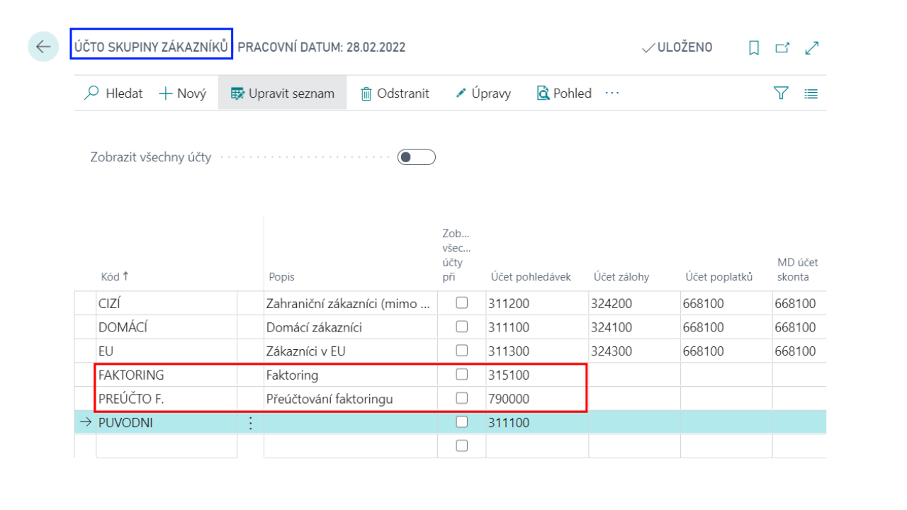
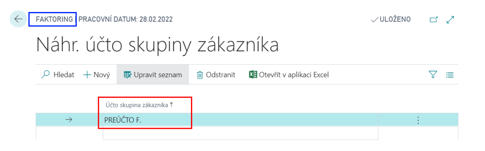
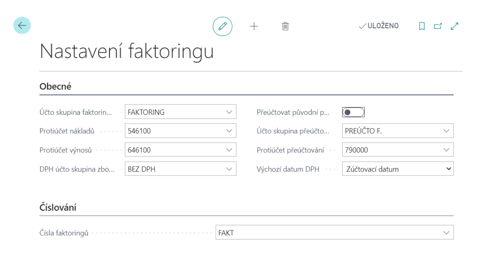

# Factoring Setup

Basic settings of the facoring add-on.
## Setup of Factoring add-on
### Necessary Business Central settings

For the correct function of the add-on, it is necessary to set and create other settings in Business Central.

|Settings|Description|
|-|-|
|**Chart of Accounts**|Chart of Accounts It is necessary to open financial accounts for tracking receivables, cost and revenue accounts for factoring re-accounting; if they no longer exist.|
|**Factoring group account**|hrough the Customer group account, it is necessary to create a new factoring group account, which will be used for factoring accounting. |
|**Customer Group Alternate Account**|New customer group account substitution combinations must be created (available from the Customer Posting Group Substitute page).|

### Factoring settings

On the Factoring Settings page, you need to make the basic settings for the factoring module:
1. Choose the , icon, enter **Factoring Setup** and then choose the related link.
2. Fill in the following fields on the Factoring setup:
   - **Factoring Posting Group** –  the posting group that is used for posting a factoring receivable
   - **Cost Bal. Account No.** – the account to which the receivable from the customer is posted
   - **Icome Bal. Account No. 2** – the account to which the factoring income is recognised
   - **DPH účto skupina zboží faktoringu** – here you need to set up a VAT posting group of goods, which in combination with the VAT business posting group from the customer-factor represents posting without VAT
   - **Orig. Entry Advanced Posting** – the YES option allows you to continue tracking the receivable from the original customer on off-balance sheet accounts
   - **Adv. Posting Group** and **Adv. Posting Bal. Account No.** – off-balance sheet accounts on which the receivable from the original customer will be further monitored
   - **Factoring Nos.** – number series by which factoring will be numbered   
      
3. After filling in the fields, you can close the page.

### Factoring Templates
It is possible to define templates for converting factoring agreements into Microsoft Word documents. You can create a document on the factoring tab by using the **Create Factoring Document** feature.

**See also**

[Factoring](ac-factoring.md)  
[Financial Pack](ac-finance-pack.md)
