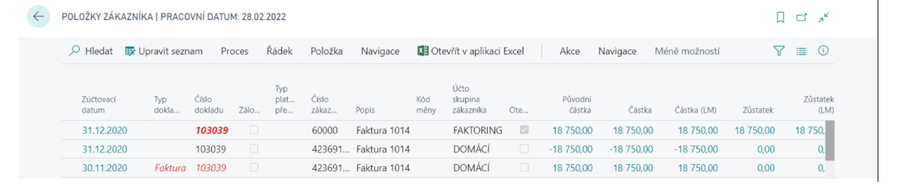
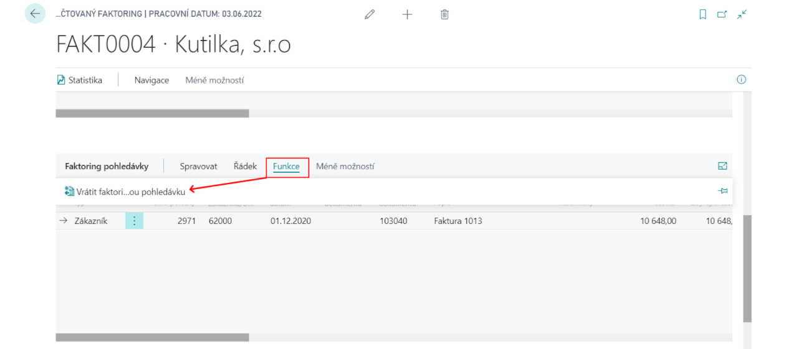

# Factoring

Add-on modul Faktoring rozšiřuje možnosti oblasti Správa financí systému Dynamics 365 Business Central o možnost evidence a účtování postoupení pohledávek a vytváření faktoringových smluv. Je podporována i varianta regresního faktoringu, kdy faktor může pohledávku/závazek vrátit.

Funkčnost add-on modulu je integrovaná s add-on modulem Napojení na MS Word. Využitím této integrace lze na základě definovaných šablon vytvářet faktoringové smlouvy ze systému Dynamics 365 Business Central do dokumentů Microsoft Word.

## Pořízení dokladu faktoringu

1. Vyberte ikonu , zadejte **Přehled faktoringů** a poté vyberte související odkaz.
2. Na přehledu klikněte na tlačítko **Nový**.
3. Na kartě dokladu Faktoringu do hlavičky doplťe informaci o **zákazníkovi** a **zúčtovací datum**.
4. Konkrétní položky/závazky, které mají být podstoupeny, lze vybrat pomocí polí **Typ položky** a **Číslo položky**. Pokud se jedná o regresivní faktoring, faktor může pohledávku/závazek vrátit, musí být zaškrtnuto pole **Regresní faktoring** na řádku dokladu.

## Zaúčtování faktoringu
Pro zaúčtování faktoringu postupujte následujícím způsobem:

1. Před zaúčtováním dokladu faktoringu je doklad třeba **vydat**.
2. Pro zaúčtování použijte funkci **Účtování**.
3. Zaúčtováním dokladu vznikne doklad **Zaúčtovaný faktoring**.

Řádky dokladu Zaúčtovaný faktoring jsou rozděleny **do tří záložek**:
- **Pohledávky** – postoupené položky.
- **Faktoring pohledávky** – nově vzniklé položky zákazníka k faktorovi.
- **Platby** – položky typu platba, které vyrovnávají faktoringové pohledávky.

Účtováním faktoringu jsou uzavřeny původní položky zákazníka/dodavatele a k faktorovi jsou zaúčtovány nové pohledávky.

Finanční účtování je určeno **Účto skupinou faktoringu** z Nastavení faktoringu:

Pokud je v Nastavení faktoringu zapnuté **Přeúčtovat původní položku**, vznikne u původního zákazníka/dodavatele nová zákaznická/dodavatelská položka. Ta umožňuje sledovat saldo původních zákazníků/dodavatelů včetně postoupených dokladů. Finanční účtování je určeno **Účto skupinou přeúčtování** z Nastavení faktoringu. V Nastavení účto skupin zákazníka by pro tuto účto skupinu měl být nastaven podrozvahový účet. Podrozvahová položka je uzavřena v okamžiku uzavření faktoringové pohledávky.

## Vrácení faktoringové pohledávky
Pokud se jedná o regresní faktoring (faktor může pohledávku vrátit) musí být doklad zaúčtován se zaškrtnutým pole Regresní faktoring na řádku dokladu.

1. Vyberte ikonu , zadejte **Účtovaný faktoring** a poté vyberte související odkaz.
2. Vyberte zaúčtovaný doklad, který chcete zpracovat.
3. Na kartě účtovaného faktoringu použijte funkci **Vrátit pohledávku faktoringu**
   
4. Po tomto příkazu systém odúčtuje nově vzniklou faktoringovou položku a naúčtuje ji zpět k zákazníkovi / dodavateli.

**See also**

[Nastavení - Faktoring](ac-factoring-setup.md)  
[Financial Pack](ac-finance-pack.md)
