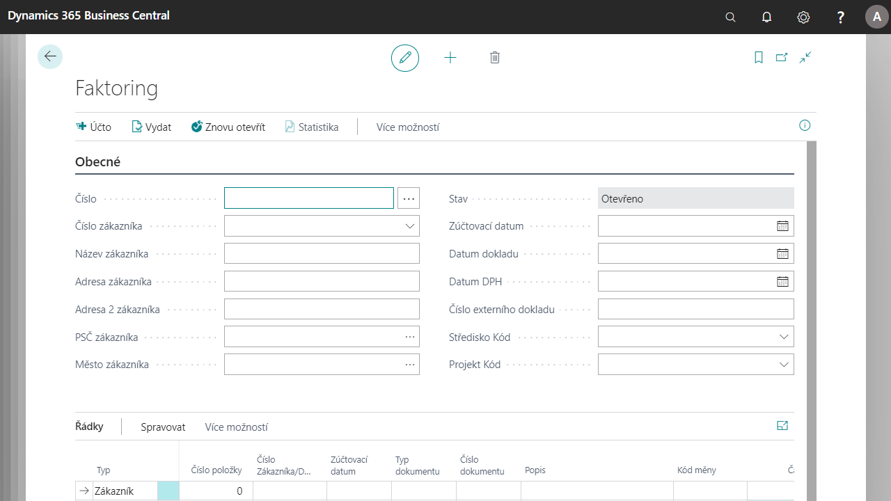

# Factoring

Add-on modul Faktoring rozšiřuje možnosti oblasti Správa financí systému Dynamics 365 Business Central o možnost evidence a účtování postoupení pohledávek a vytváření faktoringových smluv. Je podporována i varianta regresního faktoringu, kdy faktor může pohledávku/závazek vrátit.

Funkčnost add-on modulu je integrovaná s add-on modulem Napojení na MS Word. Využitím této integrace lze na základě definovaných šablon vytvářet faktoringové smlouvy ze systému Dynamics 365 Business Central do dokumentů Microsoft Word.

**See also**

[Nastavení - Faktoring](ac-factoring-setup.md)  
[Financial Pack](ac-finance-pack.md)
