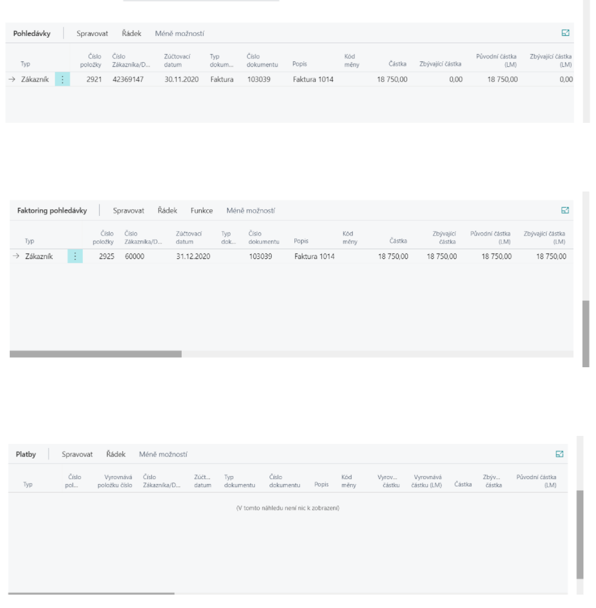

# Factoring

The Factoring add-on module extends the capabilities of the Finance Management area of the Dynamics 365 Business Central system with the possibility of recording and accounting for assignments of receivables and creating factoring contracts. The regression factoring variant is also supported, where the factor can return the receivable/liability.

The functionality of the add-on module is integrated with the add-on module Connection to MS Word. By using this integration, you can create factoring contracts from Dynamics 365 Business Central to Microsoft Word documents based on defined templates.

## Setting up of a factoring document

1. Choose the , icon, enter **Factoring List** and then choose the related link.
2. On the list, click **New**.
3. Fill in the **Customer** and **Posting date** information in the header on the Factoring document tab.
4. You can select the specific items/payables to be undertaken by using **Item type** and **Item number** fields. If it is regressive factoring, the factor can return the receivable/payables, the **Regression factoring** field on the document line must be checked.

## Faktoring posting
To post factoring, follow these steps:

1. Before you can post a factoring document, you must **Issue** the document.
2. Use the **Posting** feature to post.
3. Posting the document creates the **Posted Factoring** document.

Posted factoring document lines are divided into **three tabs**:
- **Receivables** - Assigned items.
- **Receivable factoring** - newly created customer items to the factor.
- **Platby** – položky typu platba, které vyrovnávají faktoringové pohledávky.

By posting factoring, the original customer/vendor entries are closed and new receivables are posted to the factor.

Financial posting is determined by the **Factoring Posting Group** from Factoring Settings:

If  **Orig. Entry Advanced Posting**, is turned on in Factoring Settings, a new customer/vendor item is created for the original customer/vendor. This allows you to monitor the balance of the original customers / vendors, including the transferred documents. Financial posting is determined by  **Adv. Posting Group** from Factoring Settings. In the Customer posting group settings, a off-balance sheet account should be set up for this posting group. The off-balance-sheet item is closed at the time of the conclusion of the factoring receivable.

## Return of factoring receivable
If it is regression factoring (the factor can return the receivable), the document must be posted with the Regression factoring field checked on the document line.

1. Choose the , icon, enter **Posted Factoring list** and then choose the related link.
2. Select the posted document that you want to process.
3. On the page Posted Factoring List use the function **Return Factoring Receivable**
   
4. After this command, the system derecognises the newly created factoring item and charges it back to the customer / vendor.

**See also**

[Factoring Setup](ac-factoring-setup.md)  
[Financial Pack](ac-finance-pack.md)
