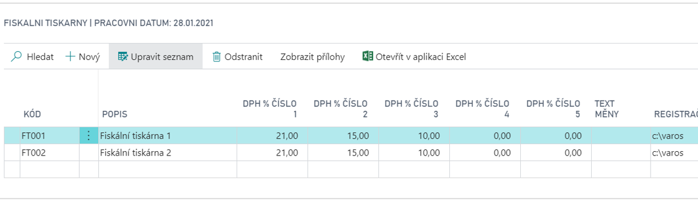

# Fiscal printers

Modul **Fiskální tiskárny – VAROS** slouží k vytvoření a tisku pokladního dokladu na fiskální tiskárně firmy VAROS.

Při účtování primárních dokladů (faktura, objednávka, dobropis) s rozpisem platby (jedním či více typy úhrad) jsou automaticky vytvářeny fiskální položky a tyto jsou pak odeslány k tisku na fiskální tiskárnu. K tisku na fiskální tiskárně dochází také při zaúčtování rozpisu platby na vytvořeném resp. zaúčtovaném dokladu (faktura, dobropis, záloha).

Rovněž všechny vklady a výběry hotovosti do registrační pokladny jsou evidovány a vytištěny na fiskální tiskárně.

**Viz také**

**See also**

[Nastavení - Fiskální tiskárny](ac-fiscal-printers-setup.md)  
[Financial Pack](ac-finance-pack.md)
