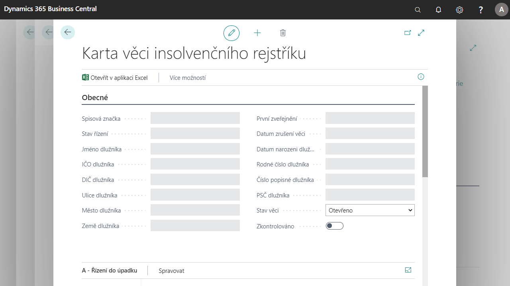

# Insolvency register

Add-on **Insolvenční rejstřík** slouží k evidenci záznamů stahovaných z  https://isir.justice.cz o insolvenčním řízení společností.

Je nástrojem pro další akce s kontakty společnosti, které jsou v insolvenčním řízení, např. při zadávání prodejních dokladů, jejich účtování (dodání, fakturace). Poskytuje vybraným osobám společnosti aktuální informace o nových záznamech v insolvenčním rejstříku.

**See also**

[Nastavení - Insolvenční rejstřík](ac-insolvence-register-setup.md)  
[Financial Pack](ac-finance-pack.md)
