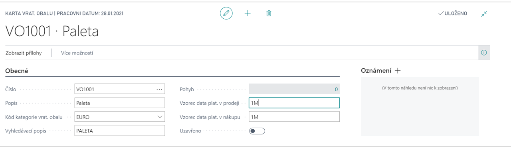

# Pack Tracking - Return Packing

The **Pack Tracking - Return Packing** add-on module is an extension of the Dynamics 365 Business Central Inventory module. It enables monitoring of the circulation of returnable packaging and pallet management. It can be used to track the packaging balances of business partners with links to the relevant business transactions (Purchase, Sale, Receipt, Issue, Transfer, Consumption and Production) and then to monitor the current price of packaging.

## See also

[Pack Tracking - Return Packing - Setup](ac-pack-tracking-return-packing-setup.md)  
[Financial Pack](ac-finance-pack.md)
