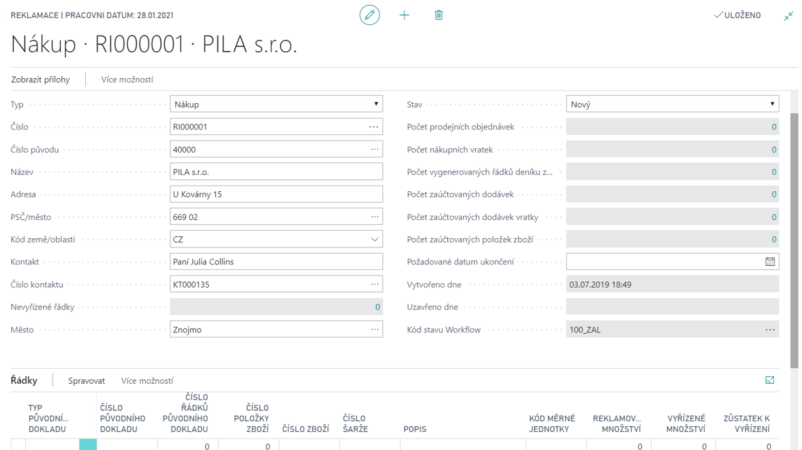

# Complaints Management
Modul Reklamace slouží k evidenci reklamací zboží prodaného i nakoupeného. Také umožňuje evidovat reklamace interní. Umožňuje sledovat proces řešení reklamace od založení reklamace, evidenci různých stavů reklamací, vytváření navazujících dokladů, podporuje účtování interních přesunů reklamovaného zboží, poskytuje základní tisky k reklamacím a je provázán na více úrovních se sledováním pomocí workflow.

**See also**

[Reklamace - nastavení](ac-complaints-management-setup.md)  
[Productivity Pack](ac-productivity-pack.md)

