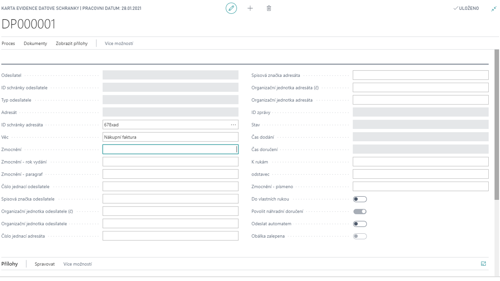

# Data boxes

Add-on modul Datové schránky poskytuje podporu pro správu datových schránek ve smyslu zákona 300/2008 Sb. o elektronických úkonech a následujících vyhlášek.
Umožňuje správu a řízení rolí datové schránky (oprávněná osoba, administrátor, pověřená osoba).

**See also**

[Datové schránky - Nastavení](ac-data-boxes-setup.md)  
[Productivity Pack](ac-productivity-pack.md)
