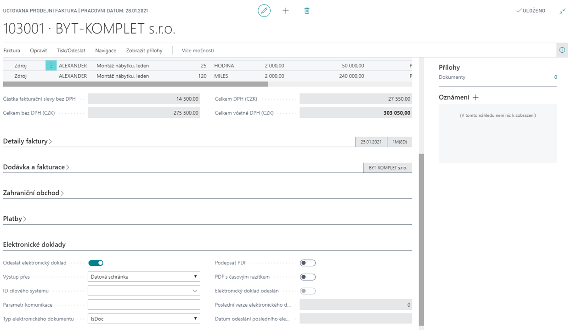

# Electronic invoicing

The **Electronic Invoicing** module is used for modern paperless exchange of tax documents with the customer.

The module allows you to automatically generate both structured documents in XML format and possibly create electronic documents for printing in other formats (PDF - modules "Electronic invoicing - pdf preview" and "Electronic invoicing - PDFXChange", DOC - module "Electronic invoicing - ISDOC").

To meet the legislative requirements, the XML file is electronically signed and uniquely identified. The electronic signature is adjustable in the system. The add-on module also includes an application supplied to customers for free distribution, which allows the addressees of an XML document to check the electronic signature, including the validity and integrity of the document. For user display of an XML document (structured data usable for automatic exports to information systems) it is possible to define so-called XSD templates, which transform data from XML into a visual form of an HTML document. The resulting documents can be automatically distributed using the Spooler add-on module via e-mail or other communication channels (TCP, named pipe, disk storage).
Any electronic attachments (delivery notes, certificates, etc.) can be attached to the distributed electronic invoicing without file type restrictions.

## Electronic invoicing - ISDOC

See Electronic invoicing – the difference only in how the invoice is sent.

## Electronic invoicing - PDFXChange

See Electronic invoicing – the difference only in how the invoice is sent. This module provides tools for electronic signing of the document, or the possibility of adding a time stamp.

**See also**

[Electronic invoicing - Setup](ac-elektronic-dokuments-setup.md)  
[Productivity Pack](ac-productivity-pack.md)
