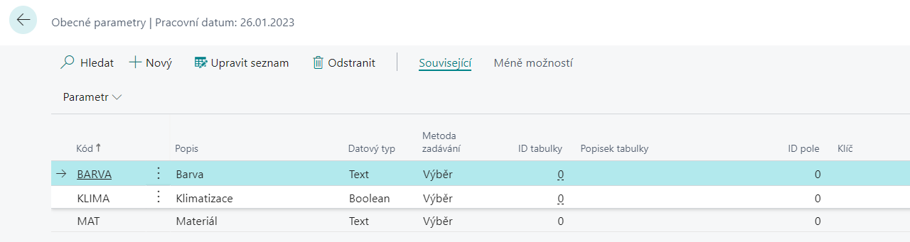
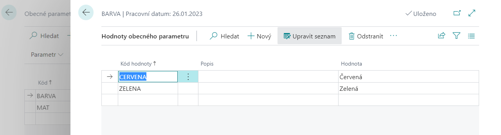
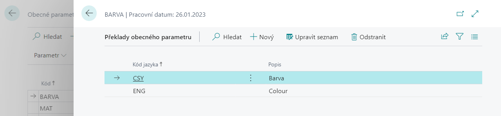
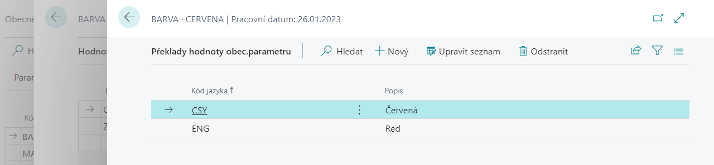
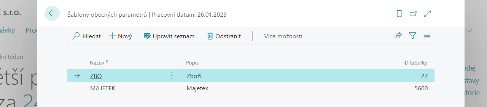
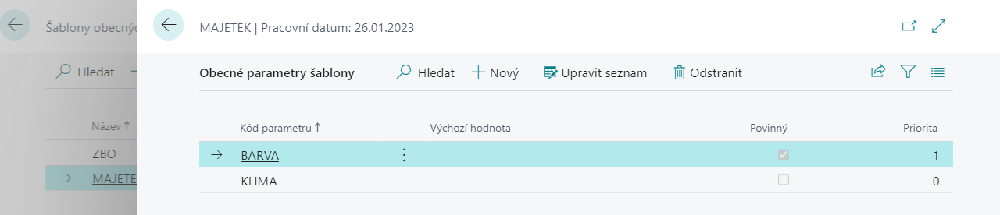

# Obecné parametry - Nastavení
> Aktualizace 17.03.2022

## Založení a nastavení obecných parametrů

Pro založení číselníku obecných parametrů pokračujte tímto způsobem:

1. Vyberte ikonu , zadejte **Obecné parametry** a poté vyberte související odkaz.
2. Na přehledu vyberte funkci **Nový**.
3. Zadejte **Kód** pro parametr, **Popis**, **Datový typ** a **Metodu zadávání**.

> [!NOTE]
> Funkcionalita nabízí více možností, ale pro obecné parametry jsou vhodné následující datové typy **Text, Code, Integer, Decimal, Boolean, Datetime, DateFormula, Date, Time, Duration, RecordID**.
> S použitím metody zadávání Tabulka souvisí naplnění polí ID tabulky a ID pole a s použitím metody zadávání Funkce souvisí naplnění ID funkce.

### Defince hodnot parametrů

Pro definici hodnot parametrů postupujte následujícím způsobem:

1. Vyberte ikonu , zadejte **Obecné parametry** a poté vyberte související odkaz.
2. Na přehledu vyberte parametr, kterému chcete nastavit hodnoty.
3. Vyberte v sekci Související, ve skupině **Parametr** funkci **Hodnoty**.
4. Otevře se okno pro zadání hodnot vybraného parametru, kde vyplníte řádky dle potřeby.

Nastavení hodnot parametru je nezbytné zejména u parametrů s **Metodou zadávání – Výběr**. Je však možné hodnoty definovat i u parametrů zadávaných Ručním vstupem. Zde je kromě takto zadaných hodnot možné při vložení obecných parametrů zadat i libovolné jiné hodnoty. Hodnoty zadané v nastavení pak slouží pro zjednodušení zadávání.

> 

### Definice překladů parametrů

Pro definici překladů parametrů postupujte následujícím způsobem:

1. Vyberte ikonu , zadejte **Obecné parametry** a poté vyberte související odkaz.
2. Na přehledu vyberte parametr, kterému chcete nastavit překlady.
3. Vyberte v sekci Související, ve skupině **Parametr** funkci **Překlady**.
4. Otevře se okno pro zadání překladů vybraného parametru, kde vyplníte **Kód jazyka** a **Popis** dle potřeby.

### Definice překladů hodnot parametru

Pro definici překladů hodnot parametrů postupujte následujícím způsobem:

1. Vyberte ikonu , zadejte **Obecné parametry** a poté vyberte související odkaz.
2. Na přehledu vyberte parametr, kterému chcete nastavit překlady.
3. Vyberte v sekci Související, ve skupině **Hodnota** a na přehldu hodnot funkci **Překlady**.
4. Otevře se okno pro zadání překladů hodnot vybraného parametru, kde vyplníte **Kód jazyka** a **Popis** dle potřeby.

## Nastavení šablon obecných parametrů

Pro nastavení šablon obecných parametrů pro použití na vybraných entitách pokračujte následujícím způsobem:

1. Vyberte ikonu , zadejte **Šablony obecných parametrů** a poté vyberte související odkaz.
2. Na přehledu vyberte funkci **Nový**.
3. Zadejte **Název šablony**, **Popis** a **ID tabulky**.

### Zadání parametrů pro vybranou šablonu

1. Vyberte ikonu , zadejte **Šablony obecných parametrů** a poté vyberte související odkaz.
2. V seznamu šablon vyberte šablonu, pro kterou chcete zadávat parametry.
3. Vyberte v sekci Související, ve skupině **Šablona** funkci **Parametry**.
4. Otevře se okno vybrané šablony, kde můžete doplnit parametry. Dále můžete nastavit parametrům to, který bude jako výchozí hodnotou šablony, povinný nebo můžete určit prioritu.

## See also

[Obecné parametry](ac-general-parameters.md)  
[Productivity Pack](ac-productivity-pack.md)
