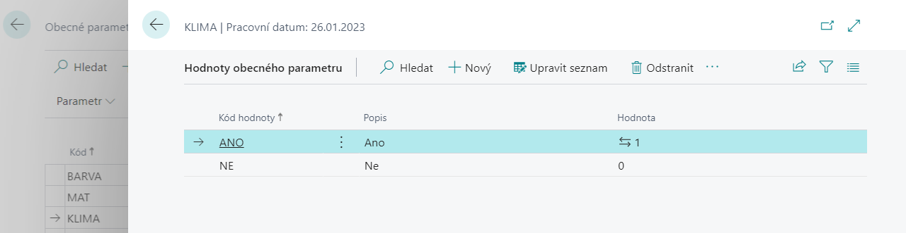

# General Parameters - Setup
> Update 17.03.2022

## Creating and setting up general parameters

To create a code list of general parameters, proceed as follows:

1. Choose the , icon, enter **General Parameters** and then choose the related link.
2. In the overview, select **New**.
3. Enter the **Code** for the parameter, **Description**, **Data Type** and **Input Method**.

> [!NOTE]
> The functionality offers more options, but the following data types **Text, Code, Integer, Decimal, Boolean, Datetime, DateFormula, Date, Time, Duration, RecordID** are suitable for general parameters.
> Using the Table input method is related to populating the Table ID and Field ID fields, and using the Function input method is related to populating the Function ID.

### Define parameter values

To define parameter values, follow these steps:

1. Choose the , icon, enter **General Parameters** and then choose the related link.
2. In the overview, select the parameter for which you want to set values.
3. In the Related section, select the **Values** function in the **Parameter** group.
4. A window for entering the values of the selected parameter will open, where you will fill in the rows as needed.

Setting parameter values is necessary especially for parameters with **Input method - Selection**. However, it is also possible to define values for parameters entered by Manual input. Here, in addition to the values ​​entered in this way, it is possible to enter any other values ​​when entering general parameters. The values entered in the settings are then used to simplify input.

> 

### Definition of parameter translations

To define parameter translations, follow these steps:

1. Choose the , icon, enter **General Parameters** and then choose the related link.
2. In the report, select the parameter you want to set up translations for.
3. In the Related section, in the **Parameter** group select **Translations**.
4. A window will open for entering translations of the selected parameter, where you will fill in the **Language Code** and **Descriptionpis** as needed.

### Define translations of parameter values

To define translations of parameter values, follow these steps:

1. Choose the , icon, enter **General Parameters** and then choose the related link.
2. In the report, select the parameter you want to set up translations for.
3. In the Related section, in the **Value** group, and select **Translations**.
4. A window for entering translations of the values of the selected parameter will open, where you will fill in **the Language Code** and **Description** as needed.

## Set up general parameter templates

To set up general parameter templates for use on selected entities, proceed as follows:

1. Choose the , icon, enter **General Parameter Templates** and then choose the related link.
2. In the overview, select **New**.
3. Enter **Name**, **Description**, and **Table ID**.

### Enter parameters for the selected template

1. Choose the , icon, enter **General Parameter Templates** and then choose the related link.
2. In the list of templates, select the template for which you want to enter parameters.
3. In the Related section, in **Template** group, select **Parameters**.
4. The selected template window opens, where you can add parameters. Additionally, you can set the parameters to be the default template, mandatory, or you can specify a priority.

## See also

[General Parameters](ac-general-parameters.md)  
[Productivity Pack](ac-productivity-pack.md)
