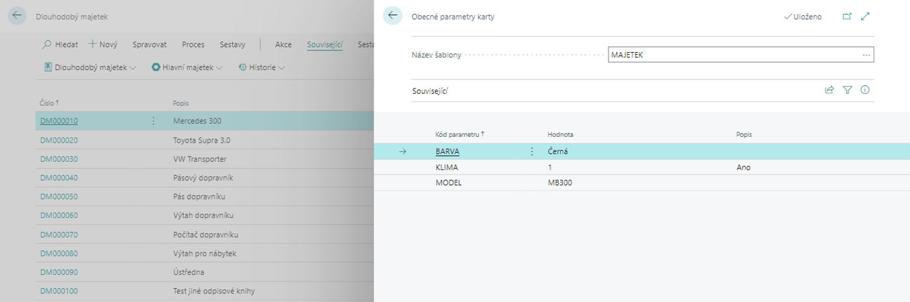

# General parameters
> Update 17.03.2022

The **General Parameters** add-on module allows you to add an unlimited number of new parameters to **Item** and **Fixed Assest** in Dynamics 365 Business Central for detailed sorting and filtering. Parameters can be grouped into templates according to the purpose. The module contains a wizard for easy entry of parameter values by manually entering or selecting from the prepared lists.

## Preview of general record parameters

To view a list of saved general parameters for a given record (in this case, fixed assets) with a filter on a given entity, do the following:

1. Choose the , icon, enter **Fixed Assets** and then choose the related link.
2. In the overview, select the specific fixed asset for which you want to view parameters.
3. In the Related section, in the **Fixed assets** group, select **General Parameters** function.
4. A window will open where you can see the name of the template.
5. At the bottom you will see a list of parameters and their values.
   
6. If a card has multiple parameter templates set up, you can switch between them, or view all values by deleting the filter on the report.

## Insert and change General Parameters

To insert general parameters to an item or fixed asset, the **Insert General Parameters** action is used. A **wizard**will appear, which will select a template (if more than one is defined for a given entity), mandatory and optional parameters for a particular tab, and set the values ​​of these parameters.

To insert or edit general parameters, do the following:

1. Choose the , icon, enter **Fixed Assets** and then choose the related link.
2. On the list in the Actions section, use the **Insert General Parameters**function.
3. The Insertion Wizard starts.

### General Parameters Insertion Wizard

1. n the first step of the wizard, you will be prompted to select **Template**. Subsequently, to fill in the lines, i.e. to enter **Mandatory General Parameters**.
2. You fill in the values in the fields of the wizard line. Fill in the **General Parameters Template** first, then the **Value**, and finally the **Description**.
3. Click **Next** in the next step.
4. Now in the next window you can fill in the **Optional general parameters** in a similar way as for the mandatory ones.
5. After entering the parameters, click on the **Finish**button to save the settings.

> [!NOTE]
> The same procedure is used both for inserting and for changing parameters or values ​​of general parameters of a given record.

## Searching records by General Parameters

The functionality of general parameters can be used to search for "similar" records. In other words, finding those records of a given entity that have, for example, the same parameters assigned to them or have the same values ​​of some parameters.

To search by parameters for fixed assets, continue as follows:

1. Choose the , icon, enter **Fixed Assets** and then choose the related link.
2. In the overview, in the Actions section, select **Filter by General Parameters** function.
3. A window will open where in the first step you will select **Parameter Template**.
4. The next step is to select by which parameters the system will filter. To do this, click on the **three dots** in the line next to the General Parameters Filter.
5. In the next dialog box, select the parameters you want to filter by.
6. Use **OK** to start filtering.

To **clear the search filter**, click **Clear General Parameters Filters**in the Actions section of the report.

## See also

[General Parameters - Setup](ac-general-parameters-setup.md)  
[Productivity Pack](ac-productivity-pack.md)