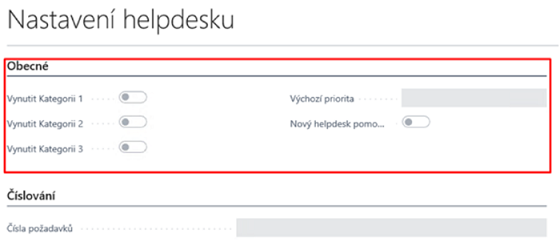
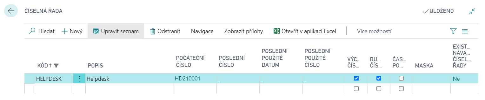
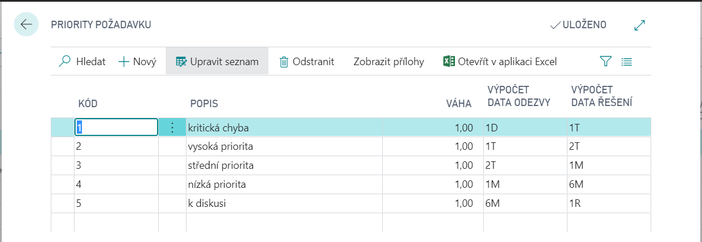

# HelpDesk - Nastavení

Modul  Helpdesk slouží k centralizovanému zadávání, evidenci, zpracování a vyhodnocování různých požadavků uživatelů v systému Microsoft Dynamics 365 Business Central. Uživatelé zde mohou zadávat požadavky na servisní úkony, na poskytnutí podpory, úpravu nebo doplnění funkcionality, evidovat reklamace a podobně. Umožňuje také kategorizaci požadavků, nastavení priorit a řízené zpracování přiřazenými řešiteli. K dispozici je i historie uzavřených požadavků HelpDesku.

Aby bylo možné zadávat požadavky do HelpDesku, je nutné předem provést některá nastavení:
- Nastavit HelpDesk.
- Založit číselnou řadu pro požadavky HelpDesku.
- Založit kategorie uživatelů.
- Zadat oprávněné osoby a přiřadit je do kategorií.
- Naplnit tabulku priorit požadavků.
- Vytvořit kategorie požadavků (volitelně, pokud se sledují).
- Naplnit tabulku způsobů řešení.
- Vytvořit šablonu workflow pro Helpdesk.
- Nastavit workflow pro HelpDesk.

## Nastavení HelpDesku
- Vyberte ikonu  , zadejte **Nastavení helpdesku** a poté vyberte související odkaz.

Na stránce **Nastavení helpdesku** lze na záložce **Obecné** zvolit, zda bude při zadání požadavků povinné vyplňovat kategorii požadavků 1-3, výchozí prioritu a zda je nutné nové požadavky zadávat pomocí průvodce.

Na záložce **Číslování** v poli **Čísla požadavků** vyberte číselnou řadu pro nově vytvářené požadavky Helpdesku.

### Vytváření číselné řady pro požadavky HelpDesku
1. Choose the , icon, enter **No. Series** and then choose the related link.
2. Na stránce **Číselná řada** klikněte na funkci **Nový** a vytvořte novou číselnou řadu.
3. Zadejte Kód, Popis a Počáteční číslo číselné řady.
4. Zaškrtněte políčko Výchozí čísla pro automatické vyplňování čísel při zadávaní nových požadavků.

Příklad vytvořené číselné řady:

## Nastavení kategorie uživatelů

Kategorie uživatelů představují skupiny uživatelů. Skupinám uživatelů se přiřadí určitá váha (stupeň důležitosti), která je jedním z faktorů při automatickém výpočtu priority požadavku. Kategorie uživatele obsahuje pole Kód, Popis a Váha.

1. Vyberte ikonu , zadejte **Kategorie uživatele** a poté vyberte související odkaz.
2. Na stránce **Kategorie uživatele** vyberte akci **Nový** a poté zadejte **Kód**, **Popis** a **Váhu**.
3. Pole Váha může nabývat hodnot 0-1 ve smyslu procent (0 =0 %, 1=100 %).

## Nastavení seznamu oprávněných osob

Pro každou oprávněnou osobu se zvolí příslušná Kategorie uživatele, podle které program automaticky předvyplní Váhu požadavku pro danou osobu. Předvyplněnou hodnotu pole **Váha** lze pro každou osobu individuálně upravit. Program pak tuto hodnotu použije pro výpočet celkové priority požadavku.

1. Vyberte ikonu , zadejte **Přehled oprávněných osob** a poté vyberte související odkaz.
2. Zobrazí se tabulka se všemi doposud zadanými oprávněnými osobami.
3. Na stránce **Přehled oprávněných osob** vyberte akci **Nový** a vyplňte pole nové oprávněné osoby podle potřeby.

Na záložce **Spojení** lze doplnit podrobnější kontaktní údaje k dané osobě (**Adresa**, **Telefon**, **Fax**, **Mobil**, **E-mail**).

Když se do pole **ID Uživatele** vyplní odpovídající přihlašovací jméno dané oprávněné osoby, bude se při pořizování požadavku do HelpDesku automaticky nabízet kód oprávněné osoby, která požadavek zadává.

Pole **Povolena změna uživatele** opravňuje ke změně Oprávněné osoby (poIe Identifikace helpdesk) při zadávání nového požadavku do HelpDesku. Zvolená **Výchozí priorita** se bude automaticky nabízet v nově pořizovaném požadavku.

## Nastavení priority požadavků

Aby bylo možné vyhodnocovat požadavky podle jejich naléhavosti, je nutné vyplnit **Priority požadavků**:
1. Vyberte ikonu , zadejte **Priority požadavku** a poté vyberte související odkaz.
2. Na stránce Priority požadavku vyberte akci **Nový**.
3. Zadejte pole **Kód** a **Popis**.
4. Zadejte příslušnou hodnotu do pole **Váha** pro výpočet výsledné priority požadavku.

- Pole Váha může nabývat hodnot 0-1 ve smyslu procent (0-0 %, 1-100 %). Váhy lze stanovit libovolně, záleží na místních podmínkách a zvyklostech (zpravidla čím závažnější je požadavek, tím vyšší je váha).

5. Zadejte pole **Výpočet data odezvy**, **Výpočet data řešení** pomocí vzorce pro výpočet.

- Do polí lze zadat celá čísla se zkratkou jednotky času (např. D = den, M = měsíc, K = kvartál, R = rok). Výsledné datum, při zadávaní nového požadavku, se vypočte z data, kdy byl požadavek zadán (datum lze následně upravit).

Po zadání priorit požadavků může tabulka vypadat následovně:

## Nastavení kategorie požadavků

Pro sledování požadavků z jiných hledisek, než podle závažnosti je možné nadefinovat kategorie požadavků, a to až ve 3 úrovních, pro které platí stromový rozpad (tzn. jsou ve vztahu hierarchické podřízenosti, tj. volba Kategorie 1 určí, jaké se budou nabízet Kategorie 2, a ty zase ovlivní nabídku Kategorií 3).

1. Vyberte ikonu , zadejte **Kategorie požadavku 1** a poté vyberte související odkaz.
2. Na stránce **Kategorie požadavku 1** zvolte akci **Nový**.
3. Vyplňte příslušná pole na řádku Kód (max. 10 znaků) a **Popis** (max. 50 znaků) kategorie.
4. Pokud chcete pro danou kategorii vytvořit vícero podkategorií (kategorií 2 úrovně) vyberte akci **Kategorie požadavku 2** na stránce **Kategorie požadavku 1**.
5. Opakujte kroky 2 a 3 pro vyplnění Kategorie požadavku 2.
6. Pokud chcete pro danou kategorii vytvořit vícero podkategorií (kategorií 3 úrovně) vyberte akci **Kategorie požadavku 3** na stránce **Kategorie požadavku 2**.
7. Opakujte kroky 2 a 3 pro vyplnění Kategorie požadavku 3.

## Nastavení řešení požadavků

V tomhle nastavení je možné nadefinovat jednotlivé způsoby řešení požadavků.

1. Vyberte ikonu , zadejte **Řešení** a poté vyberte související odkaz.
2. Na stránce **Řešení** zvolte akci **Nový**.
3. Vyplňte příslušná pole na řádku **Kód** (max. 10 znaků) a **Popis** (max. 50 znaků) kategorie.

## Založení šablony Řízení stavů pro HelpDesk

Pro založení šabloby workflow je nutný **addon Řízení stavů**, který musíte mít nainstalován.

1. Vyberte ikonu , zadejte **Šablony řízení stavů** a poté vyberte související odkaz.
2. Na stránce **Šablony řízení stavů** vyplňte pole na řádku **Kód**, **Popis** a **Číslo tabulky (52068298)**.
3. V panely funkcí klikněte na **Stavy řízení stavů** pro nastavení jednotlivých stavů.
   - Pro stav workflow je třeba nadefinovat **Kód**, **Popis** a **Filtr dalšího stavu**, který určuje, do jakých dalších stavů je možné z daného stavu přejít. Jeden ze stavů musí být označen jako **Výchozí stav** – ten se vyplní při založení nového helpdesk požadavku. Některé stavy mohou být označeny jako **Konečný stav**, z něhož se už nepokračuje do dalšího stavu.

5. Když máte nadefinované stavy Řízení stavů potvrďte je pomocí tlačítka **OK**.

Pro více informací o založení a nastavení Řízení stavů navštivte [Nastavení Řízení stavů](ac-workflow-status-management-setup.md).

## Nastavení Řízení stavú pro HelpDesk

Po založení šablony je nutné nastavit tuto šablonu na stránce **Nastavení Řízení stavů**.

1. Vyberte ikonu , zadejte **Nastavení řízení stavů** a poté vyberte související odkaz.
2. Na stránce **Nastavení řízení stavů** zadejte do pole **Číslo tabulky** číslo 52068298, které označuje tabulku Helpdesk požadavek.
3. V poli **Šablony Řízení stavů** vyberte příslušnou šablonu pro řízení stavů pro HelpDesk požadavky.

## See also
[HelpDesk](ac-helpdesk.md)  
[AC Productivity Pack](ac-productivity-pack.md)
