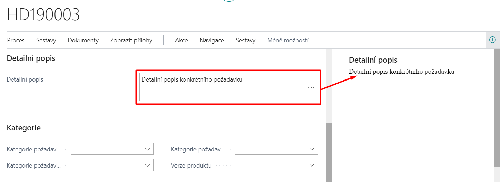
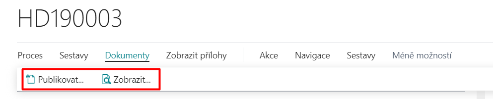
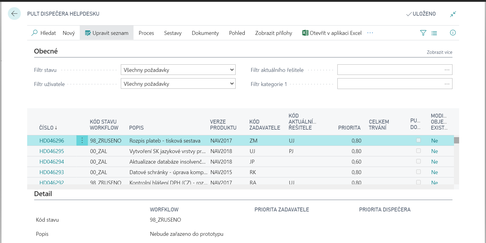

# HelpDesk

The Helpdesk module is used for centralized entry, registration, processing and evaluation of various user requests in Microsoft Dynamics 365 Business Central. Users can enter requests for service operations, for providing support, modifying or supplementing functionality, register complaints and so on. It also allows you to categorize requests, set priorities, and manage processing by assigned solvers. There is also a history of closed HelpDesk requests.

## Creating a request

After making the necessary settings, you can enter HelpDesk requests. You can make requests manually or through the Wizard. You can define whether to use the wizard in **Help Desk Settings** by selecting the **New Helpdesk with Wizard** check box. For more information about setting up a HelpDesk, visit [HelpDesk - Setup](ac-helpdesk-setup.md).

### Create a request by using the Request Wizard
1. Choose the , icon, enter **New Request** and then choose the related link.
2. The first step in the wizard is to specify **Taskmaster Code** and **Request Priority**. (Both fields are required - you cannot continue without filling in both values.)
3. The next step is to enter **Request Short Description** (title) and **Request Description** of the request.
4. Then it is possible to choose settings to predefined categories (1-3). Once you have made a suitable selection, click **Next**.
5. In the next step of the wizard, you will find the **Publish Documents** option. When you select this option, the Publish Wizard starts automatically. Publishing a document requires **SharePoint Publishing** module.
6. The last step is the **Finish** button, which you use to create the specified request.

## Helpdesk Requests
The list of helpdesk requests can be viewed as follows:

1. Choose the , icon, enter **Helpdesk Request List** and then choose the related link.
2. If you click **Request number** in the list of requests, the appropriate request tab is displayed.

The Helpdesk Request Card displays relevant information related to the selected request. The data in the white fields can be edited (e.g. it is possible to add the priority of the dispatcher, edit the data of the response or solution, or change the classification into categories on the Categories tab).

A requirement can also be assigned to a specific job. If the project does not already exist, you can create it directly from the request tab on the **Actions** tab by using the **Create Job** action. This operation creates a new project with the same code as the request number (even with the same description), and this code is automatically added to the **Job number** field.

On the **Lines** page, after creating a request, a new record appears with the default state as defined in the Helpdesk Status Management template. Each time the request state changes, if you have the **Log Status Control action** set for this state (52068291 WriteStatusChangeHlpDesk), an additional line with the corresponding values is generated (see a more detailed description below for request processing).

### Request Comments

It is possible to add Comment Lines to each created request. The first entry into notes is possible when you create a request in the wizard, as described above.

Users can use 2 forms of notes:
- **Comment Line** - available on the Note Lines tab - These structured notes contain date, Note (100 characters), and Code.
- **Free notes** - available on the Detailed Info tab - these notes allow you to enter any text, which can also be displayed in the information window in the Details tab.

It is up to the administrator to decide which form of notes will be used throughout the company.

### Documents

If **the SharePoint Publishing** module is installed, then it is possible to publish a document for each request in the HelpDesk Request on the **Actions** tab using the **Publish** button and **View** for view the published document.

For more information about publishing documents, see [Publish SharePoint](ac-sharepoint-publisher.md)

### Printing

Clicking on the **Reports** and then **Print** action in the HelpDesk Requests Overview launches the Helpdesk Requests report (the number of the currently displayed request is offered in the input filter). The print range can then be specified in more detail through filters and parameters.

## Processing of requests

Once a request has been created, it can be further processed. To do this, the **Processing** tab or the **Request Status Change** Function is used on the Helpdesk Request Card.

### Solutions

When processing a HelpDesk request, the relevant data is filled in on the request card on the Processing tab, in particular **Solution Code**, **Duration**, **Processing Description** (max. 250 characters) and **Code of the next responsible person**. The solution code is selected from a predefined table of possible solutions from the **Solutions** page.

**Duration** is entered in days, hours, minutes, seconds, or milliseconds, either directly by writing out the number and unit (you can use the abbreviation of the beginning of the word – e.g. d=day, m=minute, mil=millisecond, etc.) or by entering only a number that is interpreted as an hourly figure. For example, the figure of 28.35 is converted to 1 day 4 hours 21 minutes.

### Status change

If you have correctly entered the information on the Solution tab, you can press the function **Process → Change status**to go to the next phase of solving the request.

A dialog box appears with additional state control states that are considered according to the additional state filter definition.

When the operation is complete, **the Status Control status code** is updated on the General tab of the request tab. If a status control action with assigned codeunit 52068291 – WriteStatusChangeHlpDesk, is set in the selected state control state, the duration value is added to the total duration on the General tab and another line is generated to the request helpdesk items, which displays the history of the solution progress - date, solver, solution code, description, duration.

## Helpdesk Dispatch Board

1. Select the , enter **Helpdesk Dispatch Board**, and then select the related link.

- Dispatch Board allows a summary view of the specified requirements. This HelpDesk option offers an overview view of requests with preset optional filters in the header for easier searching. Requests can be filtered, for example, by status, by user, responsible person, taskmaster or by category. In addition, the displayed list of requirements can be sorted by different keys, especially by number, priority, workflow status or categories.

2. In the rows, select a specific request.
3. Click **Process**, and then **Card** to display the tab for the request.

## Request Priorities

One of the most important criteria for deciding on the planning and coordination of capacities to address requirements is the degree of urgency with which a particular requirement must be addressed. An important aid to the dispatcher in this process can be an indicator of the overall priority of the request, as calculated by the program based on the input parameters:

- Weight of the beneficiary, i.e. the taskmaster of the request
- Request priority set by the taskmaster when creating
- Priority of the request set by the helpdesk dispatcher during any subsequent reassessment of the request's importance.

### The overall priority is calculated as:
- the product of **Taskmaster weight** (the value on the appropriate authorized person card) and **Request priority** set by the sponsor unless the dispatcher sets a different priority (i.e., the dispatcher priority is blank).
- the product of **Weight** of the requestor and **Priority** of the request set by the dispatcher (i.e. the dispatcher's priority is filled).

## Reports

Menu of print reports assigned to the HelpDesk module:
1. Choose the , icon, enter **Helpdesk Requests (Reports and Analysis)** and then choose the related link.
2. According to the specified filters, individual request cards, delayed requests and a list of helpdesk requests are printed.

## View closed requests

1. Choose the , icon, enter **Helpdesk Closed Request List** and then choose the related link.
2. A page will appear that contains a list of already completed helpdesk requests.

- Requests are closed automatically through the Status Control states set after the transition to one of the final states.

## Export HelpDesk requests

1. Choose the , icon, enter **Export Helpdesk Requests** and then choose the related link.
2. Fill in the report input filters.
   - Number, New Request, Closed Request
3. Confirm the export of the request with the **OK** button.

## See also
[HelpDesk - Setup](ac-helpdesk-setup.md)  
[AC Productivity Pack](ac-productivity-pack.md)
