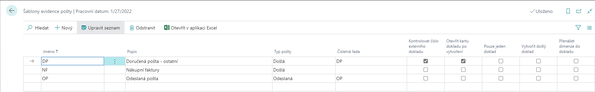
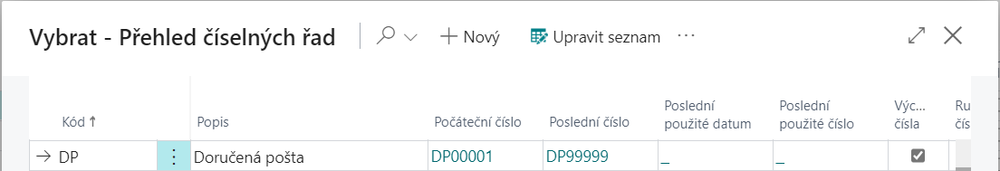
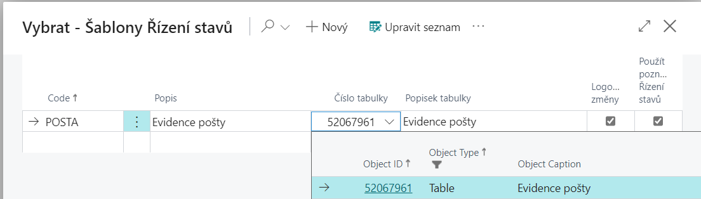
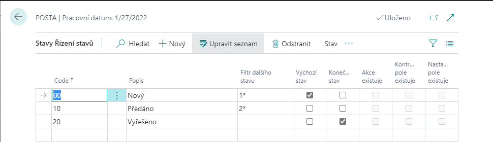
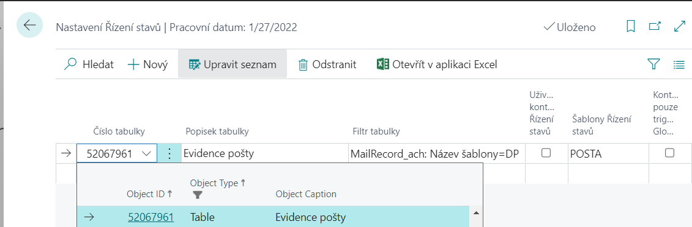
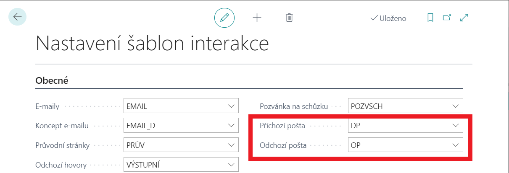
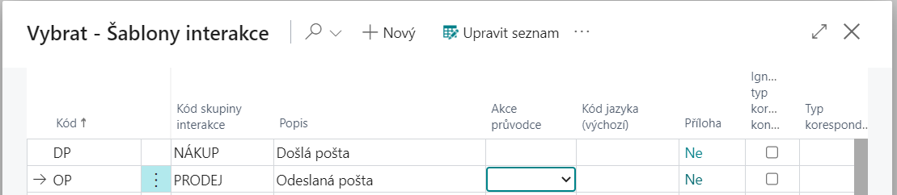

# Mail records - Setup
## Mail Record Templates
After installations of the module, it is necessary to create the Mail Record Templates on the page – **Mail Record Templates**.

- Choose the , icon, enter **Mail Record Templates** and then choose the related link.

On the **Mail Record Templates** page select the code for the correct Mail Record Template. It is also possible to check whether to **External document number Unique**, **Open document card after creation**, **Only one document**, **Create incoming document** or **Copy dimensions to document**.

In the **No. Series** field, a number sequence is selected for the newly created documents, which we must prepare in advance if we have not already done so. The number series is formed in the same way as for other agendas:

1. Choose the , icon, enter **No. Series** and then choose the related link.
2. On the **Number Series** page, click **New** to create a new number series.
3. Enter the **Code**, **Description**, and **Starting number** of the number series.
4. Select the **Default Nos.** for autofilling numbers when entering new requests check box.

An example of a created number sequence (*for more details, see Number series*):

## Status management

If you want to use **the Mail Records** module, it is also necessary to set up the **Workflow module (status management)** correctly.

### Set up a state management template

First, you need to set up a state control template *(for more details, see module - Workflow)*.

1. Choose the , icon, enter **Status Management Templates** and then choose the related link.
2. On the **Status Management Templates** page choose **New** funciton.
3. Enter the **Code** and **Description** fields.
4. In the **Table Number** field, enter the number **52067961** (the number of the Mail Record,).
5. If you want changes to be automatically logged, select the **Log changes** check box.
6. To specify individual states for the newly created state control, click **Template function → Status Management Statuses**.

For each state control state, you must define a **Code**, **Description**, and **Next status filter** that specifies what other states can be accessed from that state. Just one of the states must be marked as **Default Status** (by checking the **Default Status check box**). The status marked in this way is filled in when creating a new Mail Record document.

Some states may be labeled as **Final Status**, from which no further state is progressed.

For the active row, you can specify **State Control Actions**, **Checked Fields**, and **Set Fields**.

### Settings status management for Mail Records

1. Select the , enter **Status Control Settings**, and then select the related link.
2. On the **Status Mgt. Setup** page enter 52067961 in the **Table Number** field, which identifies the Mail Record table.
3. In the **Status management template** field select the appropriate status management template for Mail Records.

## Interaction Template Setup

If you want to use **Mail Records** module in the **Marketing** module, you also need to set up the interaction templates correctly. The settings are then used when you start **Create Interaction** function on the Mail Record Card, when the corresponding Interaction Rec. Entry is created for the Contact Card *(for more details, see. module - Marketing)*.

### Interaction Template Setup

1. Select the , enter **Interaction Template Setup**, and then select the related link.
2. On the **Interaction Template Setup** page, in the **Incoming Mail** and **Outgoing Mail** select correct interaction templates.

### nteraction Template

1. Select the , enter **Interaction Templates**, and then select the related link.
2. On the **Interaction Templates** page, enter the code for the correct interaction group.

## See also

[Mail Record](ac-incoming-mail.md)  
[Productivity Pack](ac-productivity-pack.md)
