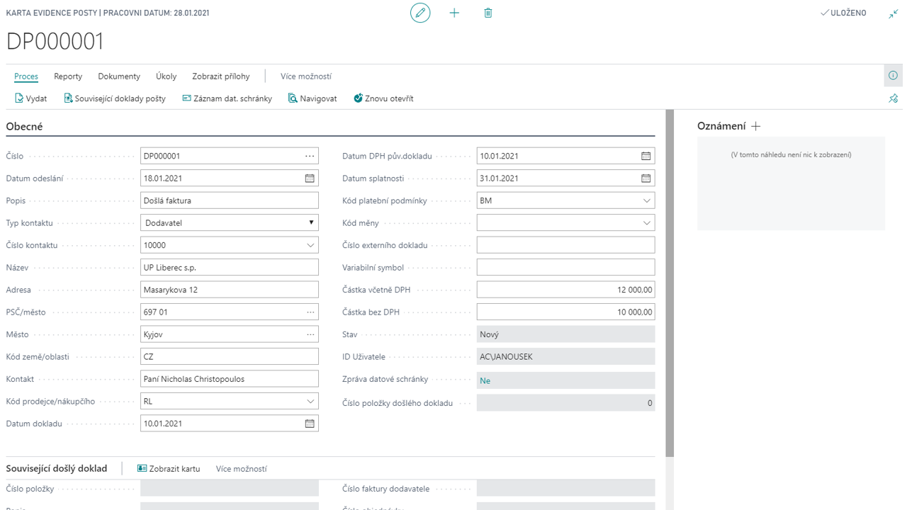

# Incoming Mail

Add-on modul Evidence pošty umožňuje evidovat a řídit schvalování došlých i odesílaných „papírových“ dokumentů přímo v systému Dynamics 365 Business Central. Schvalování probíhá řízeným způsobem podle přednastavených šablon workflow za celý doklad nebo za dílčí částky dokladu (např. schvalování nákladů po střediscích).

Využitím integrace s modulem Publikování SharePoint lze k evidované poště připojit její elektronický obraz, což umožní eliminovat fyzický oběh papírových dokumentů po organizaci a s tím související rizika jejich ztráty nebo zničení.

**See also**

[Evidence pošty - nastavení](ac-incoming-mail-setup.md)  
[Productivity Pack](ac-productivity-pack.md)
