# Mail Record

The **Mail record** extends **the Purchase** and **Sales** modules of the Microsoft Dynamics 365 Business Central system to support the registration of incoming and outgoing mail. Registered mail can be processed in a controlled manner using the **Workflow module (Status Management),** linked to purchase or sales documents, and through the **SharePoint Publishing** module or **Incoming Documents** module to attach a scanned or electronically received document to the registered mail card. Another option is to link the mail records card with the record in the **Data Boxes** module.

## Create a new Mail Record Card
After making the necessary settings, you can create Mail Record documents. Documents can be created manually by:
1. Choose the , icon, enter **Mail Record** and then choose the related link.
2. On the **Mail Record Templates** page select the code for the correct Mail Record Template.
   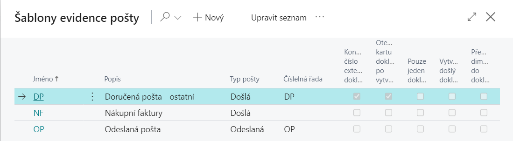
   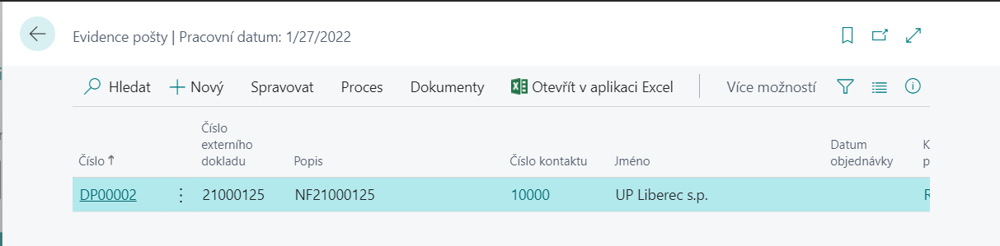
3. In the **Mail Records list,** select **New** feature.
4. Create a new Mail Record document.
   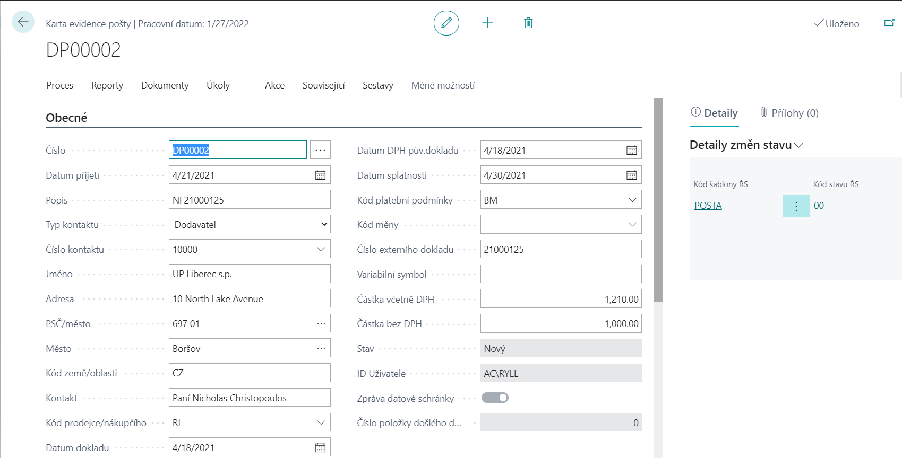

**Mail Record Card** displays relevant information related to the document. The **Number** field is automatically populated with another number from the number series **Contact Type** and **Contact No.** specify which document it is - Vendor, Customer, Contact (to be filled in if the Supplier or Customer does not yet exist).

All data in the white fields can be edited (it is therefore possible to fill in the **Description** field, all date fields, **Payment Terms**, **Salesperson/Purchaser code, Currency Code, External Document Number,** etc., which are then taken over into the created document. You can also enter the fields **Amount including VAT** and **Amount excluding VAT**.
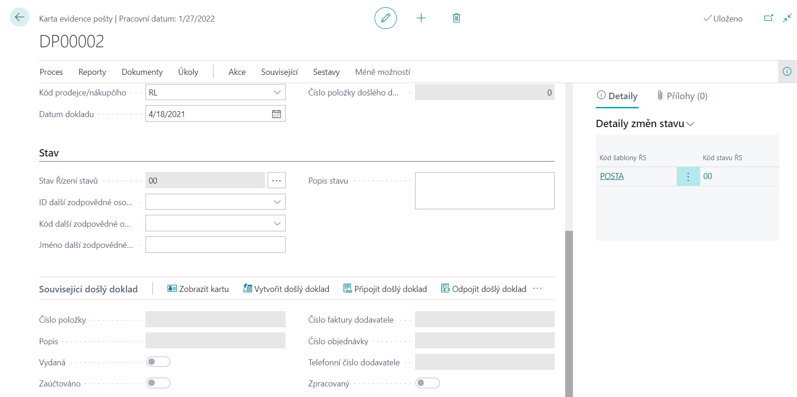
In the  **Status** a new record will appear after creation with the default status as defined in the status control template. It is also possible to fill in - **Additional responsible person** (either from Users or from the Employees module) and the **Status Description** text field.

On the **Related Incoming Document** tab, you can create or attach or disconnect the Incoming Document. This is a link to the **Incoming Mail module (for more details, see the Inbox module)**.

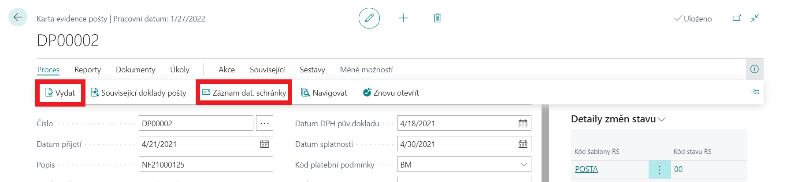
If it is a document created from the Data Box, it is possible to have the original document displayed via the function - **Process / Data recording. mailboxes (for more details, see the module - Data mailboxes)**.

**Dimensions** are automatically filled in when filling in individual fields on the mail records card, i.e. based on filling in **Contact Number**, **Salesperson/Purchaser Code**. If the user wants to edit or change these dimensions, there is the **Mail/Dimensions** function.

After filling in all the necessary data, it is advisable to approve the document and prevent its changes. This is the **Process/Issue** function.

### Request Comments
Users can enter comment lines available as **Related/Mail/Comments**. These are Request Comment Line on the request card—these structured notes contain the Date, Note (100 characters), and Code fields.
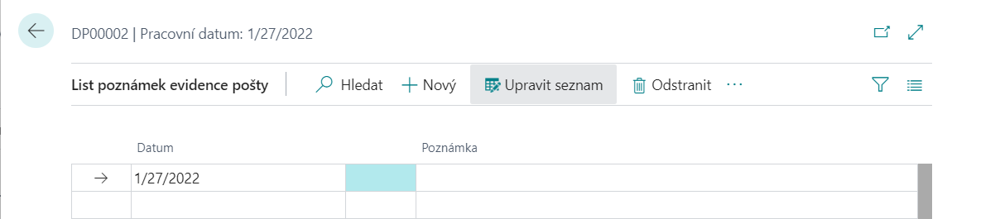
### Documents
If **the SharePoint Publishing** module is installed, then it is possible to publish a document using the **Documents/Publish** function for each Mail Registration Card and view the published document using the **View** function **(for more details, see module - SharePoint)**.
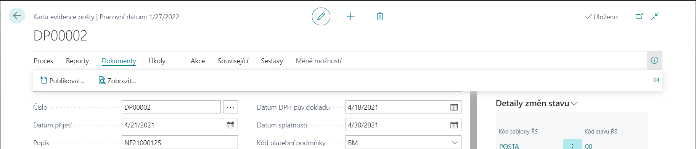
### Attached documents
Using **the Related/Mail/Attachments** function, any document can be attached to the card, which is then stored in a Microsoft Dynamics 365 Business Central table.
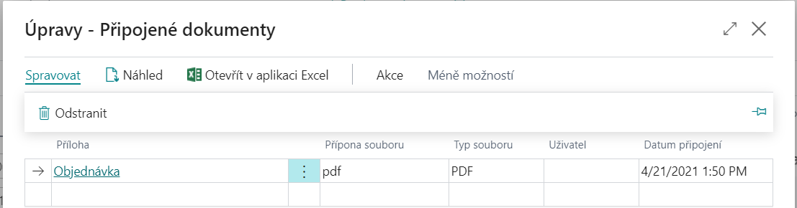
### Printing
Using the **Reports/Print** function on the **Mail Records Card** page, the **Mail Records** report is launched (the number of the currently displayed request is offered to the input filter, the print range can then be specified in more detail through filters and parameters.

## Processing of requests
After creating the Mail Registration Card, the document can be further processed.
### Request approval
If the Incoming Document Exchange workflow is created and enabled and the Approval user settings are created, you can Send request for approval – **Action/Send request for approval function (for more details, see module – Approval)**. If the mail card has not been approved, you cannot create a document.
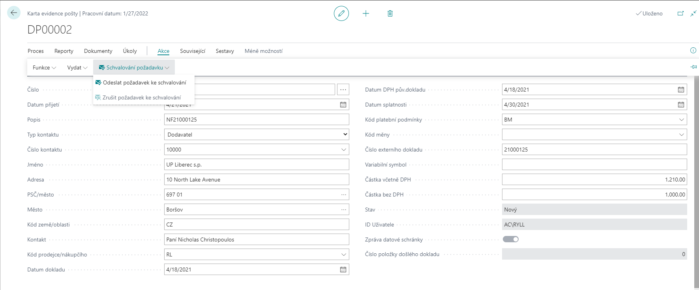
The approval request can be approved using the function - **Related/Post/Approval** or cancelled using the function - **Action/Cancel Approval Request**

### Creating an interaction
After select **Create Interaction** function, the corresponding Interaction Log Entry is created for the Contact Card according to **Interaction Template Setup** for **Incoming** and **Outgoing Mail (for more details, see module - Marketing)**.
### Creating a documents
You can use the **Create Document** function. The user is asked which document to create and after creation, the new document tab is automatically displayed.

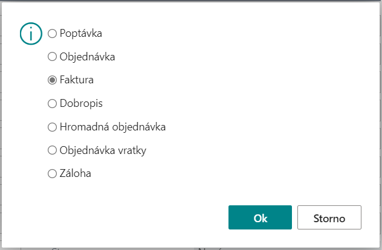

All data from the Mail Record Card are transferred to the header of the created document. If dimensions are filled in on the Mail Records card and the Transfer dimensions to document check box is selected in the Mail Registration Template, the dimensions will also be transferred to the created document. This document can be opened by the standard Navigation functionality, via the navigation function or Mail Related documents.
### Contact orders
Use the **Contact's Orders** feature to view an overview of Purchase or Sales Lines by Contact type. Rows are filtered:
- **Purchase order** or **Purchase Return Order lines** to the specified Vendor number.
- lines **Sales Orders** or **Sales Return Order Lines** to the Customer number entered.
   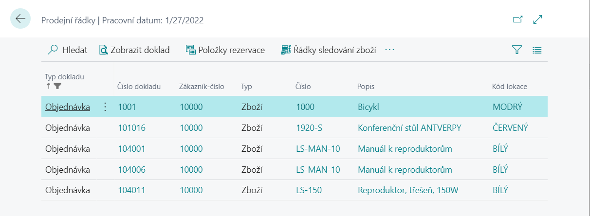
### Navigate (Mail Related Documents)
The standard **Navigate** feature displays the Mail Records tab and **the Related Mail Documents tab**.
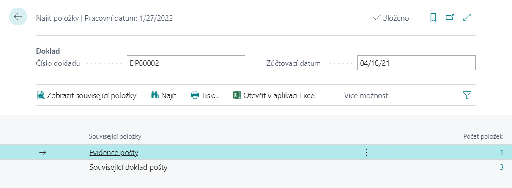
Using the **Mail Related Documents** function or the **View Related Items** function within Navigation, you will see a detailed overview of all related documents for the selected mail records tab.
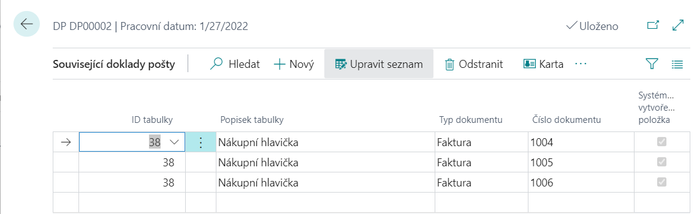
## Mail Record Board
Mail Record Board is available as follows.
- Choose the , icon, enter **Mail Record Board** and then choose the related link.

This page provides a summary view of unclosed mail records cards. It offers an overview view of requirements with preset optional filters in the header for easier searching and orientation. First of all, it is necessary to choose which cards of mail records it is, i.e. the template of mail records. Furthermore, requests can be filtered by, for example, **Customer** or **Vendors**, **Status**, **Responsible Person** or **Mail Type**. In addition, the displayed list of requirements can be sorted by different keys, especially by number, customer or supplier, date or responsible person. At the bottom of the list of cards there is additional information about **Request Status**, **Amout of document**, **Amount to Approve** and **Approved Amount**.

The selected request can then be displayed by selecting **Card**. There are also functions for **Create Interaction**, **Download Messages from Data Box**, **Navigate** or Add **Notes**, or view attached **Documents**.
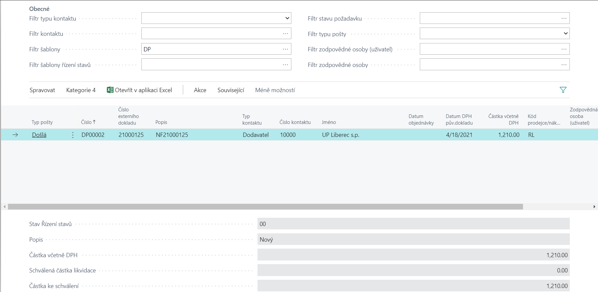
## Closed Mail Record
Closed mail records are available:
- Choose the , icon, enter **Closed Mail Record** and then choose the related link.
   Viewing the **Closed Mail Record** page displays closed requests, that is, requests that have already been processed. Requests are closed manually through the Close Mail Records feature.
   The selected request can then be displayed by selecting **View**. There are also functions for displaying ** Related Mail Documents** and **Data Box Record**.
   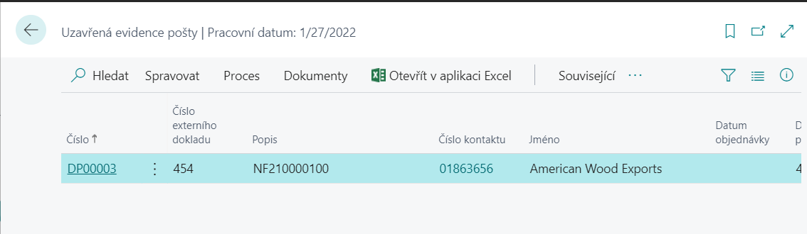

## See also
[Mail Record - Setup](ac-incoming-mail-setup.md)  
[Productivity Pack](ac-productivity-pack.md)
