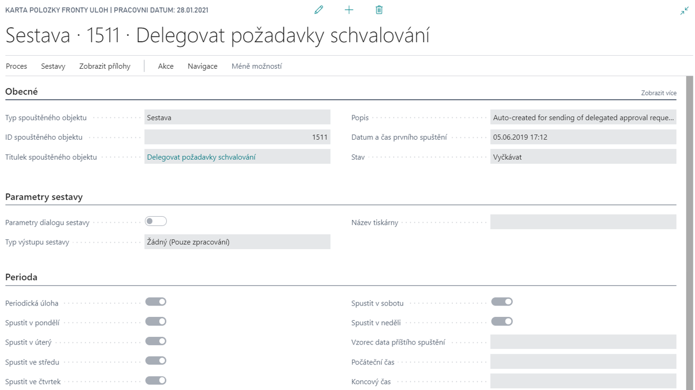

# Job Queue Extension (Job Queue)

**Job Queue** module enables automated execution of reports or procedures in Dynamics 365 Business Central at scheduled intervals. It is mainly used for automatic periodic reporting, allowing you to send the resulting reports as an e-mail attachment in HTML format, save them, or publish them to SharePoint. Managers, in particular, have up-to-date results or overviews available at a specified location without having to manually generate the report each time. Another possible use is the regular unattended execution of batch jobs, such as adjustment or billing of goods.

The Job Queue Extension is an additional module that allows you to define the parameters of job execution and actions performed at the start, successful or unsuccessful completion of the task, such as sending a notification email.

## See also

[Job Queue Extension (Job Queue) - Setup](ac-job-queue-extension-setup.md)  
[Productivity Pack](ac-productivity-pack.md)
