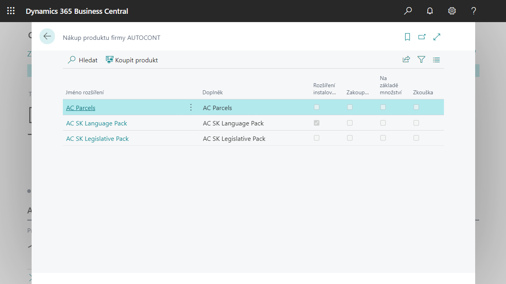

# AC Monetization
> Update 03.02.2022

It is a functionality that allows the user to manage subscriptions to AUTOCONT products in the Business Central environment.

## Trial Period Activation

Each product has a 30-day trial period to verify that the functionality suits the customer. Activation can be done either:

- **Automatically** when you start the Assisted Setup of the respective product (Installation & Extensions -> Assisted Setup, section Set up AUTOCONT extension).
- By opening the **Purchase of an AUTOCONT Product** page and running the **Buy Product** action (note: the list contains all commercially available extensions; installation of the extension is required before activation).

In both cases, a short activation wizard will start, during which you must enter the following:

- Email - this will be used for communication regarding subscriptions, e.g. to send notifications of the upcoming subscription end date, etc.

- Consent to [Terms and Conditions](https://www.autocont.cz/podnikove-aplikace/PAS-predplatne-podminky).

Note: If you are not prompted to confirm that the user really wants to create a trial subscription (and the window for selecting a subscription plan opens directly), then the trial period has already been activated in this tenant sometime before.

## Purchase of the product

At any time during the trial period, it is possible to purchase the product with the understanding that the customer will not lose the remainder of the trial period.

A notification on the Home page with a link to the **Purchase of an AUTOCONT Product** page informs the user that the trial period is about to end.

The **Buy** **Product function on the AUTOCONT Product Purchase** page guides the user through the steps:

- **Plan selection** - First, you need to choose whether you want to renew your subscription monthly or annually.
- **Customer Details** – Fill in missing company details required for ordering and billing.
- **Payment Card Details** – Entering the payment card details that will be stored in STRIPE.

## Subscription management

To manage subscriptions, use the **AUTOCONT Subscription page**, where the user:

- Get an overview of AUTOCONT's subscription products,
- has the possibility to terminate the subscription of the selected product,
- can cancel the subscription,
- can update customer information (Update Customer Information action),
- can change the payment card - when updating the information (see previous), you can select Update payment card, then the Stripe dialog will appear.

## See also

[Productivity Pack](ac-productivity-pack.md)