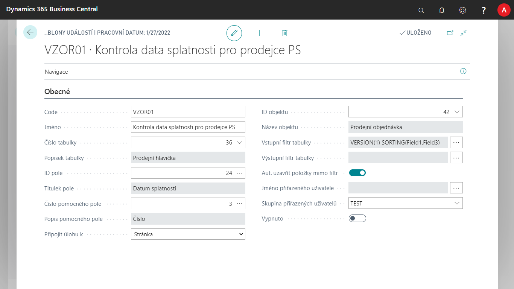
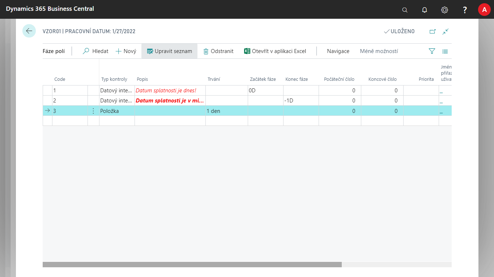
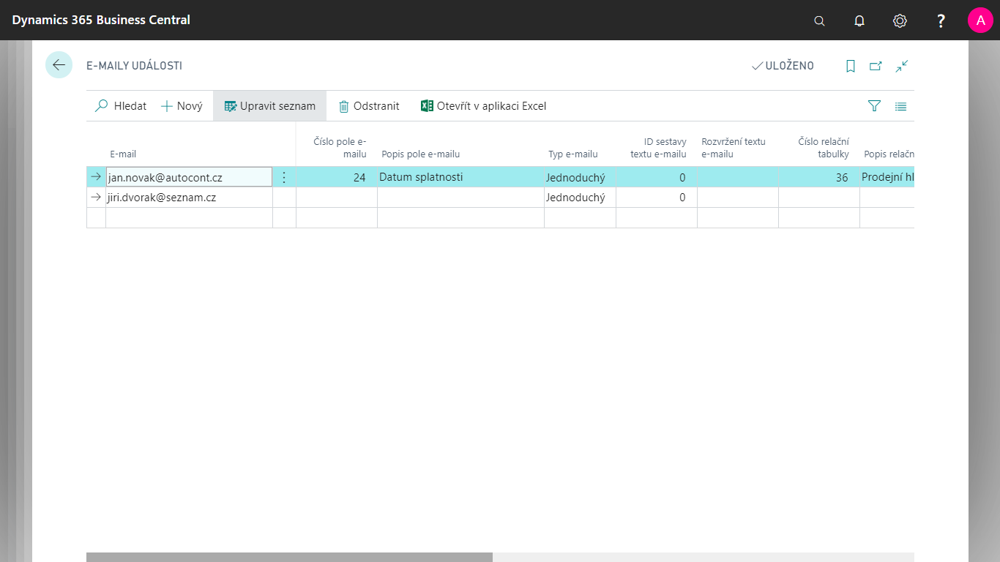

# Notifications - Settings

The **Notifications** module enables **system notifications** for data and process statuses recorded in Microsoft Dynamics 365 Business Central. Notification works both internally in the system environment and externally in the form of an e-mail. The module can work off-line, as it does not respond to an immediate change in the data, but **sends information at scheduled intervals**. In addition to tracking the current event, it is also possible to monitor the development of the event over time.

## Create and edit Event Template Card

To create a new tracked event, you need to create and define it on the **Overview page of Event Templates List**.

1. Choose the , icon, enter **Event Templates** and then choose the related link.
2. On the **Event Templates List** page, create a new event by choosing the **New** button
3. A new event tab opens with some generic pre-filled fields.
4. In the **Table No.** field, select the table above which we want to perform tracking and then select the **field No.** from the table – according to this field, the given stage is evaluated. **Helping Field No.** is used only for a closer resolution of the event.
5. In the **Attach task to** box, choose whether to open the page or report after the event appears in Event Entries. The object ID field then specifies in more detail which one.
6. In the Input Table Filter filter field, choose which items from the table to enter or not to enter for further processing.
7. In the Table Output Filter field, choose to refine the filter.
8. To close items that pass out of the filter, automatically select the **Close Entries Out of Filter** check box.
9. Use **Assigned User Name** or **Assigned User Task Group** fields to set who the subsequent task you create will be assigned to.
10. To start watching the event, uncheck **Disabled** box. This determines whether the field is tracked or not.

> [!NOTE]
> The **Field No.** functionality also works with calculated fields and is an optional field.

## Data filter settings

In addition to setting filters on the Event Templates page in the **Output and Input Filter fields**, we can also set field filters using the **Date Filters** option. We set it up as follows.

1. On the Event Template page, choose the **Date Filters** action
2. Set the **Date field number**to which the filter will apply.
3. Here, in **Start Phase** and **End Phase** boxes, enter a date formula related to the system date (TODAY).

## Set up Event Phases

For each **Event Template Card**, you need to set the phases that the event can reach when the conditions are met.

1. On the **Event Template Cards** page, choose the **Phases** action.
2. Create a new line using the **New** button.
3. For each line, enter a **Code** that is used to distinguish between the stages of tracking.
4. Choose **Control Type**.
   It takes values **Entry**, **Date Interval** or **Numerical Interval**. When selecting phases, the highest priority is to select Item, then Date Interval, and finally Numerical Interval. This field refers to the Field Number field from the Event Template Card.

> [!NOTE]
> When selecting the **Entry** control type, the **Period** field is taken. Specifies how long the stage will last from the time the alert item is created. Selecting **Date Interval** works with the **Start Phase** and **End Phase**fields. Therefore, a date formula related to the system date (TODAY) is entered. The Numerical Interval value, in turn, works with the **Start Number** and **End Number** fields.

## Specify the addressee of e-mails

Each event phase can also be assigned an email address specifying to whom the event will be sent. There are three different ways to specify an email recipient that can be combined with each other. The email can then go to all three definitions for one item.

| **Definition Type** | **Description** |
|---------------------------------------------|-----------|
| **Manually defined email** | Use this option if you always want to send notifications to this defined e-mail. |
| **Dynamic email from a field in a record** | Use this option if you want to send email alerts that are directly stored in a record in the source table of the alert template, which is also the source of the alert. (e.g. a notification above an employee's card, which also contains their e-mail). |
| **Dynamic email from a relational table field** | It is used in cases where we want to send an email alert that is stored in a relational table to the source table of the alert template with a link through one field that we set. For example, when notifying you of a sales document, when we want to send an email to the seller of the document. The email is then stored in the E-mail field in the Salesperson/Purchaser table, which is bound from the sales header through one field **Salesperson Code** – Code. |

## Set up a Manually Defined Email

1. Select the , enter **Event Templates**, and then select the related link.
2. On the **Event Template Cards** page, choose the **Phases** action.
3. Here select **Field Phases** action **E-mails**
4. On the **Event Emails** page, choose ** New** action to fill in the **Email** field as needed.

## Set up Dynamic Email from a field in a record

1. Select the , enter **Event Templates**, and then select the related link.
2. On the **Event Template Cards** page, choose the **Phases** action.
3. Here select **Field Phases** action **E-mails**
4. On the **Event Emails page,** choose **New** action and fill in the **Email Field No.** field. This is a text box from a table defined by the event template.

## Set up a dynamic email from a relational table fields

1. Select the , enter **Event Templates**, and then select the related link.
2. On the **Event Template Cards** page, choose the **Phases** action.
3. Here select **Field Phases** action **E-mails**
4. Fill in **Relational Table No.** field with the table where the email field is located.
5. In **E-mail relational field number** box, type the e-mail field in the relational table.
6. In the **Relation From Field No.** field, enter the **Event Template Table**field that defines the relation to the relational table.
7. In the **Relation To Field Number** box, type the field from the relational table on which the binding is defined.

## Obsah E-mailů

There are two ways to define the content of an email (subject and body). With a **fixed programmed structure**that we choose ourselves and will be used each time we run it, or with **dynamic content**where the content is defined using fields and email texts.

## Set up an email with a fixed structure

The subject of this type of email is the **event template code** and the **phase description**. The body of the email, in turn, is the content from the **primary key** field of the event item.

1. Select the , enter **Event Templates**, and then select the related link.
2. On the **Event Template Cards** page, choose the **Phases** action.
3. Here select **Field Phases** action **E-mails**
4. Fill in **Email Type** field as **Standard**.

## Set up an email with dynamic content

The subject and body of this kind of email are defined in the texts of the email using the email fields. The field itself can be defined from the following tables: Notification Template Source Table, Event Template, Field Phases.

1. Select the , enter **Event Templates**, and then select the related link.
2. On the **Event Template Cards** page, choose the **Phases** action.
3. Here select **Field Phases** action **E-mails**
4. Fill in the **Email Type** field as **Structured**.

**See also**

[Notifications](ac-notifications.md)  
[Productivity Pack](ac-productivity-pack.md)
