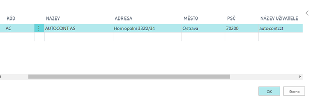
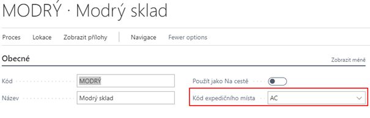
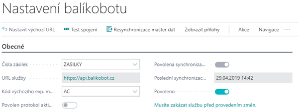

# Nastavení Balíkobotu

Pro správné fungování addonu Zásilek je zapotřebí nastavit několik oblastí:

- Číslenou řadu
- Expediční místa
- Nastavení Balíkobotu
- Přepravce
- Nastavení lokací
- Parametry zásilky
- Nastavení tisku
- Nastavení způsobu platby (dobírka)

Ostatní číselníky (Služby přepravce, Manipulační jednotky a Pobočky přepravce) si addon stahuje z API Balíkobotu.

## Expediční místa

Expediční místo je místo Vašeho skladu odkud jsou expedovány zásilky. Uživatel může mít několik expedičních míst. Pro každé expediční místo je nutné jiné API, dále je expediční místo spojeno s jednou lokací Vaší společnosti.

1. Vyberte ikonu , zadejte **Expediční místa** a poté vyberte související odkaz.
2. Na přehledu vyhrat funci **Nový**
3. Zadat **Kód** pro expediční místo, popis, adresu a **Název uživatele a heslo** k Vašemu API.
4. Zavřít přehled expedičních míst pomocí OK
   

## Nastavení lokací
Na kartě dané lokace je potřeba vybrat expediční místo, které je spjaté s daným API. Pokud bude více lokací, je nutné na každé nastavit příslušné expediční místo. Toto slouží k omezení chybovosti uživatelů, aby nemohli spojit do zásilky doklady s různými expedičními místy.

Pro přiřazení expedičního místa lokaci je zapotřebí nastavit **Kód Expedičního místa**.

1. Vyberte ikonu , zadejte **Lokace** a poté vyberte související odkaz.
2. Otevřít kartu požadované lokace
3. Vyplnit pole **Kód expedičního místa** v záložce Obecné
   
## Nastavení Balíkobotu
Základní nastavení Balíkobotu je nutné provést na stránce **Nastavení Balíkobotu**

### Stránka Nastaven Balíkobotu

Okno nastavení Balíkobotu obsahuje:
- **Čísla zásilek** - Číselná řada pro zásilky.
- **URL služby** - Adresa služby Balíkobot.
- **Kód výchozího expedičního místa** - Výchozí expediční místo, odkud budou odváženy zásilky (viz další kapitola)
- **Povolen protokol aktivity** - Spuštění sledování logu aktivity
- **Povolena synchronizace master dat** - Povolení stahování číselníků z Balíkobotu
- **Poslední synchronizace master dat** - Datum a čas poslední aktualizace číselníků z Balíkobotu
- **Povoleno** - Zapnutí a vypnutí funkcí Balíkobotu
   Funkce nad oknem Nastavení Balíkobotu
- **Test spojení** - Otestuje spojení se službou Balíkobotu
- **Resynchronizace master dat** - Aktualizace číselníků z Balíkobotu
- **Protokol aktivity** - Log obsahující data o aktivitě

Základní číselníky se nahrávají pomocí RapidStart balíčku pro Dynamics NAV. Tento balíček obsahuje data, která se nestahují z API Balíkobotu:
Přepravci, parametry zásilek,..
Ostatní tabulky se stahují a plní po zapnutí synchronizace master dat a následném povolení v tabulce nastavení BalíkBotu.
Aktualizace těchto dat probíhá ručně pomocí funkce „Resynchronizace master dat“.
### Spuštění addonu Zásilky - Balíkobot
Pro spuštění funkcí Balíkobotu je potřeba provést nastavení:

1. Vyberte ikonu , zadejte **Nastavení Balíkobotu** a poté vyberte související odkaz.
2. Vybrat číselnou řadu pro zásilky
3. Zadat do pole URL služby: https://api.balikobot.cz
4. Vybrat kód výchozího expedičního místa
5. Povolit nebo zakázat automatický tisk protokolů svozu
6. Povolit nebo zakázat Protokol aktivity
7. Povolit nebo zakázat synchronizaci master dat (stahování číselníku z API Balíkobotu)
8. Povolit nebo zakázat funkce Balíkobotu (Po povolení se začnou stahovat číselníky)
9. Potvrdit pomocí OK

## Nastavení přepravců

Na přehledu **Přepravci** v rámci addonu přibyly nová pole a funkce.

### Pole nad přepravci:

- **Povoleno pro Balíkobot** - Přepravce je povolen a je možné ho používat
- **Povolit více balíků** - Při vytváření zásilky funkce umožní vytvořit více balíků v rámci jedné zásilky
- **Paletová přeprava**
- **Počet manipulačních jednotek** - U paletové přepravy je možnost nastavit více manipulačních jednotek
- **Pouze pobočky** - Přepravce nemá služby přepravce
- **Výchozí kód manupulační jednotky**
- **Kontrola příjemce** - kontrola na e-mail a tel. číslo, případně jejich kombinace
- **Povinný obsah zásilyk mimo EU** - pro přepravce, kteří převáží mimo EU

### Funkce nad přepravci:

- **Služby přepravců** - Tabulka služeb jednotlivých přepravců
- **Pobočky přepravců** - Tabulka lokalit, kde si mohou zákazníci zboží od přepravce převzít
- **Manipulační jednotky** - Tabulka manipulačních jednotek paletové přepravy

## Nastavení služeb přepravců

Služby přepravců se stahují automaticky pomocí API Balíkobotu. Je možné vynutit určité nastavení pro jednotlivé služby přepravce. Pro nastavení musíte:
1. Vyberte ikonu , zadejte **Přepravci** a poté vyberte související odkaz.
2. V seznamu vyberte požadovaného přepravce a zvolte funkci **Služby přepravce**
3. Na následující stránce vyplňte pole dle pořeby:
   - **Povoleno pro Balíkobot** - Službu je možné používat (ve výchozím stavu povoleno)
   - **Vynutit hmotnost zásilky**
   - **Vynutit objem zásilky**
   - **Vynutit cenu zásilky**
   - **Vynutit dobírku zásilky**
   - **Vynutit variabilní symbol zásilky**
   - **Hmotnost na řádku** - Hmotnost musí být vyplěna v řádku zásilky
   - **Služby ČP** – Pouze pro Českou poštu - dlouhý textový řetězec služeb pošty nad danou zásilkou
      o	https://www.balikobot.cz/dokumentace/cp_ciselnik_sluzeb.pdf

## Parametry zásilek

Parametry pro jednotlivé přepravce nejsou stahovány z API balíkobotu a je potřeba je zadat ručně nebo pomocí RapidStart Balíku.

## Nastavení způsobu platby - Dobírka

Pro nastavení a používání funkce zásilka na dobírku je zapotřebí nastavit na způsobu platby booeal **Dobírka**

1. Vyberte ikonu , zadejte **způsob platby** a poté vyberte související odkaz.
2. V přehledu vybrat na daný způsob platby boolean **Dobírka**
3. Zavřít přehled způsobu platby
## Nastavení tisku
### Výběr formátu tisku – klientská zóna
Základním krokem nastavení tisku štítků je definice jakým způsobem se budou generovat PDF se štítky ze strany Balíkobotu. V klientské zóně (https://client.balikobot.cz/) uživatel musí nastavit, zda se bude tisknout ve formátu na celou stránku nebo dle pozic na papíru velikosti A4. Vše záleží na tom, na jaké tiskárně se bude tisknout. Pro tisk na tiskárně pro štítky se nemusí vybírat pozice tisku štítku.
### PDF reader
Pro tisk štítků je zapotřebí mít nainstalovaný PDF reader. Pro práci se štítky doporučujeme Acrobat Reader v základní free verzi a také ho mít nastavený jako výchozí program pro PDF soubory.
### Výběr formátu tisku – klientská zóna
Základním krokem nastavení tisku štítků je definice jakým způsobem se budou generovat PDF se štítky ze strany Balíkobotu. V klientské zóně (https://client.balikobot.cz/) uživatel musí nastavit, zda se bude tisknout ve formátu na celou stránku nebo dle pozic na papíru velikosti A4. Vše záleží na tom, na jaké tiskárně se bude tisknout. Pro tisk na tiskárně pro štítky se nemusí vybírat pozice tisku štítku.

### Výběr tiskárny
Pro nastavení tisku štítku je potřeba nastavit ID sestavy a přidělit uživateli tiskárnu. Funkce tisk štítků je nastavená, aby tiskla na definové tiskárně.

Pro definice tiskárny je nutné:
1. Vyberte ikonu , zadejte **Výběry tiskáren** a poté vyberte související odkaz.
2. Zvolit **Nový**
3. Vybrat ID uživatele, ID sestavy 52068430 a Název tiskárny

Tisk předávacího protokolu se tiskne automaticky po objednání svozu. Pokud uživatel nechce automatický tisk, stačí v Nastavení Balíkobotu vypnout Boolean - Tisk předávacích protokolů svozu. Tisk se provádí z Výchozí tiskárny dle Vašeho zařízení. Případně pokud máte nastavenou výchozí tiskárnu ve **Výběry tiskáren** jako zbytek Vašich tiskových sestav.

## See also
[Zásilky](ac-parcels.md)  
[AC Productivity Pack](ac-productivity-pack.md)  
[AUTOCONT řešení](../index.md)
