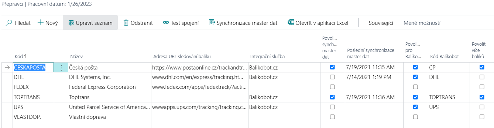

# Setup - AC Parcels - Balíkobot Integration
> Update: 08.03.2022

There are several areas that need to be set up for the AC Parcel addon to work properly. The addon is initially set up using the wizard and then the settings can be changed manually.

## Addon settings areas:
- Numbered series
- Expedition places
- Parcels settings
- Shipping agents
- Location Settings
- Shipment parameters
- Print Settings
- Payment settings (COD)
- Automatic updates
- Settings in the Sandbox environment

Other code lists (Carrier Services, Handling Units and Carrier Branches) are downloaded from the Balíkobot API.
## Setting up AC Parcels using the wizard

1. Choose the , icon, enter **Assisted Setup** and then choose the related link.
2. Select Shipment Settings
3. After reading the instructions, click **Next**.
4. If you want you can import the RapidStart package manually, or you can click **Next and the package will download and import itself**.
5. Next, create a new shipping location using the **New** button and fill in the fields:
   - Code
   - Username
   - Password
6. You can also fill in additional information:
   - Description
   - Name
   - Address
   - City
   - Postcode
7. In the **Expedition Places**, select the newly created record.
8. In the next step, select the location created by the shipping location and click Next.
9. Create a new Shipping Agent using the fields:
   - Code
   - Name
   - Integration services: Balíkobot.cz
   - Balíkobot code
   - Allow multiple packages - YES
   - Master data synchronization - YES
10. Select the **Synchronize master data**function.
11. In the Number Series field, select the appropriate number series for shipments.
12. Once you have filled in everything and clicked **Finish**, the assisted guide will close and the master data will begin to synchronize.

## Manual adjustment of settings
### Expedition places

The Expedition Places are locations of your warehouses from where shipments are dispatched. A user can have several expedition places. A different API is required for each expedition place, and the expedition place is associated with one location of your company.

1. Choose the , icon, enter **Expedition Places** and then choose the related link.
2. Choose the function **New**.
3. Insert **Code** for expedition place, description, address and **User Name and password** to yours API.
4. Close the list of Expedition places.

### Location Settings
On the tab of the given location it is necessary to select the dispatch place that is connected with the given API. If there are more locations, it is necessary to set the appropriate dispatch point for each. This serves to reduce the error rate of users so that they cannot combine documents with different shipping points into the shipment.

To assign a shipping location to a location, you need to set the **Expedition Places Code**.

1. Choose the , icon, enter **Locations** and then choose the related link.
2. Open the desired location tab
3. Fill in **Expedition Places Code** field on the General tab

### Parcels settings

Basic Package Setup must be made on the **Parcels Settings**page.

Parcels Management Setup page contain:
- **Parcels No.** - Specifies the No. Series for parcels.
- **Default Expediton Place Code** - Specifies the API credentials and shipment location from where the parcel will be shipped.
- **Print Handover After Order** – Automatic print of Handover protocols after collection order.
- **Default Printer Name** – Specifies the printer for printing labels
- **Limit Response Time** – Specifies the timeout of communication.
- **Activity Log Enabled** - Starts activity log tracking.
- **Debug Mode** – Allows you to intercept messages in communication with the service
- **Automatic master data synchronization** - Runs a procedure on the job queue that updates all data from the Package in a certain time period.
- **Automatic Transportation Status Update** - Runs a procedure on the job queue that updates the shipment transfer status for the last month in a specific time period.

Basic settings are made using the application setup wizard.
The other tables are downloaded and filled after master data synchronization is enabled.
These data are updated manually using the "Resynchronize master data" function.
#### Basic settings of AC Parcels - Balíkobot integration
To start the balíkobot functions, you need to make the following settings:

1. Choose the , icon, enter **Parcels setup** and then choose the related link.
2. Select a number series for shipments
4. Select default Expedition Places
5. Enable or disable automatic printing of collection reports
6. Enable or disable Activity Log

### Shipping Agents setup
The basic codebook is loaded using the RapidStart package for Business Central. This package contains data that is not downloaded from the Balíkobot API:
#### Table of Shipping Agents

Other tables are downloaded and filled after synchronization of master data and in the Shipping Agent table.
The update of this data is done manually using the "Resynchronization of master data" function.

The overview also includes carriers that you do not have configured with Balíkobot. Additional data is not imported for such data (see below).
### On the carrier overview, there are several fields to set up:
- Integration Service**Integrační služba** – Determines through which integration service the shipping agent is used (in this case Balikobot.cz)
- **Enable master data synchronization** – Master data may become available after switching on
- **Last master data synchronization** – Date of last master data synchronization
- **Enabled for Balíkobot** - Carrier is enabled and can be used
- **Allow multiple packages** - When creating a shipment, the feature allows you to create multiple packages within one shipment.
- **Pallet transport**
- **Number of handling units** - For pallet transport it is possible to set more handling units.
- **Branch only** – Specifies that the carrier serves only as a pickup point.
- **Maximum address length** – set the address length for the selected carrier.
### Functions over shipping agents
- **Connection Test** – Test communication between the integration service and Business Central
- **Master data synchronization** – Starts master data synchronization
- **Shipping Agent Services** - Table of services of individual shipping agent
- **Shipping Agent Branches** - Table of locations, where customers can take goods from the carrier
- **Handling units** - Table of pallet handling units
- **ADR units of the carrier** – Table of ADR units of the carrier

If you add a carrier after the first setup has been made using assisted setup, you must fill in the fields correctly:
- Code
- Package Tracking URL
- Integration service
- Balíkobot code

Then you need to use **the Synronization function of master data**!
### Set up Shipping Agent Services

Shipping Agent Services are downloaded automatically using the Balikobot API. It is possible to force certain settings for individual Shipping Agents services. To set it up, you must:
1. Choose the , icon, enter **Shipping Agents** and then choose the related link.
2. Select the desired carrier from the list and select **Shipping Agent Services** feature
3. Fill in the fields on the following page as needed:
   - **Enabled for Balikobot** - The service can be used (enabled by default)
   - **Enforce Shipment Weight**
   - **Force shipment volume**
   - **Enforce Shipment Price**
   - **Force cash on delivery**
   - **Enforce shipment variable symbol**
   - **Weight on line** - Weight must be filled in the shipment line
   - **Services of ČP** – Only for Czech Post service - a long text string of postal services above the parcel
      o	https://www.balikobot.cz/dokumentace/cp_ciselnik_sluzeb.pdf

## Shipment parameters

Parameters for individual shipping agents are downloaded from the package package API

### Payment method settings - Cash on delivery

To set up and use the cash on delivery function, it is necessary to set up booeal **Cash on delivery** on the payment method.

1. Choose the , icon, enter **Payment Method** and then choose the related link.
2. In the overview, check the **Cash on delivery** option.
3. Close the payment method overview.
## Print Settings
### PDF reader
You need to have a PDF reader installed to print labels. To work with labels, we recommend Foxit pdf and also have it set as the default program for PDF files.
### Print Format Selection - Client Zone
The basic step in setting up label printing is to define how the PDF with labels will be generated by Package. In the client zone (https://client.balikobot.cz/), the user must set whether to print in full page format or according to positions on A4 size paper. It all depends on what printer it will be printed on. The label printing position does not need to be selected for printing to the label printer.

### Printer selection
To set up label printing, you need to set the report ID and assign a printer to the user. The Print Labels feature is set to print to a defined printer.

To define a printer, it is necessary:
1. Choose the , icon, enter **Printer Selections** and then choose the related link.
2. Choose **New**.
3. Select User ID, Report ID 52068430, and Printer Name

Printing of the handover protocol is printed automatically after ordering the collection. If the user does not want automatic printing, just turn off Boolean - Printing handover protocols in the Balíkobot Settings. Printing is done from the Default Printer according to your device. Alternatively, if you have the default printer set in **Printer Selections** as the rest of your print reports.

## Automatic updates

### Automatic master data update
The automatic update of the master data starts a procedure on the job queue, which updates all data from Balikobot in a certain period of time (By default on Sunday at 14:00).

To turn on this feature, follow these steps:
1. Choose the , icon, enter **Parcels setup** and then choose the related link.
2. In Parcels Management Setup, turn on "Run Master Data Sync. Task".
3. The user will be prompted to create and open a new job queue item that will be in the "Ready" state.
4. After that, you can close the settings.

### Automatic update of the transport status
Automatic shipment status update triggers a procedure on the job queue that updates the shipment shipment status for the last month over a period of time.

To turn on this feature, follow these steps:
1. Choose the , icon, enter **Parcels setup** and then choose the related link.
2. In Parcels Management Setup, turn on "Run Track Status Update Task".
3. The user will be prompted to create and open a new job queue item that will be in the "Ready" state.
4. After that, you can close the settings.

## Settings in the Sandbox environment
### Runtime deadlock

When setting up the add-on with assistance, the message "*The request was blocked by the runtime*" may be displayed.

To resolve this issue, follow these steps:
1. Choose the , icon, enter **Extension Management** and then choose the related link.
2. **The Installed Extensions** page opens.
3. Select the line extension **AC Parcels** and then use the action **Configuration**.
4. On the **Extension Configuration** page, enable the **Enable HttpClient requests** switch.
5. You can then close the page and run the Guided Wizard again.

## PaperLess Trade settings

### Turn on Paperless Trade at the carrier

Paperless Trade is used to send an electronic invoice (in the case of a pro-forma invoice) for customs clearance.

To set it up correctly, follow these steps:

1. Choose the , icon, enter **Shipping Agents** and then choose the related link.
2. On the carriers overview, select the carrier for which you want to turn on the service.
3. To turn on the service, select the **Paperless Trade** field.
4. After setup, you can close the page

### Automatically attach an invoice to a shipment

For Paperless Trade to work properly, you must attach a PDF file of the invoice (pro-forma invoice) to the shipment.

In the case of creating a shipment from a billed sales invoice, it is possible to generate a document and attach it automatically when creating the shipment. To make the correct settings, proceed as follows:

1. Choose the , icon, enter **Shipping Agents** and then choose the related link.
2. In the carriers overview, select the carrier for which you want to turn on automatic document creation.
3. To turn on automatic PLT document creation, select the **Create PLT Document**field.
4. Once set up, you can close the page.

## See also
[AC Parcels](ac-parcels.md)  
[AC Productivity Pack](ac-productivity-pack.md)  
[AUTOCONT Solutions](../index.md)
