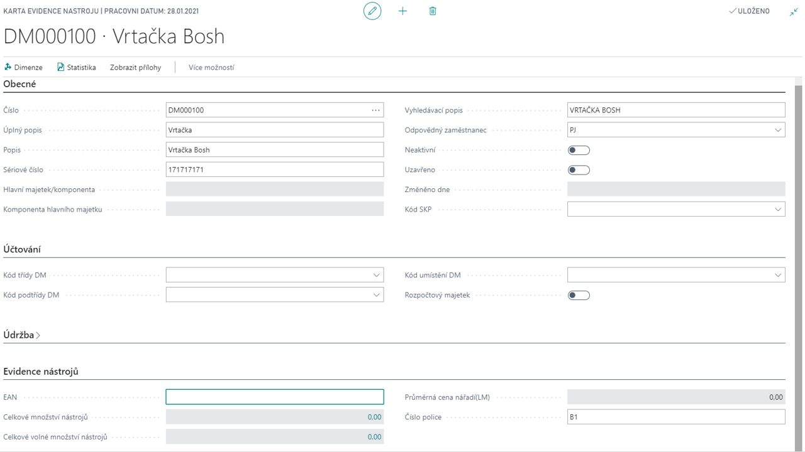

# Production Tools

Add-on modul **Evidence nářadí a pomůcek** řeší problematiku evidence nářadí, pomůcek, nástrojů, forem a jiných potřeb obvykle evidovaných pomocí skladové evidence systému. Tento modul je postaven nad základy evidence majetku, s ohledem na sjednocení evidence pro potřeby sledování dlouhodobého majetku a výrobní evidence, tj. půjčování nářadí a pomůcek.

## See also

[Evidence nářadí a pomůcek - nastavení](ac-production-tools-setup.md)  
[Productivity Pack](ac-productivity-pack.md)
