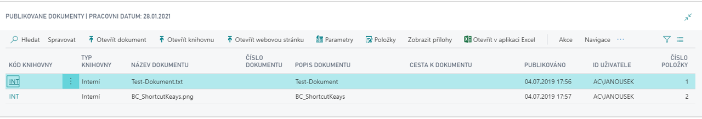

# SharePoint publishing

Add-on modul **Publikování SharePoint** umožňuje přímo z prostředí systému Dynamics 365 Business Central publikovat dokumenty v centrálním datovém úložišti SharePoint, souborovém systému či databázi Dynamics 365 Business Central a propojit je se záznamy v tabulkách informačního systému. Připojené publikované dokumenty lze přímo ze systému Dynamics 365 Business Central otevřít v asociované aplikaci. Modul tak výrazně rozšiřuje informační hodnotu a možnost využití záznamů v systému Dynamics 365 Business Central. Praktickým využitím této technologie je připojení produktových informací ke kartám zboží nebo obchodních dokumentů (např. smluv) ke kartám dodavatelů či zákazníků.

**See also**

[Publikování SharePoint - nastavení](ac-sharepoint-publisher-setup.md)  
[Productivity Pack](ac-productivity-pack.md)
