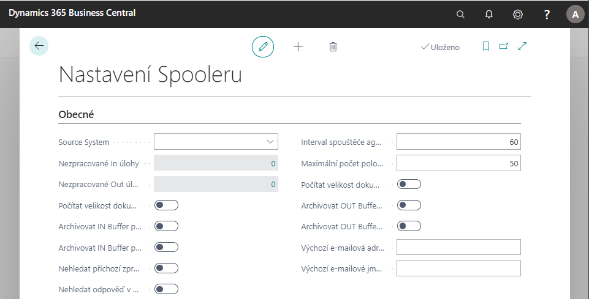

# Nastavení Spooleru

Spooler slouží pro komunikaci systému Business Central s externími systémy nebo datovými zdroji.

## Základní nastavení Spooleru

Pro nastavení spooleru postupujte následujícím způsobem:

1. Vyberte ikonu , zadejte **Nastavení spooleru** a klikněte na související odkaz.
1. Otevře se stránka **Nastavení spooleru**, kde jsou nastavovací a informativní pole:
   - **Source System**, které označuje zdrojový systém - jak se daný systém v komunikaci identifikuje.
   - **Nezpracované In úlohy** a **Nezpracované Out úlohy** zobrazují počet nezpracovaných úloh v In Bufferu nebo Out Bufferu.
   - **Počítat velikost dokumentu IN Bufferu** a **Počítat velikost dokumentu OUT Bufferu** určují, zda se mají počítat velikosti dokumentů zobrazovaných v IN a OUT Bufferech.
   - **Archivovat IN Buffer při zpracování** a **Archivovat IN Buffer při expiraci** určují, kdy a jestli se mají položky IN Bufferu archivovat.
   - **Archivovat OUT Buffer při zpracování** a **Archivovat OUT Buffer při expiraci** určují, kdy a jestli se mají položky OUT Bufferu archivovat.
   - **Nehledat příchozí zprávu v archívu** určuje, zda se má hledat příchozí zpráva dle jednoznačného identifikátoru GUID (ID dokumentu) v archivovaných položkách.
   - **Nehledat odpověď v archívu** určuje, zda se má hledat odpověď dle jednoznačného identifikátoru GUID (ID dokumentu) v archivovaných položkách.
   - **Maximální počet položek v Bufferu** omezuje počet položek. Pokud se zadá hodnota 0, jedná se o neomezený počet položek v Bufferech.
   - **Certifikát Pfx** – pokud zadáte *, tak pole zobrazuje, že je zde uložen elektronický podpis.
   - Pole **Cesta k certifikátu Pfx** se využívá, pokud není certifikát uložen přímo v databázi.
   - **Heslo k certifikátu Pfx** - vyplněno pokud se používá.
   - **Nepovolit elektronické podepisování** slouží k zapínání a vypínání použití elektronického podpisu. Volba nezaškrtnuto znamená nepoužívat elektronický podpis.

3. Pro import elektronického podpisu, použijte **Certifikát Pfx** a dále funkci **Impotovat...**.
1. Podpis je možné dále zobrazit, exportovat nebo smazat pomocí funkcí **Exportovat, Odstranit a Ukázat**.
1. Stránku následně můžete zavřít.

## Agenti Spooleru

Pro nastavení agentů spooleru postupujte následujícím způsobem:

1. Vyberte ikonu , zadejte **Agenti** a klikněte na související odkaz.
   Otevře se stránka **Agenti**, kde musíte vyplnit následující pole:
   - pole **ID agenta a Popis** slouží k evidenčnímu rozlišení agentů.
   - **Typ** rozlišuje agenty
      - IN - slouží pro příchozí komunikace. Přijímá zprávy z okolí a ukládá je do IN Bufferu.
      - OUT - prochází OUT Buffer a odesílá zprávy do okolí.
      - Procesní - prochází úlohy v IN Bufferu, zpracovává úlohy IN Bufferu a ukládá je do OUT Bufferu.
   - **ID codeunity agenta** se nastaví automaticky, ale dá se přepsat na jinou.
   - **Interval komunikace (s)** slouží pro aktivní agenty. Určuje, v jakém časovém intervalu se aktivuje a vykonává činnost.
   - **Přídavné parametry komunikace** využívají v podstatě aktivní agenti. Někteří agenti mohou mít více parametrů. Např. Diskový agent může sbírat data z více adresářů.
   - Pro IN Agenty slouží pole **ID výchozí úlohy**. Pokud se úloha Spooleru nenajde dle hlavičky XML, vezme se výchozí úloha.
   - **Změnit agenta po počtu chyb** je pouze pro OUT Agenty a Procesní Agenty. Pokud se agentovi nepodaří úlohu zpracovat (např. 5 chyb) lze nastavit do pole Změnit na agenta ID nového agenta, který se pokusí úlohu zpracovat.
   - **Logovat** určuje, zda a jak se zapisuje do aplikačního logu. Hodnoty mohou být Nikdy, Dle úlohy a Vždy.
   - **Odpovídat pouze na XML** je pro IN Agenty TCP a ukazuje, zda se bude odpovídat pouze na XML
   - **Druh komunikace a Parametr komunikace** je pouze pro IN Agenty. Parametr komunikace se nastavuje dle zvoleného druhu komunikace:
      - TCP – port [čárka] Timeout
      - MSMQ – název MSMQ
      - Pipe – název named PIPE
      - HTTP – adresa http
      - Disk – cesta [čárka] filtr souboru

Pro Diskového a HTTP (timer) In agenta je možné nastavit ID výchozí úlohy pro každý parametr komunikace, aby bylo možné rozlišit, jakým typem úlohy bude přijatá zpráva následně zpracována.

Všichni agenti jsou buď tzv. pasivní, nebo aktivní. Aktivní agent se sám aktivuje a vykonává nějakou činnost. Pasivní agent čeká na podnět zvenčí, na nějaké přerušení systému a na tuto změnu pak reaguje.

Pasivní agent běží sám na aplikačním serveru. IN Agent TCP a IN Agent MSMQ jsou pasivní agenti.

2. Po vyplnění polí je možno stránku zavřít.
3. Pokud uživatel potřebuje spustit agenta ručně, může to povést ve skupině **Zpracovat** funkcí **Spusť agenta**.

## Úlohy spooleru

1. Pro základní nastavení úloh spooleru vyberte ikonu , zadejte **Úlohy Spooleru** a klikněte na související odkaz.
1. Na stránce **Úlohy spooleru** můžete založit řádek pro novou úlohu obsahující následující pole:

- Pole **ID úlohy** označuje danou úlohu spooleru.
- Pole **Typ** určuje, zda je daná úloha pro IN Buffer (In) nebo pro OUT Buffer (Out).
- Pole **Druh komunikace** slouží pouze pro OUT úlohy. Druh komunikace je podobný jako u agentů, tzn. Disk, MSMQ, Pipe, HTTP, TCP a E-mail.
- **Popis** slouží k popsání dané úlohy.
- Pole **Výchozí priorita** označuje, v jakém pořadí se úlohy zpracovávají.
- Pole **ID Agenta** určuje, který agent bude úlohu spooleru zpracovávat. U IN úloh to bude Procesní agent a u OUT úloh to bude OUT agent.
- Pole **XDR** zobrazuje existenci schéma XML dokumentu (*).
- Pole **ID codeunity zpracování** označuje, kterou codeunitu agent spustí nad položkou Bufferu. U OUT úloh se pole vyplní automaticky při výběru druhu komunikace
- Dle polí **Typ procesu** a **Typ dokumentu** se rozpoznává úloha. Slouží tedy k nalezení úlohy dle hlavičky XML dokumentu v Bufferu.
- Pole **Výchozí cílový systém** se může vyplnit pouze pro OUT úlohy, pokud se cílový systém neurčí přímo z hlavičky XML dokumentu.
- Pole **Číslo posledního dokladu** využívá systém interně, nenastavuje se a slouží pouze pro OUT úlohy.
- Do pole **Expirovat po** se zadává doba trvání (proměnná Duration).
- Pole **Logovat** určuje, zda a jak se zapisuje do aplikačního logu. Hodnoty mohou být Nikdy, Dle úlohy a Vždy.
- Pole **Typ odpovědi** využívají pouze IN úlohy.
   - Potvrzení – úloha se vloží do IN Bufferu.
   - Výsledek – úloha se vloží do IN Bufferu a okamžitě se spustí zpracování.
- Pole **Šablona XSL** slouží k zobrazení dokumentu v HTML.
- Pole **Čekat po množství chyb** a **Čekací doba po chybách** slouží k určení, po kolika chybách se bude jak dlouho čekat s dalším pokusem o zpracování.
- Pole **ID codeunity při vložení** – umožňuje spustit codeunitu při vložení do Bufferu.
- Pole **Nenutit posloupnost odesílání** – pokud je toto pole zaškrtnuto, tak se položky úlohy neúčastní výpočtu pro vynucení posloupnosti odesílání (zaškrtnout pouze na úlohách, kde je vysloveně nežádoucí vynucovat posloupnost odesílání. Např. pro odesílání dokladů E-Mailem (zde nemusí platit, že když neprojde odeslání jednoho dokladu (třeba kvůli velikosti), tak potom neprojde odesílání dalších).
- Pole **Elektronicky podepisovat** slouží pouze pro OUT úlohy. Určuje, zda se úloha při vložení do Bufferu automaticky podepíše.
- Polem **Kódování XML** určujeme, jak bude XML dokument kódován.
- Pole **Nearchivovat při zpracování a Nearchivovat při expiraci** nám určují, kdy a jestli se mají položky Bufferu archivovat. Tyto pole mají vyšší prioritu než pole v nastavení spooleru.
- Pole **Nehledat příchozí zprávu v archívu** a **Nehledat odpověď v archívu** slouží k zabezpečení komunikace. Viz popis nastavení spooleru.

Cílové úlohy spooleru se zobrazují na formuláři Úlohy spooleru na tlačítku Úloha – Cílové systémy. Týká se pouze OUT úloh.

Zde je vyplněno s kým komunikuji (pole ID cílového systému) a s jakým parametrem (pole Parametr komunikace).

Dle zvoleného druhu komunikace nastavují parametry:

- TCP – IP adresa [čárka] port [čárka] Timeout
- MSMQ – název MSMQ
- Pipe – název named PIPE
- Disk – cesta [čárka] přípona
- HTTP – adresa http
- E-mail – emailové adresy

Pro druh komunikace E-mail platí: Při vložení úlohy do OUT Bufferu lze přenastavit (přepsat) parametr komunikace pro konkrétní položku v OUT Bufferu. Dále je možno vyplněním tabulky T4002916 OUT Buffer Dokument odeslat více souborů příloh v jednom e-mailu z jedné položky OUT Bufferu.

Na formuláři Úlohy spooleru lze přes tlačítko Funkce exportovat, importovat, zobrazit nebo smazat XDR a XSL šablony k jednotlivým úlohám.

3. Po vyplnění polí je možno stránku zavřít.

## See also
[Spooler](ac-spooler.md)
[AC Productivity Pack](ac-productivity-pack.md)  
[AUTOCONT řešení](../index.md)