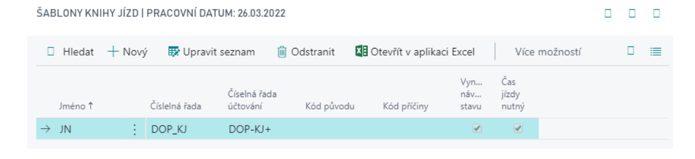

# Doprava základ - Nastavení

## Nastavení dopravy

Pro základní nastavení addonu dopravy porakčujte následujícím způsobem:
1. Vyberte ikonu , zadejte **Nastavení dopravy** a poté vyberte související odkaz.
2. Na kartě nastavení dopravy je několik polí k nastavení:
   - **Čísla vozidel** – číselná řada pro vytváření vozidel.
   - **Čísla řidičů** – číselná řada pro vytváření řidičů.
3. Dále Nastavení Dopravy obsahuje v ovládacím panelu další možnosti nastavení a doplnění číselníků:

   

### Kódy odborné způsobilosti

- Číselník reprezentující schopnosti/dovednosti/oprávnění řidičů
- Tato oprávnění lze následně přidělit vč. časové platnosti konkrétnímu řidiči

### Kódy PHM
Číselník druhů paliv používaných ve vozidlech a s vazbou na karty, které jsou vám fakturovány jejich dodavateli (např. různé druhy pohonných hmot, poplatky,…).  Tato vazba je následně použita při vytváření nákupních faktur z výpisu čerpání.

## Typy vozidel

Číselník typů vozidel používaných ve vašem parku a členěných dle vašich potřeb

## Vybavení vozidla

Seznam položek výbavy, které chcete evidovat pro vozidla

## Typy údržby

Pro členění údržby vozidla dle vašich potřeb

## Typy provozu

Číselník je možné použít ke stanovování různých nákladů a normovaných spotřeb u vozidel v závislosti na typu vozidla.

## Šablony knihy jízd

- Šablony umožnují definovat deník pro určitý záznam – například řidič, nebo vozidlo.
- Šablona knihy jízd obsahuje jeden řádek pro každou šablonu, pole:
   - **Vynutit návaznost stavu** – řádky musí být zadávány v pořadí, v jaké byly jízdy uskutečněny.
   - **Čas jízdy nutný** – uživatel musí zadat dobu trvání jízdy.

## Šablony výpisu čerpání

- Šablony výpisu čerpání slouží k vytváření a sledování jednotlivých šablon výpisů. V šabloně je nutné vyplnit následující pole:

   - **Název** a **Popis**.
   - **Čísla výpisů** – číselná řada pro výpisy čerpání PHM.
   - **Čísla vydaných výpisů** – číselná řada pro vydané výpisy čerpání PHM.
   - parametry pro elektronické zpracování vyúčtování **Cesta pro import**, **Typ souboru pro import**, **Typ objektu pro import**, **ID objektu pro import**, **Název objektu pro import**.
   - **Číslo dodavatele** – je nutné vyplnit, budou-li z výpisů generovány nákupní faktury.
   - **Číslo dodavatele PHM** – needitovatelné, je zkopírováno ze stejného pole na kartě dodavatele (jedná se o číslo dodavatele PHM, které uvádí v elektronických výpisech, a které je kontrolováno při jejich importu).
   - **Šablona deníku PHM** – je nutné vyplnit, budou-li z výpisů generovány deníky PHM.
   - **List deníku PHM** – je nutné vyplnit, budou-li z výpisů generovány deníky PHM.

## Dodavatelé

V případě, že budou využívány deníky čerpání PHM, tak je nutné nastavit na dodavateli následující údaje:
- Číslo dodavatele PHM (Fuel Vendor No.) – jde o pole, které je kontrolované v průběhu zadávání výpisu čerpání PHM nebo jeho importu
- Katalog zboží dodavatele PHM – pro označení zboží ve výpisu dodavatele a jeho napárování na karty zboží v systému.

**See also**

[Doprava - základ](ac-transport-basic.md)  
[Productivity Pack](ac-productivity-pack.md)
