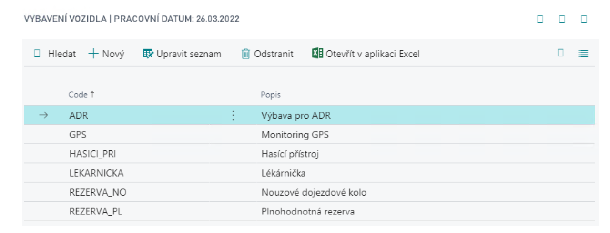

# Transport - Basic - Setup

## Transport Setup

For basic transport addon settings, do the following:
1. Choose the , icon, enter **Transport Setup** and then choose the related link.
2. There are several settings fields on the Traffic Settings page:
   - **Vehicle Nos.** – a number series for creating vehicles.
   - **Drivers Nos.** – a number series for creating drivers.
3. In addition, the Transport Settings contains additional options for setting and adding lists in the control panel:

   

### Professional Qualifications

- Code list representing drivers abilities/skills/authorizations
- These authorisations can then be assigned, including time validity, to a specific driver

### Fuel Codes
A code list of the types of fuels used in vehicles and linked to the cards invoiced to you by their suppliers (e.g. different types of fuel, fees,...).  This link is then used when creating purchase invoices for purchase statements.

## Vehicle Types

Code list of vehicle types used in your fleet and broken down according to your needs

## Vehicle Equipment

List of equipment items you want to register for vehicles

## Maintenance Types

To break down vehicle maintenance according to your needs

## Operation Types

The list can be used to determine different costs and standardised vehicle consumption depending on the vehicle type.

## Drive Journal Templates

- Templates allow you to define a Drive Journal for a specific entry - for example, a driver or a vehicle.
- Drive Journal Template contains one line for each template, field:
   - **Force Counter Continuity** – lines must be entered in the order in which the rides were made.
   - **Drive Time Mandatory** – user must enter the duration of the journey.

## Refuelling Statement Template

- Refuelling Statement Template are used to create and track individual statement templates. You must fill in the following fields in the template:

   - **Name** and **Description**.
   - **Statement Nos.** – number series for Refuelling Statement.
   - **Issued Statement Nos.** – number series for issued Refuelling Statement
   - parameters for electronic processing of **Import path**, **Import File Type**, **Import Object Type**, **Import object ID**, **Import object ID Name**.
   - **Vendor No.** – Must be filled in if purchase invoices will be generated from statements.
   - **Fuel Vendor No.** – non-editable, it is copied from the same field on the supplier's card (this is the fuel supplier number that he states in the electronic statements and which is checked during their import).
   - **Fuel Journal Template** – must be filled in if fuel journals will be generated from the statements.
   - **Fuel Journal Batch** – it is necessary to fill in if fuel journals will be generated from the statements.

## Vendors

In the event that fuel Driver journal are used, it is necessary to set the following data on the supplier:
- Fuel Vendor No. – this is the field that is checked during the entry of the fuel drawdown statement or its import
- Fuel Item Vend. Catalog – to mark the items in the vendor's statement and pair them to the item cards in the system.

**See also**

[Transport - Basic](ac-transport-basic.md)  
[Productivity Pack](ac-productivity-pack.md)
